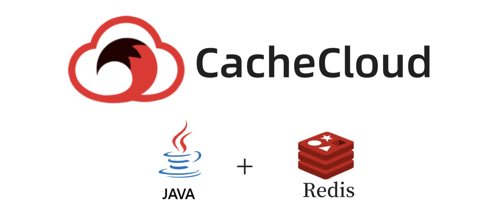
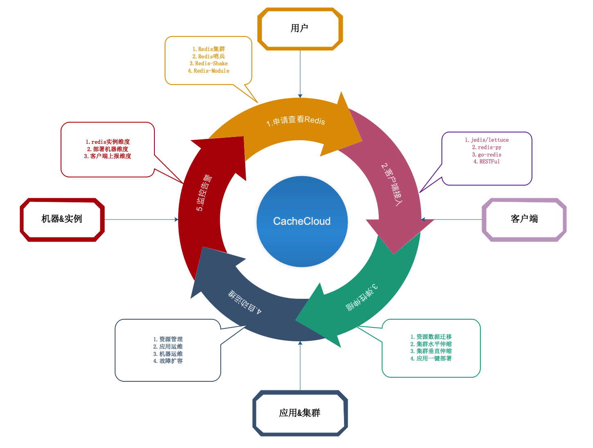
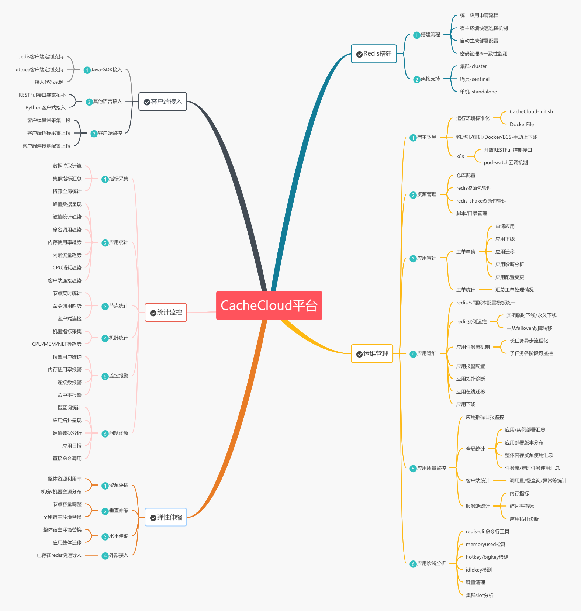
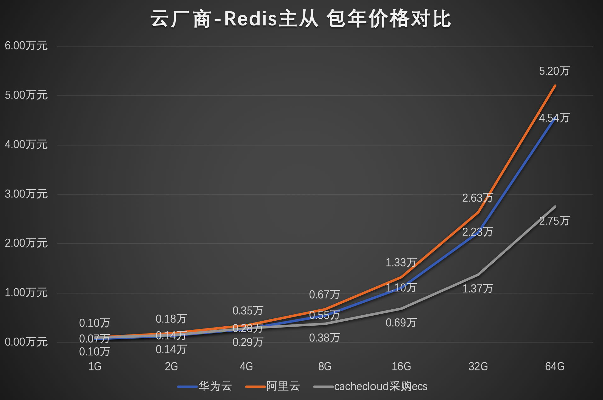
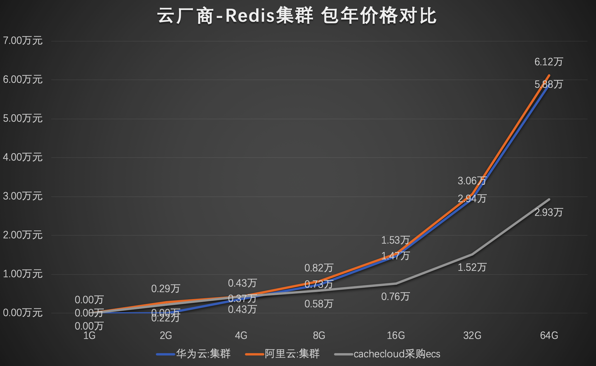

[中文](README_CN.md) | [EN](README_EN.md)

[![CI checks on main badge]][CI checks on main link] [![latest release badge]][latest release link] [![github stars badge]][github stars link] [![github forks badge]][github forks link] [![github open issues badge]][github open issues link] [![github open prs badge]][github open prs link] [![latest commit to main badge]][latest commit to main link]

[CI checks on main badge]: https://flat.badgen.net/github/checks/sohutv/cachecloud/main?label=CI%20status%20on%20main&cache=900&icon=github
[CI checks on main link]:https://github.com/sohutv/cachecloud/actions?query=branch%3Amain
[github forks badge]: https://flat.badgen.net/github/forks/sohutv/cachecloud?icon=github
[github forks link]: https://useful-forks.github.io/?repo=sohutv%2Fcachecloud
[github open issues badge]: https://flat.badgen.net/github/open-issues/sohutv/cachecloud?icon=github
[github open issues link]: https://github.com/sohutv/cachecloud/issues?q=is%3Aissue+is%3Aopen
[github open prs badge]: https://flat.badgen.net/github/open-prs/sohutv/cachecloud?icon=github
[github open prs link]: https://github.com/sohutv/cachecloud/pulls?q=is%3Apr+is%3Aopen
[github stars badge]: https://flat.badgen.net/github/stars/sohutv/cachecloud?icon=github
[github stars link]: https://github.com/sohutv/cachecloud/stargazers
[latest commit to main badge]: https://flat.badgen.net/github/last-commit/sohutv/cachecloud/main?icon=github&color=yellow&label=last%20dev%20commit&cache=900
[latest commit to main link]: https://github.com/sohutv/cachecloud/commits/main
[latest release badge]: https://flat.badgen.net/github/release/sohutv/cachecloud/development?icon=github
[latest release link]: https://github.com/sohutv/cachecloud/releases

  <h2>CacheCloud云平台</h2>
  <a href="https://github.com/sohutv/cachecloud/blob/main/cachecloud-web/src/main/resources/static/wiki/quickstart/index.md">Quickstart</a>
  &nbsp;&nbsp;•&nbsp;&nbsp;
  <a href="https://github.com/sohutv/cachecloud/blob/main/cachecloud-web/src/main/resources/static/wiki/access/client.md">Client</a>
  &nbsp;&nbsp;•&nbsp;&nbsp;
  <a href="https://github.com/sohutv/cachecloud/wiki">Docs</a>
  &nbsp;&nbsp;•&nbsp;&nbsp;
  <a href="https://github.com/sohutv/cachecloud/wiki#%E5%85%ADfaq%E5%B8%B8%E8%A7%81%E9%97%AE%E9%A2%98">FAQ</a>
  &nbsp;&nbsp;•&nbsp;&nbsp;
  <a href="http://43.137.44.6:8080/admin/app/list">Demo</a>
  &nbsp;&nbsp;•&nbsp;&nbsp;
  <a href="https://github.com/sohutv/cachecloud/issues/289">Feedback</a>
  &nbsp;&nbsp;•&nbsp;&nbsp;
  <a href="https://github.com/sohutv/cachecloud#contact">Contact</a>
  

## What is CacheCloud？

CacheCloud is a Redis cloud management platform that supports efficient management of multiple Redis architectures (Standalone, Sentinel, and Cluster), effectively reduces large-scale redis Operation and Maintenance costs, and improves resource management capabilities and utilization. The platform provides functions such as rapid construction/migration, operation and maintenance management, elastic scaling, statistical monitoring, and client integration and access.

## CacheCloud Function Architecture

+ Redis build: Machine environment initialization, Instance deployment and installation, Redis architecture support;
+ DevOps: Machine environment, Resource management, Application audit, Application operation and maintenance, Quality monitoring, Diagnostic analysis;
+ Statistical monitoring: Redis log collection, Instance indicator collection, Machine indicator collection, Application statistics, Monitoring alarms, Problem diagnosis;
+ Client access: SDK access support, Language access support, Client monitoring;
+ Elastic scaling: Memory Resource shrinkage, Application scaling, External access;

<a name="cc4"/>

## CacheCloud Scale

+ 800亿+ commands/day
+ 18T+ Memory Total
+ 420+ app Total / 4800+ Instances Total
+ 80+ Physical machine/ 360+ K8s Pod Total

<a name="cc5"/>

## CacheCloud VS Cloud vendor

Redis Sentinel/Cluster deploy cost

## Contributing member

## Supporters

<a name="contact"/>

## Contact us

+ QQ: 534429768(Full) / 2群:894022242 / 3群:908821300

+ Wechat Group:

+ Wechat：If you have public network resources can contact me, I will join the open source version service resource deployment trial, improve everyone's user experience.

If you find CacheCloud is helpful, welcome to Star⭐️.
