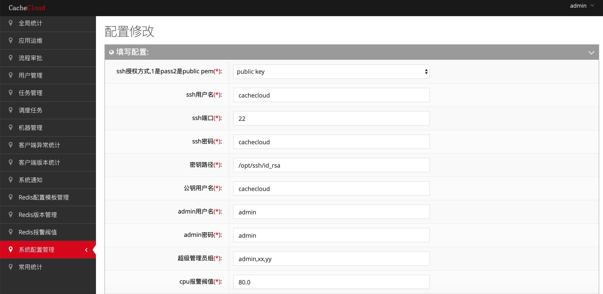

## 系统配置说明

### 一、系统配置说明

在早期的CacheCloud版本中，许多配置需要对源码进行一些修复，对于一些运维人员以及对java不太熟悉的朋友来说不是很友好，为此添加了系统配置页面，系统配置页面可以动态修改系统的一些配置，例如ssh的相关信息，客户端版本信息，机器报警阀值，文档地址、maven仓库、手机和邮件报警、值班联系人配置等等，具体示意图如下：



### 二、详细说明

#### 1.ssh相关配置：

ssh配置主要是打通cachecloud服务器与Redis机器交互通讯方式。

> 1.1 ssh授权方式：

- ssh授权方式

````
cachecloud.ssh.auth.type = (1：密码，2：public key)

````

> 1.2 ssh用户名密码配置:

- ssh用户名
- ssh密码
- ssh端口

```
cachecloud.machine.username = cachecloud
cachecloud.machine.password = cachecloud
cachecloud.machine.ssh.port = 22
```

> 1.3 [ssh公钥配置](../operate/ssh.md):

- 公钥用户名
- 密钥路径

````
cachecloud.public.key.pem = /opt/ssh/id_rsa (cachecloud服务器上路径)
cachecloud.public.user.name = cachecloud
````

#### 2.管理员配置:

- admin用户名：cachecloud超级管理员登录名
- admin密码： cachecloud超级管理员密码
- 超级管理员组: 除了admin，可以添加其他成员，用于做下线的操作(超级管理员与普通管理员的区别：目前只是下线应用)

#### 3.机器报警阀值：
cachecloud会定期对机器重要指标进行检测进行报警(报警实现请参考：https://github.com/sohutv/cachecloud/wiki/3.%E6%9C%8D%E5%8A%A1%E5%99%A8%E7%AB%AF%E6%8E%A5%E5%85%A5%E6%96%87%E6%A1%A3#cc5-2)

- cpu报警阀值 
- 内存报警阀值
- 负载报警阀值
- 应用连接数报警阀值


#### 4.系统信息：
   
- CacheCloud系统文档：[文档地址](../intro/index.md)
- 值班电话：系统相关负责人联系方式

[系统信息](../../img/access/baseinfo.png)

#### 5.报警信息
   
- 邮件联系人：用逗号隔开
- 邮件报警接口：用逗号隔开
- 微信报警接口：用逗号隔开
- 微信号报警：用逗号隔开


#### 6.客户端版本管理（**修改请慎重，修改不当可能造成客户端启动失效**）
   
- 可用客户端版本(用逗号隔开)：良好的客户端版本列表，没有bug，如果客户端使用该版本的客户端可正常使用。
- 警告客户端版本(用逗号隔开): 即将被放弃的客户端版本列表，如果客户端使用该版本能启动成功，但是可能存在bug，建议替换成可用版本的客户端。
- 不可用客户端版本(用逗号隔开)： 不可用的客户端版本列表，如果客户端使用该版本将启动失败。 
注意，最后一个可用版本的版本号，就是接入代码中的版本号，代表最新的版本，例如1.1,1.2,1.5 ,具体客户端版本参考: [CC客户端版本](../intro/releaseNote.md)

#### 7. 相关工具

- redis-migrate-tool安装路径；
- redis-shake安装路径；
- redis-full-check安装路径。

    
####

### 三、注意

系统配置的初始化值，需要导入2.0.sql(目录:cachecloud-web/sql)中的相关表和数据：

```
CREATE TABLE `system_config` (
  `config_key` varchar(255) NOT NULL COMMENT '配置key',
  `config_value` varchar(512) NOT NULL COMMENT '配置value',
  `info` varchar(255) NOT NULL COMMENT '配置说明',
  `status` tinyint(4) NOT NULL COMMENT '1:可用,0:不可用',
  `order_id` int(11) NOT NULL COMMENT '顺序',
  PRIMARY KEY (`config_key`)
) ENGINE=InnoDB DEFAULT CHARSET=utf8 COMMENT='系统配置';

--
-- init cachecloud data
--

BEGIN;
INSERT INTO `system_config` VALUES 
 ('cachecloud.admin.user.name', 'admin', 'cachecloud-admin用户名', '1', '6'),  
('cachecloud.admin.user.password', 'admin', 'cachelcoud-admin密码', '1', '7'),  
('cachecloud.app.client.conn.threshold', '2000', '应用连接数报警阀值', '1', '24'),  
('cachecloud.base.dir', '/opt', 'cachecloud根目录，要和cachecloud-init.sh脚本中的目录一致', '1', '23'),  
('cachecloud.contact', 'user1:(xx@zz.com, user1:135xxxxxxxx)<br/>user2: (user2@zz.com, user2:138xxxxxxxx)', '值班联系人信息', '1', '16'),  
('cachecloud.email.alert.interface', '', '邮件报警接口(说明:http://cachecloud.github.io 邮件和短信报警接口规范)', '1', '25'),  
('cachecloud.machine.ssh.name', 'cachecloud', '机器ssh用户名', '1', '1'),  
('cachecloud.machine.ssh.password', 'cachecloud', '机器ssh密码', '1', '2'),  
('cachecloud.machine.ssh.port', '22', '机器ssh端口', '1', '3'),  
('cachecloud.machine.stats.cron.minute', '1', '机器性能统计周期(分钟)', '1', '30'),  
('cachecloud.mobile.alert.interface', '', '短信报警接口(说明:http://cachecloud.github.io 邮件和短信报警接口规范)', '1', '26'),  
('cachecloud.nmon.dir', '/opt/cachecloud', 'nmon安装目录', '1', '31'),  
('cachecloud.owner.email', 'xx@sohu.com,yy@qq.com', '邮件报警(逗号隔开)', '1', '13'),  
('cachecloud.owner.phone', '13812345678,13787654321', '手机号报警(逗号隔开)', '1', '14'),  
('cachecloud.public.key.pem', '/opt/ssh/id_rsa', '密钥路径', '1', '3'), 
('cachecloud.public.user.name', 'cachecloud', '公钥用户名', '1', '3'),  
('cachecloud.ssh.auth.type', '1', 'ssh授权方式', '1', '4'),  
('cachecloud.superAdmin', 'admin,xx,yy', '超级管理员组', '1', '8'),  
('cachecloud.whether.schedule.clean.data', 'false', '是否定期清理统计数据', '1', '28'),  
('machine.mem.alert.ratio', '80.0', '机器内存报警阀值', '1', '10');
COMMIT;
```