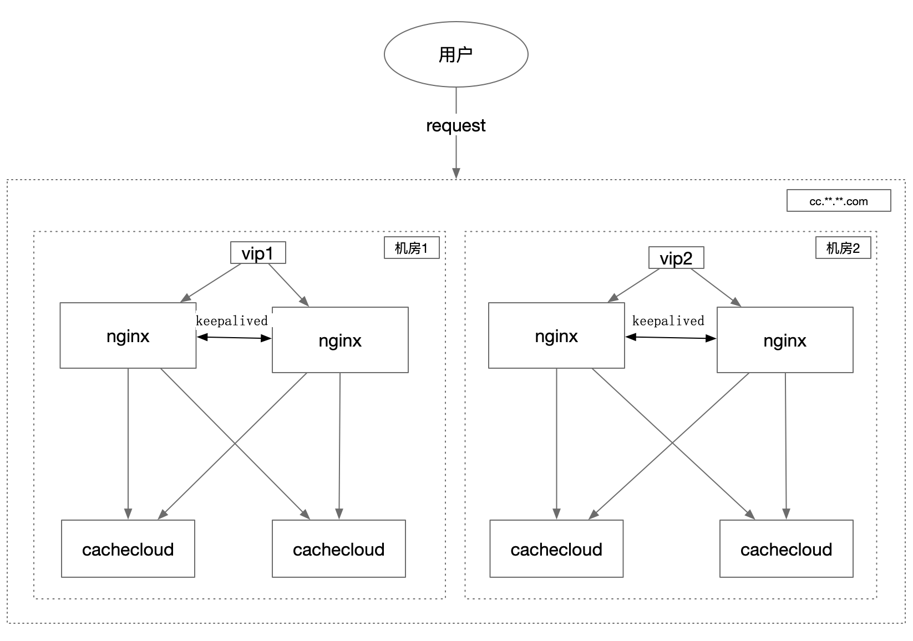
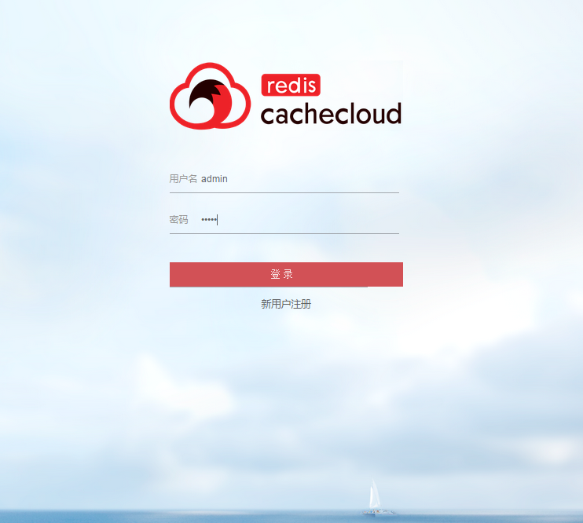

## 系统接入

* [一、初始化数据库](#cc1)
* [二、CacheCloud系统配置](#cc2)
* [三、CacheCloud部署拓扑](#cc3)
* [四、CacheCloud服务部署](#cc4)
* [五、Redis机器环境安装](#cc5)
* [六、系统扩展性模块说明](#cc6)
   

<a name="cc1"/>

### 一、初始化数据库
  导入项目sql目录下初始化库表结构，默认插入admin超级管理员。以下表为相关sql文件说明:
  
  | 序号 | sql文件名 | 说明  | 
  | :-------------------------- | :-------------------------- |:----------------------------- | 
  | 1 | 1.2.sql     | CacheCloud1.2版本的sql文件 | 
  | 2 | 1.2-2.0.sql     | CacheCloud从1.2版本升级到2.0版本增量sql文件 |  
  | 3 | 2.0.sql | CacheCloud2.0版本的sql文件 |  
  | 4 | update 2.0 to 3.0 sql | CacheCloud从2.0版本升级到3.0版本增量sql文件 |
  | 5 | 3.0 sql | CacheCloud3.0版本的sql文件 |

<a name="cc2"/>

### 二、CacheCloud系统配置

项目采用springboot部署方式，通过application-${profile}.yml来区分不同环境资源隔离,其中profile:本地(默认为local)、测试(test)、线上(online)。
当第一次启动系统后，需要对管理后台进行初始化配置，详细配置请参考: [系统配置说明](config.md) 		
    

    
<a name="cc3"/> 
    
### 三、CacheCloud部署拓扑



````
服务拓扑说明:
1. 资源说明: nginx机器/cachecloud机器各4台，其中每2台机器分布在不同机房；
2. 域名说明: 申请nginx域名： cc.**.**.com用于访问
3. 虚ip说明：每组虚ip映射2台nginx机器，防止nginx出现单点问题；
4. 机房说明: nginx/cachecloud机器每2台资源会分布在不同机房，为防止因为某个机房网络问题导致无法访问cc后台；
````
	
<a name="cc4"/>

### 四、CacheCloud服务部署

- 1.本地环境:

````
(a). 在cachecloud根目录编译：mvn clean compile install
(b). 在cachecloud-web模块下启动：mvn spring-boot:run
````

- 2.生产环境:

````
(a).项目根目录下编译打包：mvn clean compile install -Ponline
(b).上传war包(cachecloud-web/target/cachecloud-web-online.war)到服务器/opt/cachecloud-web目录下
(c).启动资源包：java -jar cachecloud-web-online.war -Dspring.profiles.active=online
````

- 3.后台登录:

(a) 访问：http://127.0.0.1:9999/manage/login 

(b) 如果访问正常，请使用用户名:admin、密码:admin访问系统，跳转到应用列表下：

 

<a name="cc5"/>

### 五、Redis机器环境安装

- 5.1 Redis机器环境手动安装：

````
1. 运行脚本:

  cachecloud项目中的cachecloud-init.sh(目录：cachecloud-web\script\cachecloud-init.sh)脚本是用来初始化Redis服务器环境，主要工作如下：
    (a). 创建cachecloud项目用户;
    (b). 创建cachecloud项目的工作目录、数据目录、配置目录、日志目录、redis安装目录、临时目录等等;
    (c). 安装最新的release版本的Redis;

2. 脚本执行:
    (a). 使用root登录目标服务器;
    (b). 将cachecloud-init.sh脚本拷贝到目标服务器当前用户目录下;
    (c). 执行 sh cachecloud-init.sh ${yourusername};
    (d). 两次确认密码;
    (e). 一路安装直到成功;
请确保机器和用户名与cachecloud后台中系统用户名/密码配置一致。

3. 建议和警告 
    (a). 请在root用户下执行初始化脚本，因为初始化脚本涉及到了用户的创建等较高的权限。
    (b). 出于安全的考虑，所选的机器最好不要有外网IP地址。
    (c). 用户名和密码最好不要用cachecloud, 密码尽可能复杂。
    (d). 请确保/opt/有足够的硬盘空间，因为/opt/cachecloud/data要存储RDB和AOF的持久化文件，如果硬盘过小，会造成持久化失败。（如果硬盘确实很小，建议建立一个软链接到/opt/cachecloud/data,且保证软链接的目录也是username用户，一定要保证/opt/cachecloud的目录结构）
    (e). 脚本中目前使用的是redis-3.0.7，如有需要请自行替换，建议使用3.0 release以后的版本。但是要注意3.2版本中bind的默认是127.0.0.1
````

- 5.2 Redis机器环境镜像安装：[Redis镜像安装](docker.md)
- 5.3 Redis机器授权方式：[访问Redis机器方式](../operate/ssh.md)

<a name="cc6"/>

### 六、系统扩展性模块说明

#### 1. 登录模块:

除了超级管理员admin:admin以外，所有的用户在登录时都要做两项内容的验证：

- (1). 实现登陆逻辑：
根据各公司自身需要实现逻辑可以在cachecloud-custom模块com.sohu.cache.login.impl.DefaultLoginComponent类中实现：

```Java
    public class DefaultLoginComponent implements LoginComponent {
    
        @Override
        public boolean passportCheck(String userName, String password) {
            /**
             * your company login check code
             */
            return true;
        }
    
        @Override
        public String getEmail(String ticket) {
            return null;
        }
    
        @Override
        public String getRedirectUrl(HttpServletRequest request) {
            return null;
        }
    
        @Override
        public String getLogoutUrl() {
            return null;
        }
    }
```
- (2). 是否为cachecloud用户

    需要验证用户是否在app_user表中

#### 2. 报警模块说明

cachecloud提供了邮件和微信两种形式的报警工具,这里主要是对Redis机器/实例等重要指标进行监控。
各个公司、项目组可以根据需要实现对应报警接口逻辑，具体参考：

- 2.1 代码实现：

    - (1).邮件报警接口实现:com.sohu.cache.alert.impl.DefaultEmailComponent (cachecloud-custom)
    ```Java
    public class DefaultEmailComponent implements EmailComponent {
    
        @Override
        public boolean sendMail(String title, String content, List<String> emailList, List<String> ccList) {
            //todo
            throw new UnsupportedOperationException();
        }
    
        @Override
        public boolean sendMail(String title, String content, List<String> emailList) {
            //todo
            throw new UnsupportedOperationException();
        }
    
        @Override
        public boolean sendMailToAdmin(String title, String content) {
            //todo
            throw new UnsupportedOperationException();
        }
    
        @Override
        public String getAdminEmail() {
            //todo
            throw new UnsupportedOperationException();
        }
    }
    ```

    - (2).微信报警接口实现:com.sohu.cache.alert.impl.DefaultWeChatComponent (cachecloud-custom)
    ```Java
    public class DefaultWeChatComponent implements WeChatComponent {
    
        @Override
        public boolean sendWeChat(String title, String message, List<String> weChatList) {
            //todo
            throw new UnsupportedOperationException();
        }
    
        @Override
        public boolean sendWeChatToAll(String title, String message, List<String> weChatList) {
            //todo
            throw new UnsupportedOperationException();
        }
    
        @Override
        public boolean sendWeChatToAdmin(String title, String message) {
            //todo
            throw new UnsupportedOperationException();
        }
    }
    ```
    
- 2.2 接口实现

提供了http接口规范，只要按照规范开发http接口，任何语言都可以实现。

(1).邮件：

参数 | 含义 | 是否必须
---|--- |---
title | 邮件标题 | 是
content | 邮件内容 | 是
receiver | 收件人列表 | 是
cc | 抄送人列表 | 否


例如我们用python语言按照上面的参数开发了一个http接口
```
www.xxx.com/emailAlert?title=xx&content=xx&receiver=x&cc=x
```
(2).微信：

参数 | 含义 | 是否必须
---|--- |---
title | 短信内容 | 是
message | 手机号列表 | 是
weChatList | 微信人员列表 | 是

例如我们用python语言按照上面的参数开发了一个http接口
```
www.xxx.com/weChatAlert?title=xx&message=xx&weChatList=xx
```

(3). 修改系统配置：

确认无误后，我们需要把它添加到系统配置修改中即可：


