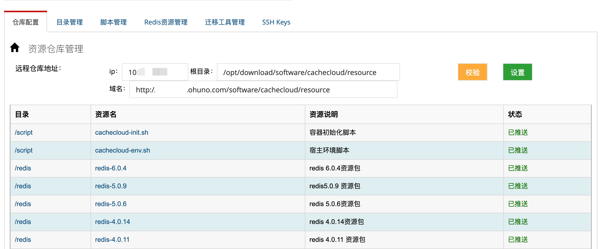
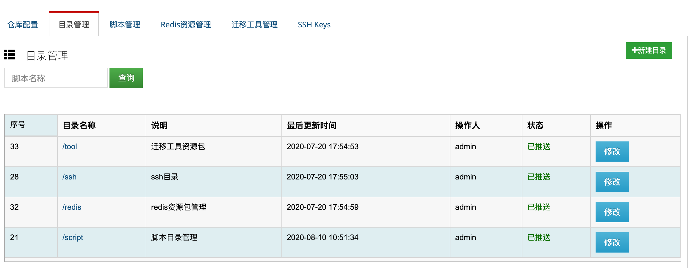
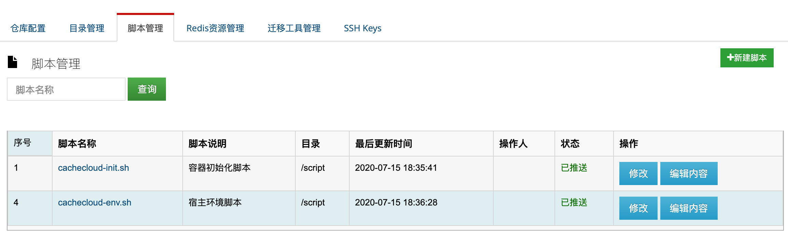
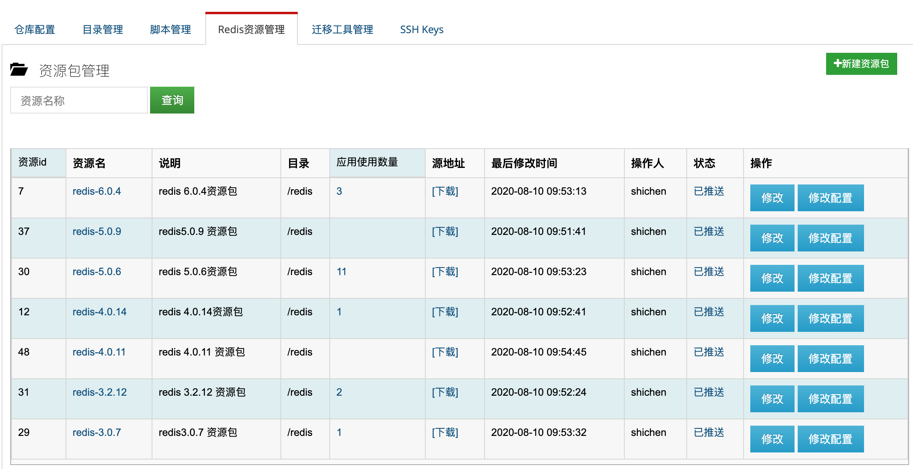
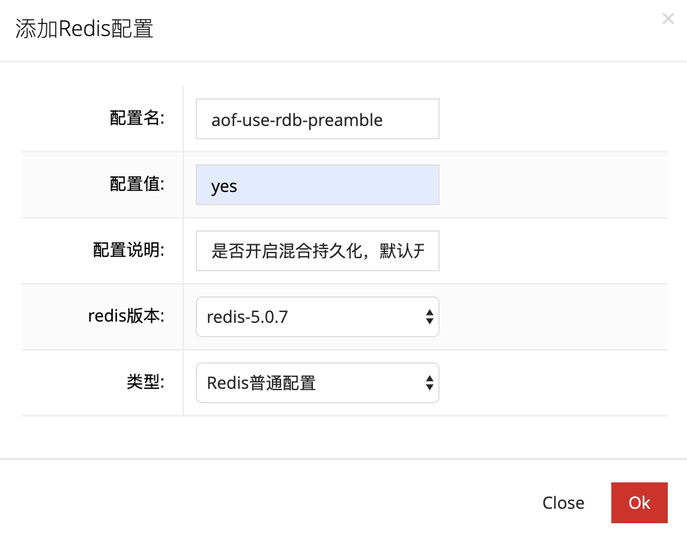
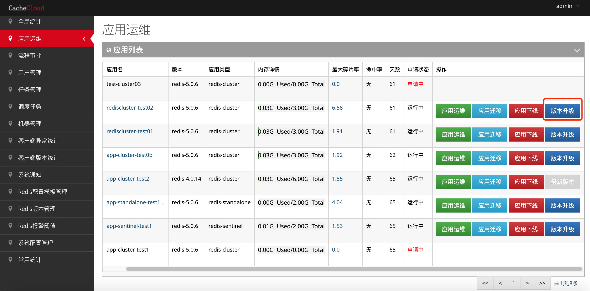
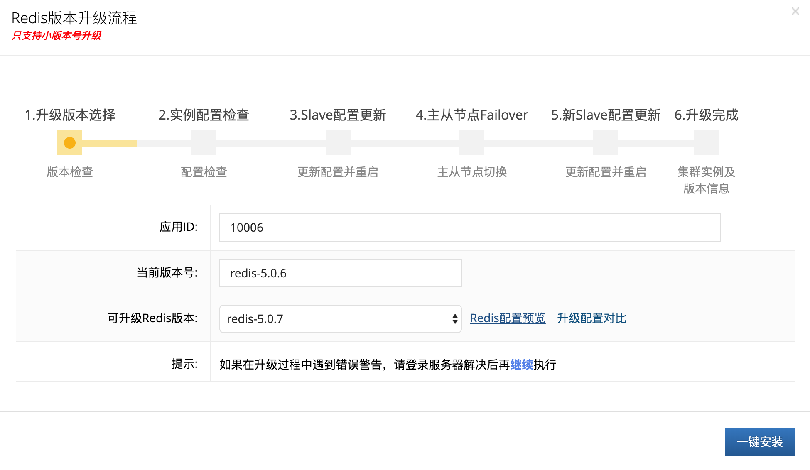
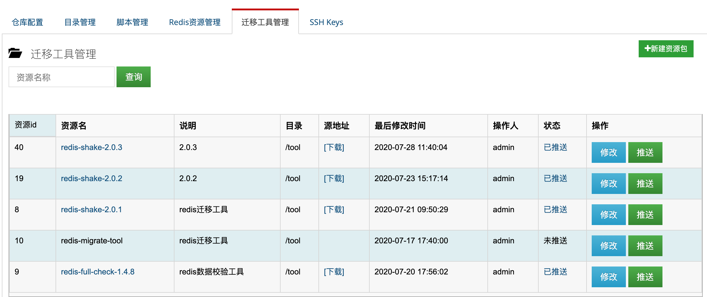

## 系统资源管理

<a name="cc1"/>

### 一、目的

CacheCloud系统需要依赖一些脚本，Redis资源包，迁移工具，公钥/私钥等资源，由于比较零碎，此项功能用于对资源及其版本同一管理控制，简化运维提升效率。
主要分以下几大类：

- 仓库配置：配置资源的仓库地址，可用于推送和下载资源；
- 目录管理：区分各类资源的目录结构，便于管理资源；
- 脚本管理：管理系统依赖资源的脚本；
- Redis资源管理： 管理redis资源包不同版本及推送下载；
- 迁移工具资源管理：管理迁移工具不同资源包版本及推送下载；

<a name="cc2"/>

### 二、仓库配置

远程仓库地址：可访问的仓库ip地址；例如:10.%.%.%

根目录：仓库资源的根目录；例如:/opt/download/software/cachecloud/resource

资源下载地址：可访问资源地址；例如:http://%.%.%.com/software/cachecloud/resource

<a name="cc3"/>

### 三、目录管理

对不同类型资源创建不同目录，需要做推送后及在远程仓库创建对应资源目录(格式:/${dir})；

<a name="cc4"/>

### 四、脚本管理

对系统依赖脚本进行版本管理，可在编译内容和推送脚本到仓库上；

<a name="cc5"/>

### 五、Redis资源管理

Redis资源管理支持对Redis大小版本做统一管理和版本控制(3.0.x -> 3.2.x -> 4.0.x -> 5.0.x -> 6.0.0-rc)的不断迭代更新，项目也需要用到不同版本和新特性。

#### 5.1.新增资源包

- 1).Redis版本格式规范，验证格式：redis-主.子.增量版本
- 2).安装目录规范：/opt/cachecloud/redis-主.子.增量版本
- 3).是否备份：可直接继承之前版本配置模板，进行增量修改配置

#### 5.2.修改配置

点击`修改配置`，可新增配置项：

#### 5.3、应用版本升级

只支持小版本增量升级(Redis-3.2.x/Redis-4.0.x/Redis-5.0.x):
例如:Redis-5.0.6 升级到 Redis-5.0.7

点击`版本升级`，可升级当前应用版本: 

升级完后，若为升级版本5.0.7为当前管理的最终小版本号，则应用按钮会显示为`最新版本`。

<a name="cc6"/>

### 六、迁移工具资源管理

对系统迁移工具版本管理，方便对资源的可控和管理；
