## 应用统计信息

当您的应用开始使用后，您可以按照如下步骤查看应用统计数据和各实例统计数据。

### 一、全局统计

- 在页面详情页，默认展示应用统计信息，可以看到全局信息、命令统计、各命令峰值信息，全命令统计、命中统计、网络流量等全天统计曲线。按照顺序，
  + 全局信息：展示应用的全局信息，包括内存使用率、当前连接数、应用redis版本、应用类型、主从节点数、命中率、当前对象数、当前状态及分布的机器数；
  + 命令统计：展示当前应用执行最频繁的5个命令的分布情况；
  + 各命令峰值信息：展示当前应用执行最频繁的5个命令的峰值统计；
  + 全命令统计：展示当前应用的命令执行次数趋势图；
  + 命中统计：展示当前应用的命中次数趋势图；
  + 网络流量：展示应用的输入输出流量趋势图，亦可查看应用下各实例的网络输入输出流量；
  + CPU消耗：展示应用的CPU消耗情况趋势图，亦可查看应用下各实例的CPU消耗情况趋势；
  + 内存使用量：展示应用的内存使用情况趋势图，亦可查看应用下各实例的内存碎片率情况；
  + 客户端连接统计：展示该应用下客户端连接数趋势图；
  + 键个数统计：展示该应用下键个数趋势图。
  
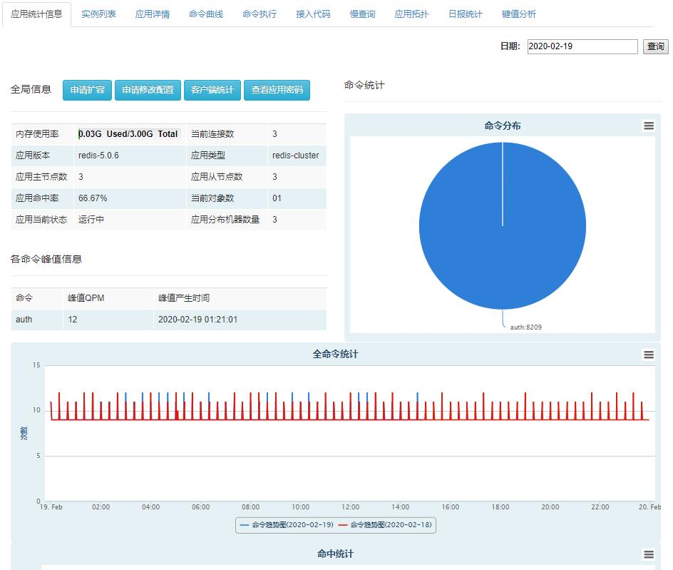

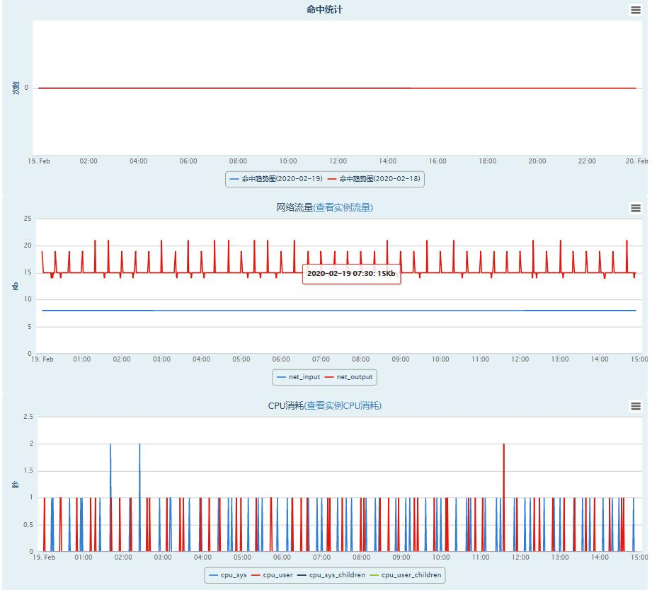

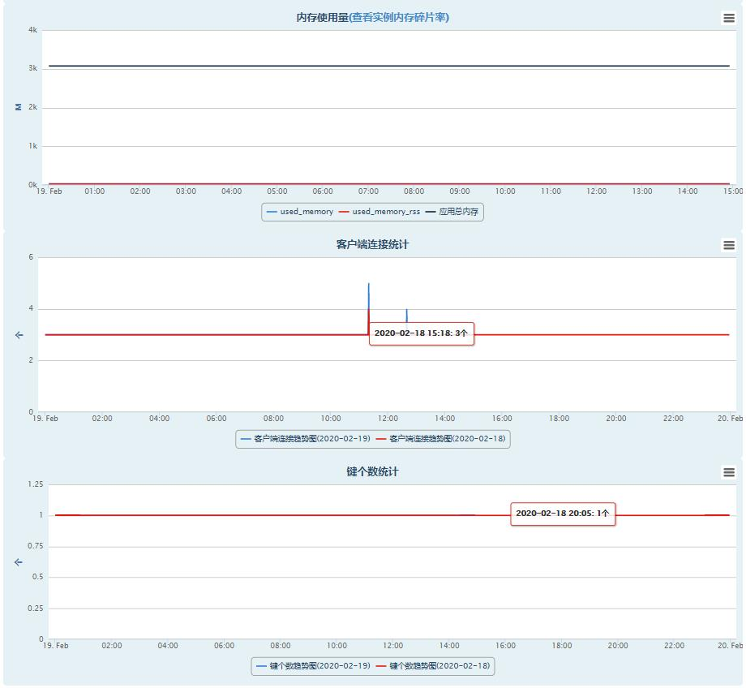

    - 扩容/缩容，在应用统计信息页面，点击申请扩容，弹出如图弹框，按照要求填写对应信息，提交。提交成功后，将收到进度邮件。
    
   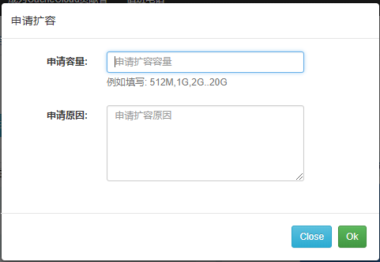
   
    - 客户端统计

- 命令曲线，命令曲线展示了该应用下执行最频繁的5个命令的执行次数趋势比较图，可以点击不同命令查看个命令的趋势图。

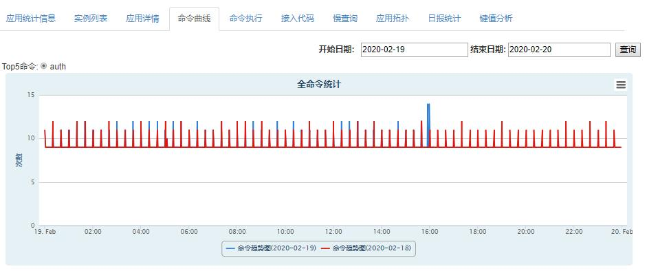

### 二、客户端统计

应用首页查看客户端统计，主要客户命令调用，异常统计情况。
某个客户端调用/流量/耗时
具体命令调用/流量/耗时

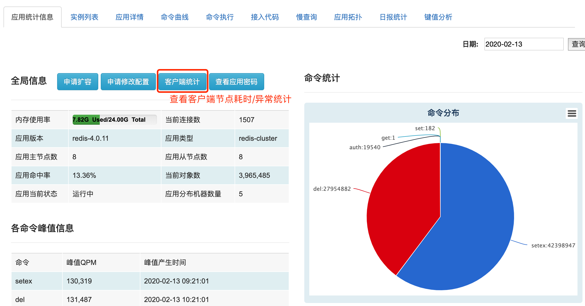

- 客户命令调用统计，展示应用下命令调用全局统计情况，包括命令调用次数、命令平均耗时、输入/输出流量趋势。

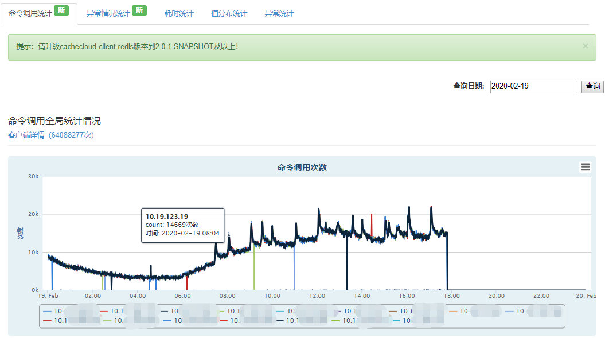
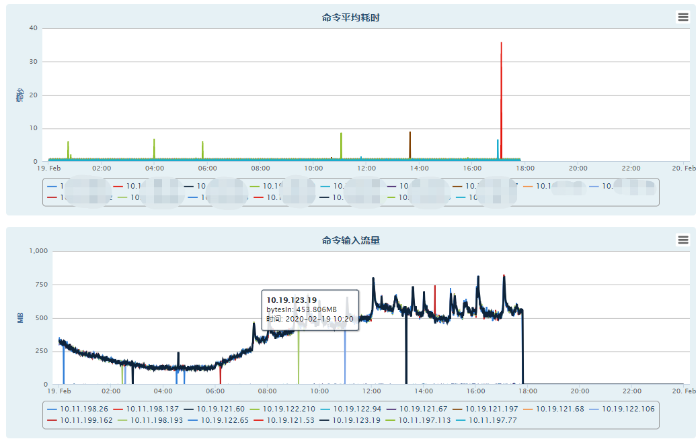
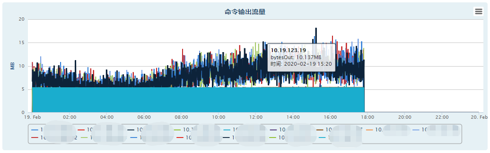
    
**点击“客户端详情”，查看不同客户端下各命令的调用情况。**

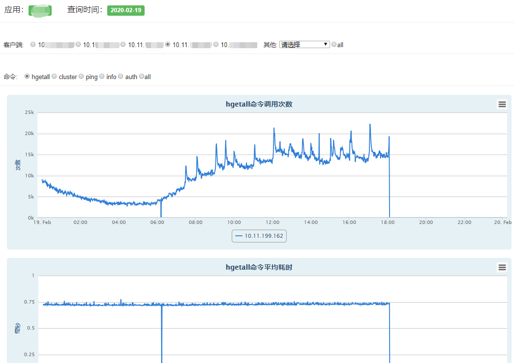

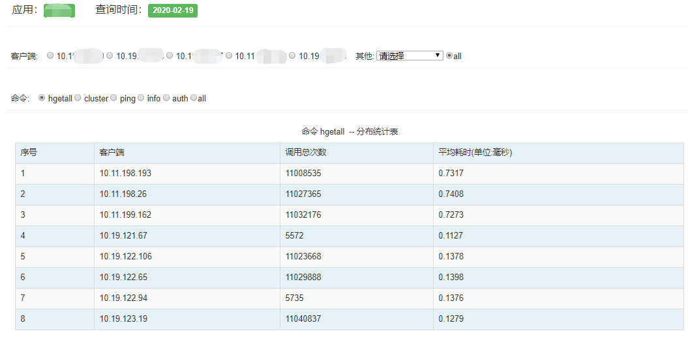

- 客户端异常情况统计：展示应用下异常情况全局统计情况，包括异常次数、异常平均耗时趋势。

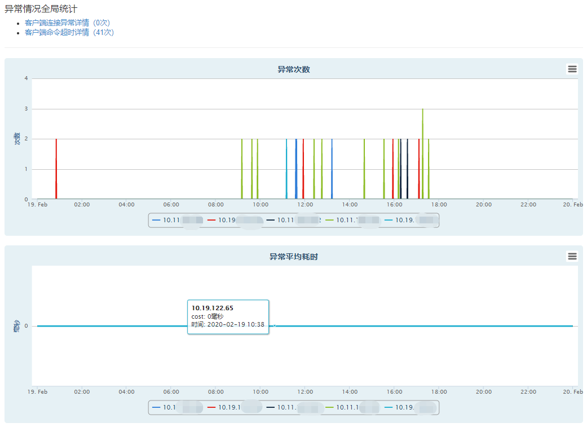

**异常分为客户端连接异常及命令调用超时异常，可分别点击“客户端连接异常详情”和“客户端命令超时详情”查看不同客户端下对应的异常情况。**

**1.客户端连接异常详情**

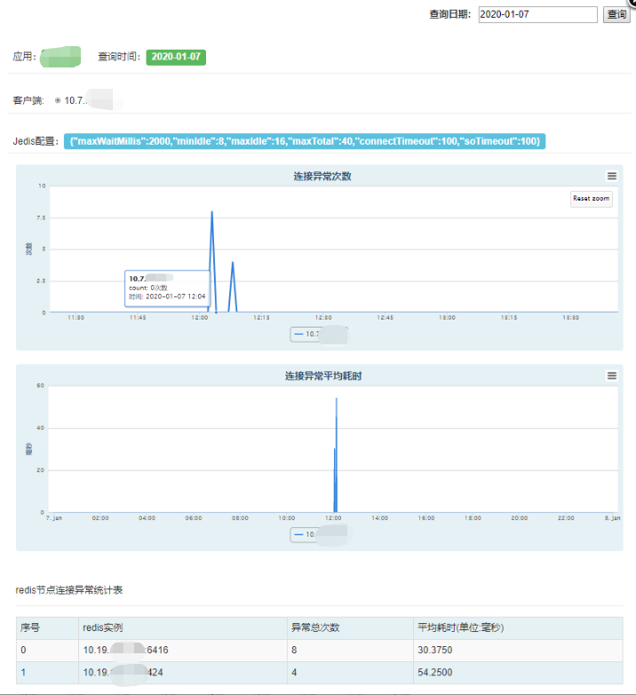

**2.客户端命令超时详情**

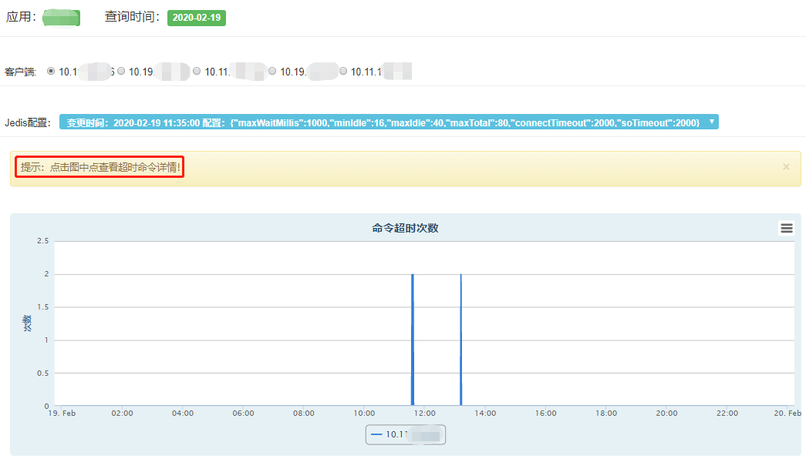

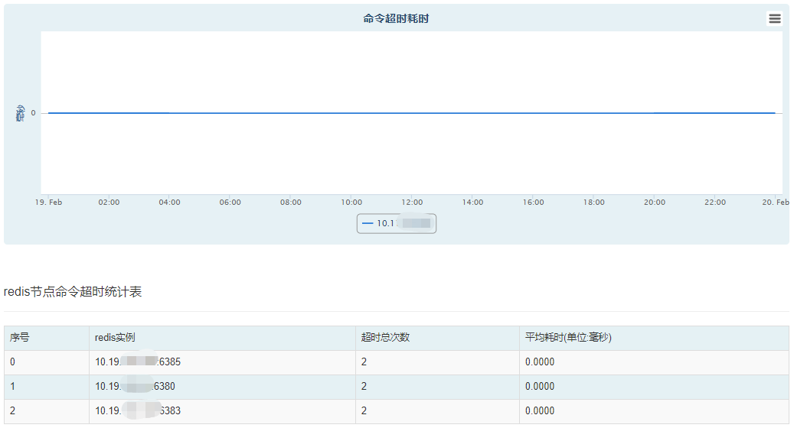

    点击图中点查看超时命令详情，包括命令的执行时间，命令明文，参数明文和字节数信息，如下图：
    
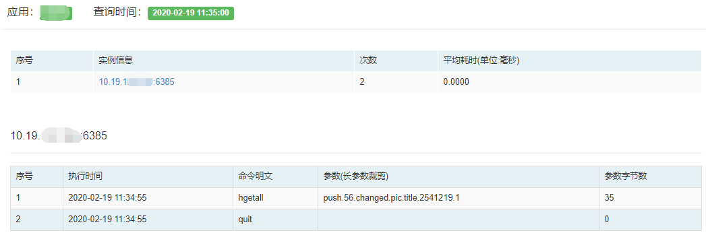
 
 