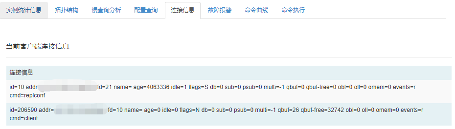

## 连接信息

支持查看当前客户端连接信息，包括客户端ip、连接数、客户端类型，点击”查看实例连接信息“可查看具体redis实例下的连接信息。

- 应用客户端：该分类下展示用户端连接信息，可通过查看此连接确认是否有用户使用该应用，为应用迁移/下线提供极大便利；
- cc客户端：该分类下展示CacheCloud客户端的连接信息；
- redis客户端：该分类下展示redis实例连接信息；
- 所有客户端：该分类下展示所有客户端连接信息。