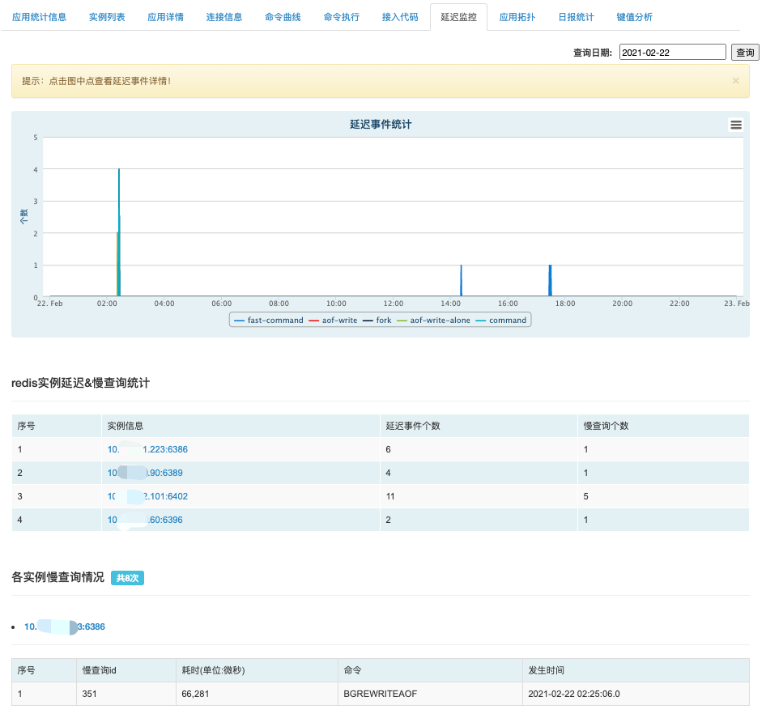
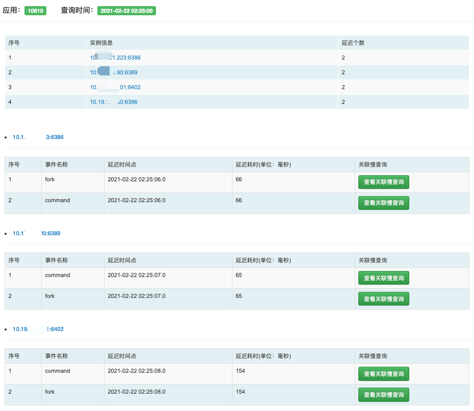

## 延迟监控

延迟监控统计了应用下发生的”延迟事件“。根据发生事件点，将”延迟事件“和”慢查询命令“对应，更好的辅助用户发现、定位redis的使用问题。

- 延迟事件统计：统计了各延迟事件数量的趋势图，点击图中点可查看延迟事件详情，如下图：查看某个时间点下某个redis实例发生的延迟事件，关联的慢查询情况等。

- redis实例延迟&慢查询统计：统计每个redis实例下发生的延迟事件数和慢查询数。
- 各实例慢查询情况：展示详细的实例下慢查询情况。

