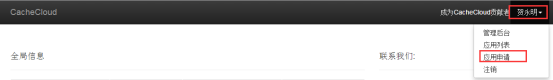
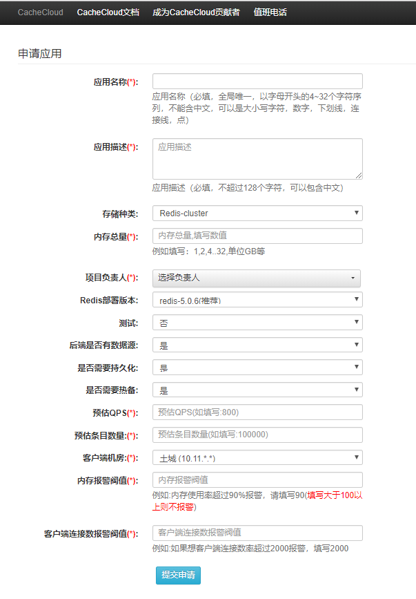
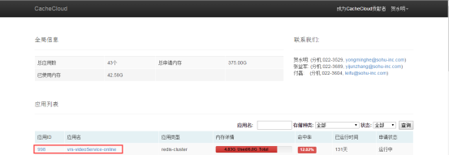
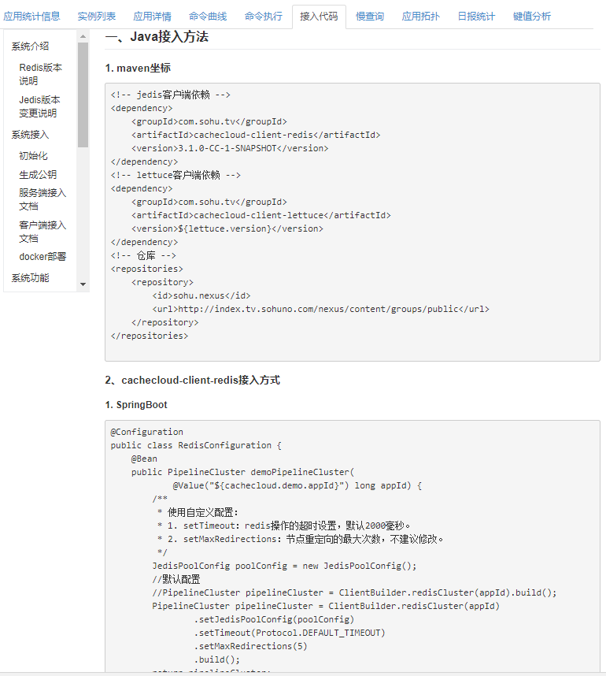
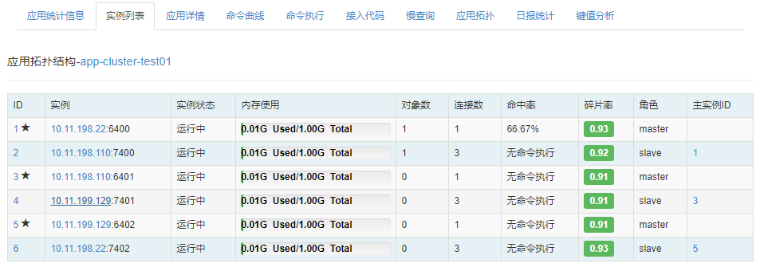
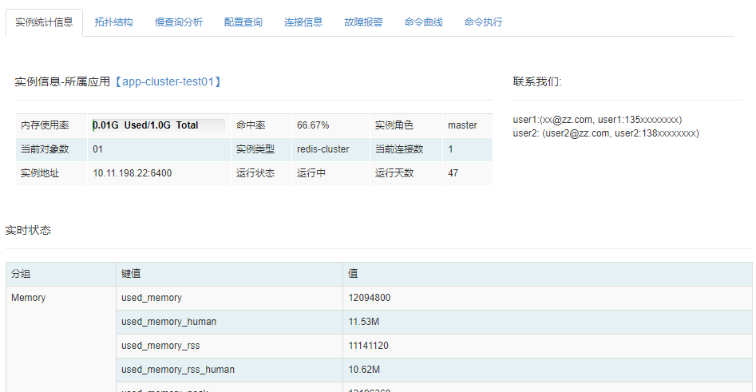
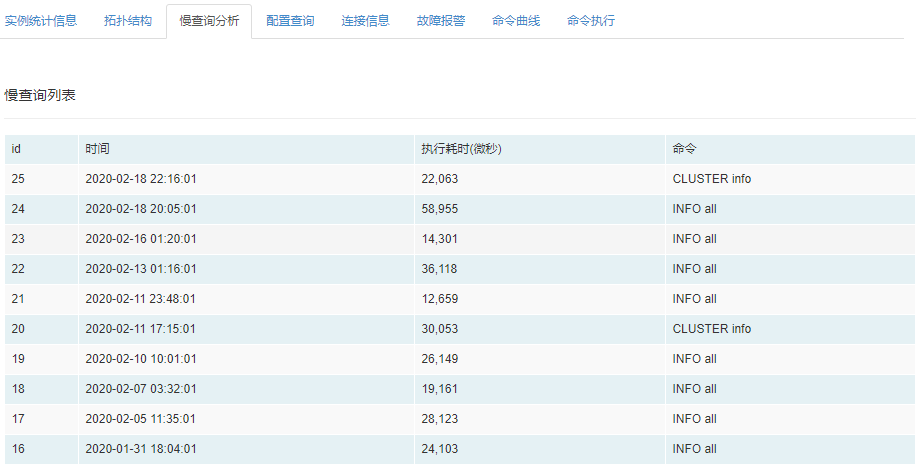
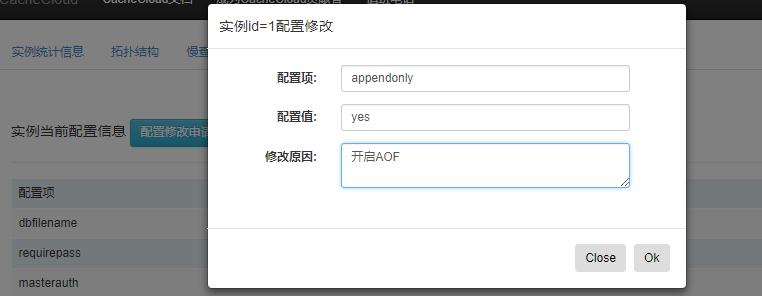

<a name="cc1"/>

客户端模块介绍用户使用CacheCloud平台功能，包括客户端接入、应用/实例监控数据曲线展示、shell命令执行平台及报警权限设置等功能。

## 一、总体使用流程
用户使用CacheCloud平台总体流程如下：

<a name="cc2"/>

## 二、账户申请

在执行所有操作之前，用户首先需要申请一个系统账号。当需要开通账户时，填写相关信息，管理员收到申请邮件时确认开通。

- 进入CacheCloud首页，点击注册按钮

- 填写用户相关信息

<a name="cc3"/>

## 三、应用申请
- 首次登录系统，如下图所示，点击右上角自己的姓名，在弹出的下拉框中选择应用申请。

- 弹出应用申请界面，如下图所示，按要求填写应用需求，提交申请即可。提交申请后，您将收到应用申请的邮件提醒及处理进度。

<a name="cc4"/>

## 四、应用接入Demo
- 当您的应用申请流程全部完成后(收到应用已经开通的邮件)，您可以开始使用您的应用。登录系统后，您会看到您申请及负责的应用列表，例如登录后，可以看到一个id为998的应用。如下图所示，点击应用id或应用名，进入应用详情页面。

- 点击接入代码tab页，如下图所示，查看使用[代码demo](#access)，参考demo代码进行测试和使用。

<a name="cc5"/>

## 五、统计信息
当您的应用开始使用后，您可以按照如下步骤查看应用统计数据和各实例统计数据。如第四章中所述，进入应用详情页面后，可以看到应用统计信息、拓扑结构、应用详情、命令分析，命令执行、接入代码、慢查询等。接入代码已经在上一节中做过阐述，本章中，我们将依次查看应用统计信息等其他功能。

- 在页面详情页，默认展示应用统计信息，可以看到全局信息、命令统计、各命令峰值信息，全命令统计、命中统计、网络流量等全天统计曲线。按照顺序，
  + 全局信息：展示应用的全局信息，包括内存使用率、当前连接数、应用redis版本、应用类型、主从节点数、命中率、当前对象数、当前状态及分布的机器数；
  + 命令统计：展示当前应用执行最频繁的5个命令的分布情况；
  + 各命令峰值信息：展示当前应用执行最频繁的5个命令的峰值统计；
  + 全命令统计：展示当前应用的命令执行次数趋势图；
  + 命中统计：展示当前应用的命中次数趋势图；
  + 网络流量：展示应用的输入输出流量趋势图，亦可查看应用下各实例的网络输入输出流量；
  + CPU消耗：展示应用的CPU消耗情况趋势图，亦可查看应用下各实例的CPU消耗情况趋势；
  + 内存使用量：展示应用的内存使用情况趋势图，亦可查看应用下各实例的内存碎片率情况；
  + 客户端连接统计：展示该应用下客户端连接数趋势图；
  + 键个数统计：展示该应用下键个数趋势图。
  

    - 扩容/缩容，在应用统计信息页面，点击申请扩容，弹出如图弹框，按照要求填写对应信息，提交。提交成功后，将收到进度邮件。
    
   
   
    - 客户端统计

- 命令曲线，命令曲线展示了该应用下执行最频繁的5个命令的执行次数趋势比较图，可以点击不同命令查看个命令的趋势图。

<a name="cc6"/>

## 六、应用详情、拓扑、扩容/缩容、命令执行

在应用详情页面，还剩下实例列表、应用详情、命令执行、应用拓扑页面，本节中将描述这部分功能。

- 实例列表，展示应用下各实例的具体情况，可以看到该应用的具体实例分布情况，包括ip、端口，实例状态，角色以及关联实例的id，根据应用类型的不同，可能会有区别。

- 应用拓扑，展示应用实例在各机器上的分布情况。

- 应用详情，运维应用详情，配置应用报警，管理用户下的用户。

- 接入代码，参考[“应用接入Demo”](#cc4)

<a name="cc7"/>

## 七、实例信息查看及配置修改

- 实例统计信息：在实例列表界面中，点击实例id可以跳转到实例信息页面，默认展示实例的统计信息，在实例页面可以看到菜单。

- 其中拓扑结构，命令曲线，命令执行参考应用相关操作。

- 慢查询分析：Redis实例中，可以对慢查询进行查看分析，点击慢查询分析，如下图，可以看到实例的慢查询操作。

- 配置查询：点击配置查询可以对当前配置信息进行查询，如下图，根据应用需求，可以对配置信息进行修改，点击申请修改配置，如下图，按照要求填写信息，提交后会收到处理进度邮件。

- 连接信息：查看当前客户端连接信息。

- 故障警报：展示当前实例故障情况。

<a name="cc8"/>

## 八、CacheCloud Shell Console

在应用或实例页面，点击命令执行，如下图，打开命令执行tab页面，可以在console中执行只读命令。

<a name="cc9"/>

## 九、权限管理及报警阀值设置

在应用对应页面，点击应用详情，打开本应用的详情页面，可以看到应用详情，报警指标，用户管理。如下图，
- 对应用信息进行修改；
- 对需要接收该appId报警信息的人员进行管理；
- 对报警指标进行设置和管理。

<a name="cc10"/>

## 十、客户端使用统计

应用首页查看客户端统计，主要客户命令调用，异常统计情况。
某个客户端调用/流量/耗时
具体命令调用/流量/耗时

- 客户命令调用统计，展示应用下命令调用全局统计情况，包括命令调用次数、命令平均耗时、输入/输出流量趋势。

    
**点击“客户端详情”，查看不同客户端下各命令的调用情况。**

- 客户端异常情况统计：展示应用下异常情况全局统计情况，包括异常次数、异常平均耗时趋势。

**异常分为客户端连接异常及命令调用超时异常，可分别点击“客户端连接异常详情”和“客户端命令超时详情”查看不同客户端下对应的异常情况。**

**1.客户端连接异常详情**

**2.客户端命令超时详情**

    点击图中点查看超时命令详情，包括命令的执行时间，命令明文，参数明文和字节数信息，如下图：
    

<a name="cc11"/>

## 十一、应用分析

键值分析主要用来分析应用BigKey/过期键/键值分布等情况。

