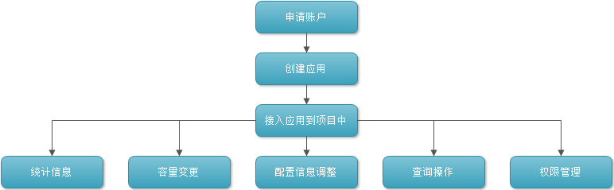

<a name="cc1"/>

客户端模块介绍普通用户使用CacheCloud平台功能，包括账户申请、应用管理和我的申请三大模块。

- 账户申请：用户首次使用CacheCloud执行所有操作之前，用户首先需要注册一个系统账号；
- 应用管理：用户可以查看、管理自己名下的redis应用，包括应用的统计信息、应用详情、实例列表、连接信息、命令曲线、延迟监控和日报统计等；
- 我的申请： 用户可以查询、申请对自己名下redis应用的相关操作，保留申请应用、导入应用、数据清理、诊断应用等操作。

用户使用CacheCloud平台总体流程如下：

