## 我的申请
Cacheloud系统提供完善的工单申请-审批流程。用户可以提交自己名下相关应用的工单申请，由管理员驳回/处理、通过后，一条完整的工单流程执行完毕。 

### 我的工单

- 点击"我的申请"进入工单列表界面：

  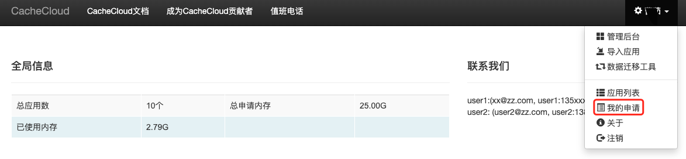

  展示了工单申请/处理情况汇总，每条工单具体的记录，工单状态分为：待审、已受理、通过、驳回，工单受理后显示处理人。

  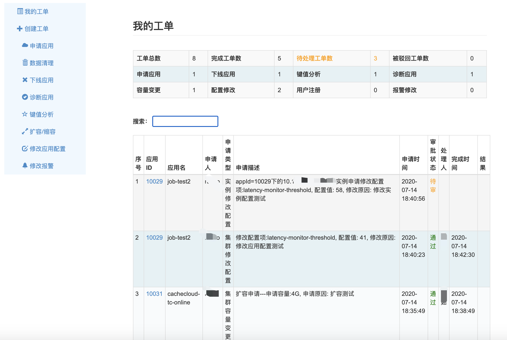

### 创建工单

- "创建工单"按不同类型分为：申请应用，应用导入，数据清理（全库清理/删除数据），下线应用，数据迁移，诊断应用，键值分析，扩容/缩容，修改应用配置和修改报警等。

    a.应用申请：

    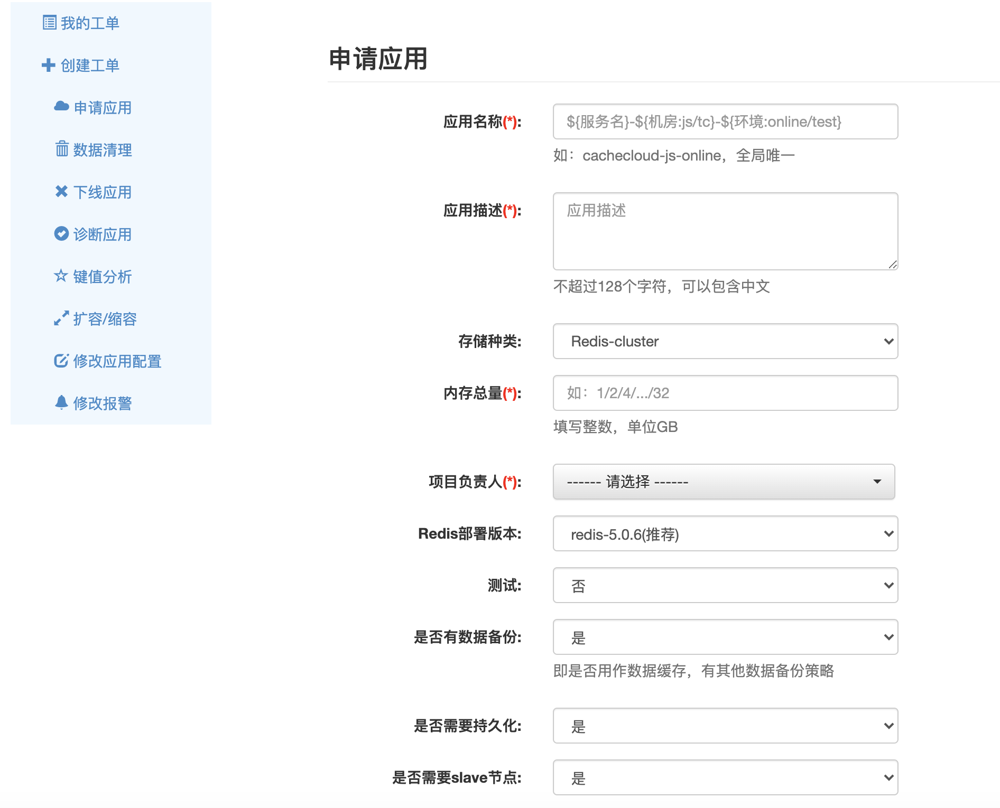 
   
    b.导入应用：用户将现有redis实例导入cachecloud平台，进行集中管理。
  
	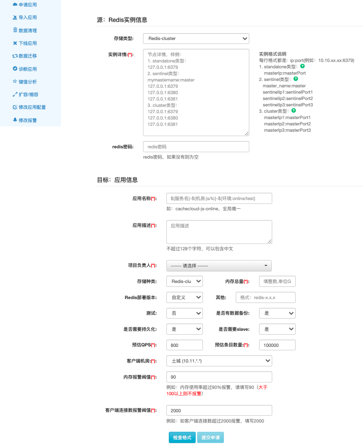 

    c.数据清理：分为全库清理和删除数据
    
    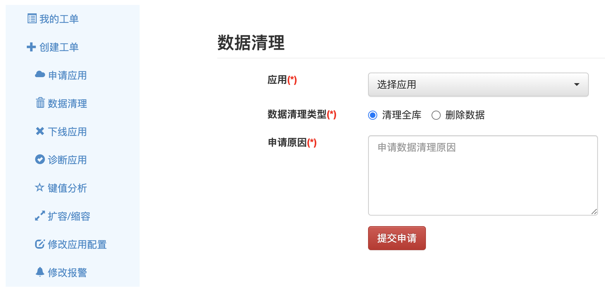 

    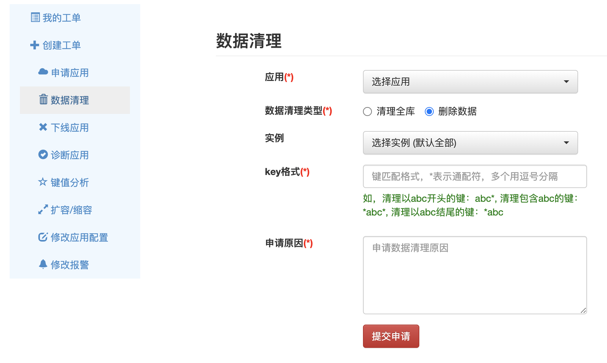

    d.下线应用：
    
    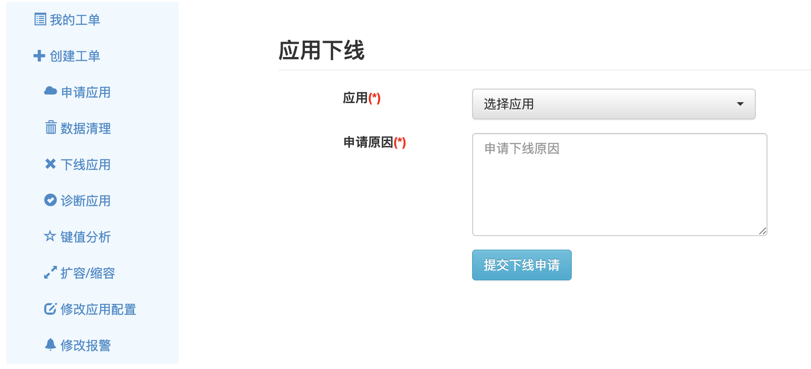 
    
    e.数据迁移：将redis数据迁移到新的应用下
    	
	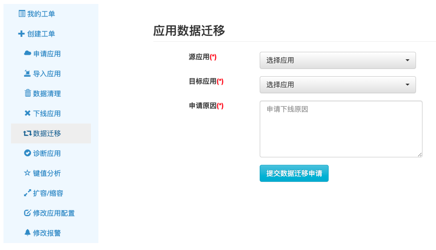 

    f.诊断应用:
    
    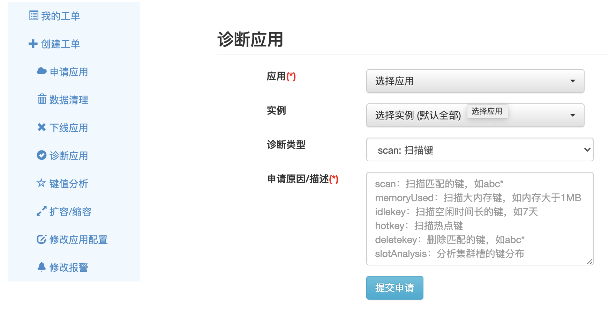 

    g.键值分析:
    
    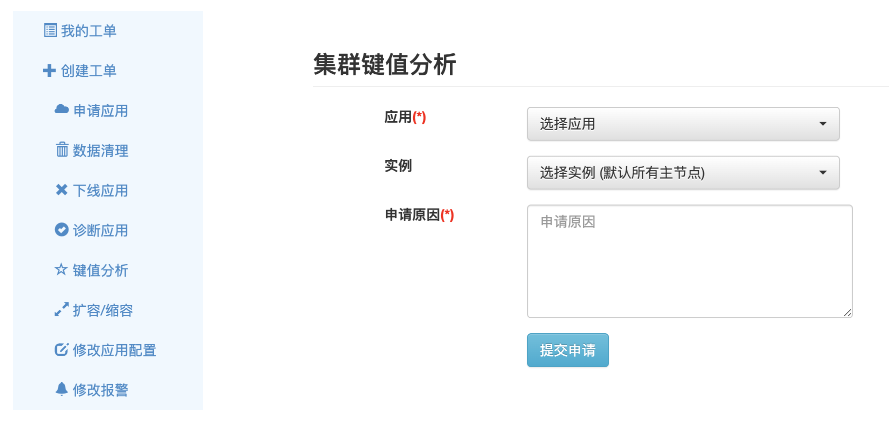 

    h.扩容/缩容:
    
    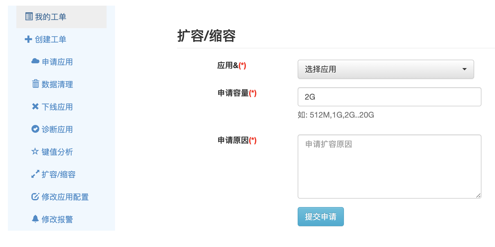 

    i.修改应用配置:
    
    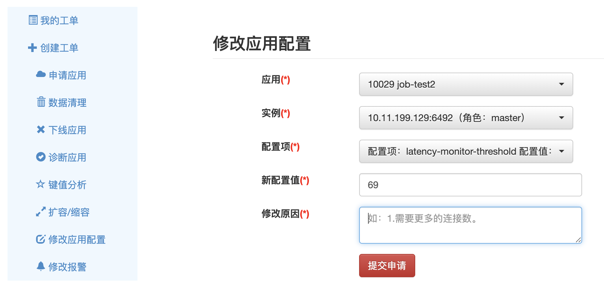 

    g.修改报警:
    
    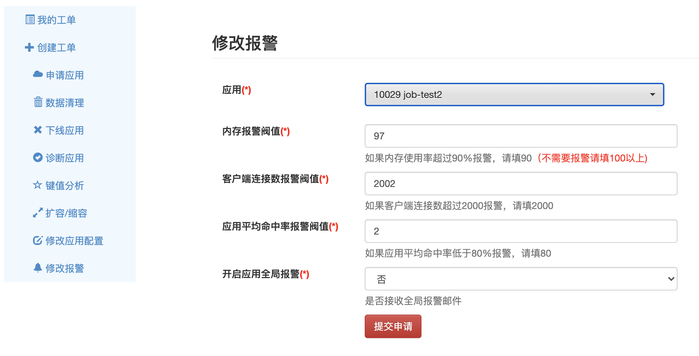 
   