###### 目录
* [1. 应用运维](#cc1)
	- [管理应用实例](#cc1-1)
	- [管理应用模块](#cc1-6)
	- [应用机器列表](#cc1-2)
	- [应用详情和审批列表](#cc1-3)
	- [应用密码修改](#cc1-4)
	- [应用拓扑诊断](#cc1-5)
* [2. 应用迁移](#cc2)
* [3. 应用下线](#cc3)
* [4. 版本升级](#cc4)

## 应用运维

管理员在应用运维中可查看应用列表，了解各应用的使用情况，如版本、类型、内存详细、碎片率等，并对应用进行一系列的管理操作。

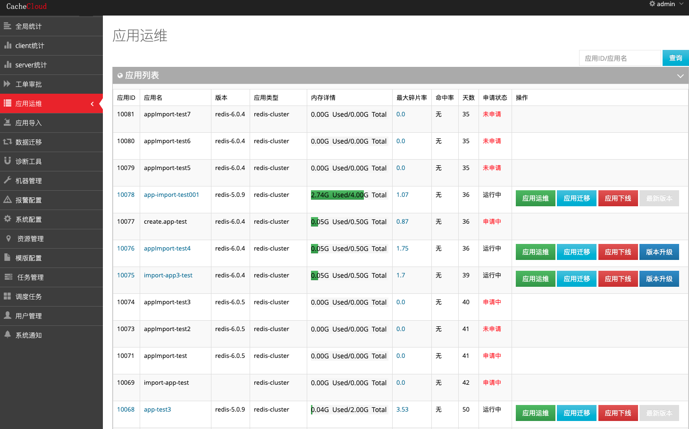

<a name="cc1"/>
### 应用运维
点击”应用运维“操作，可管理应用实例、查看应用机器列表，应用详情和审批列表，修改应用密码等。

<a name="cc1-1"/>
#### 管理应用实例

**1. Redis Sentinel类型应用**

a. 一键添加sentinel节点  
b. 一键Failover  
c. 上下线实例  
d. 添加slave节点  
e. 查看操作日志  
f. 修改配置 

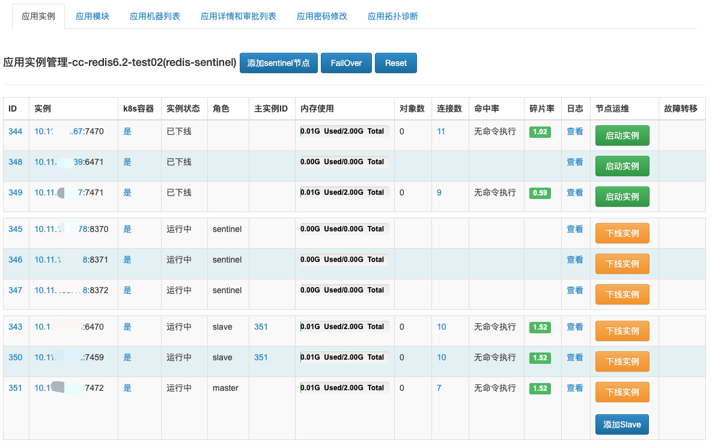

<a name="cc2-1-cluster"/>

**2. Redis Cluster应用类型**

a. 添加Slave  
b. 一键Failover  
c. 上下线实例  
d. 查看操作日志  
e. 修改配置  
f. config/restart（修改配置/滚动重启）

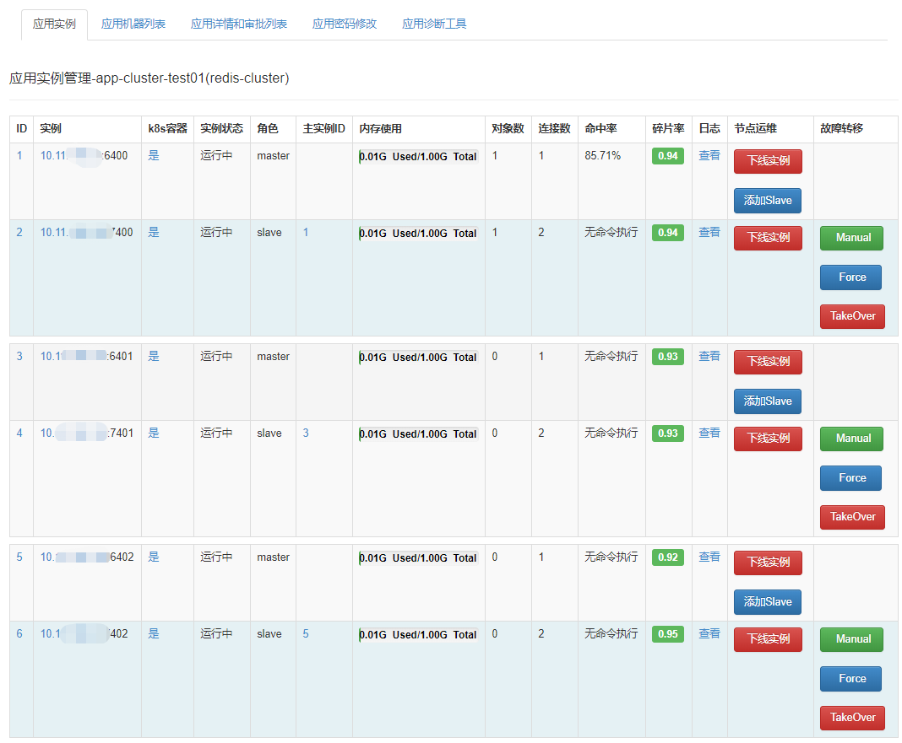

<a name="cc1-6"/>
#### 管理应用模块

查看机器集成模块情况，实例装载模块情况，安装模块，查看实例日志等。

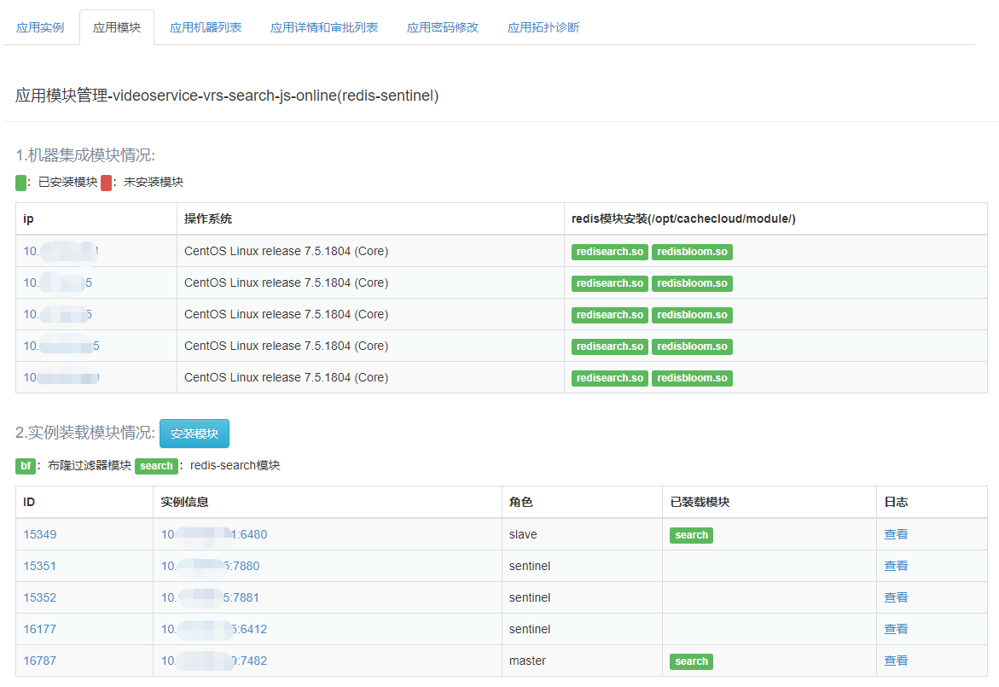

<a name="cc1-2"/>
#### 应用机器列表

查看该应用分布机器的使用情况，包括内存使用率、已分配内存、cpu使用率等信息。

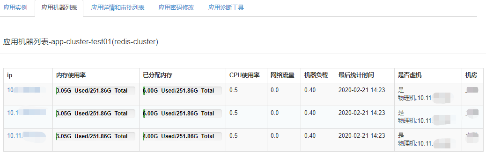

<a name="cc1-3"/>
#### 应用详情和审批列表

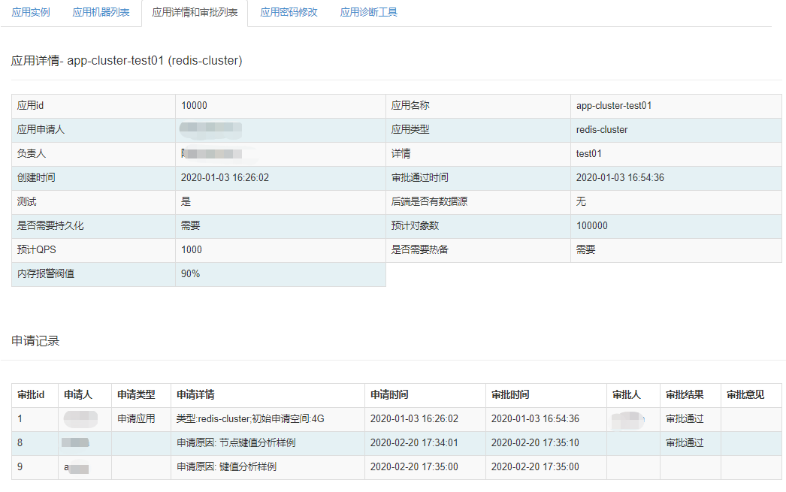

<a name="cc1-4"/>
#### 应用密码修改

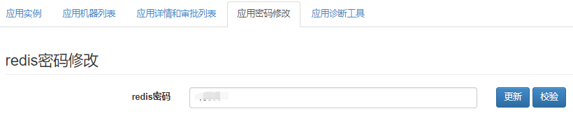

<a name="cc1-5"/>
#### 应用拓扑诊断

提供对应用拓扑分布规范的检查功能，便于发现问题，做出调整。

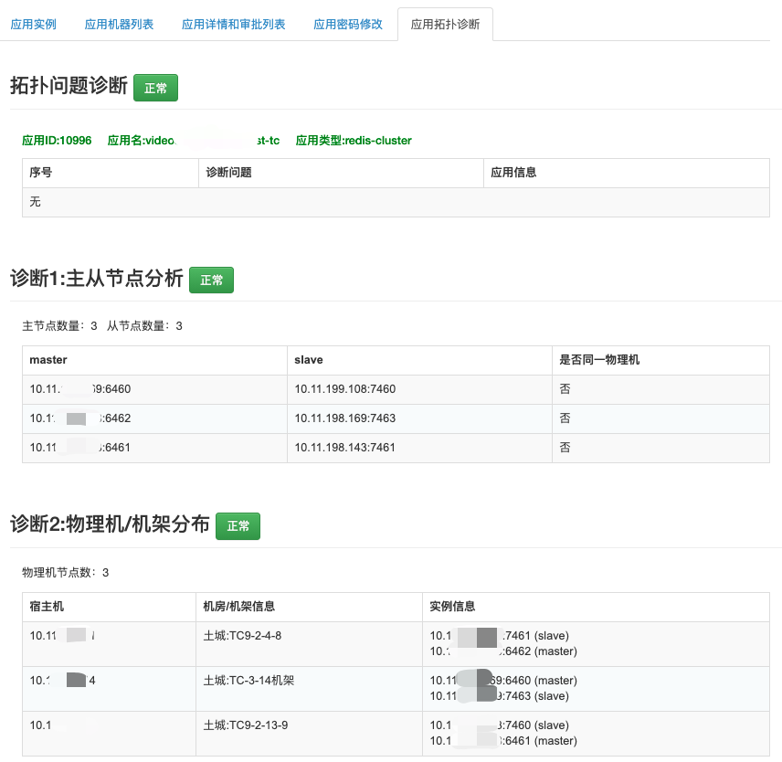

<a name="cc2"/>
#### 2.应用迁移

在CacheCloud后台的“应用运维”页面，选择要进行迁移的应用，点击“应用迁移”。 这种迁移方式不会更换应用的appId，通过主从节点的failover实现，是对客户端无感知迁移。注意：此操作通过failover实现节点切换，仅支持同redis版本/小版本应用的迁移升级。

应用迁移整体包含八个主要步骤：

+ (1) 应用信息：查看源应用的实例IP，角色和Redis版本等信息，选择迁移的目标机房和迁移机器；

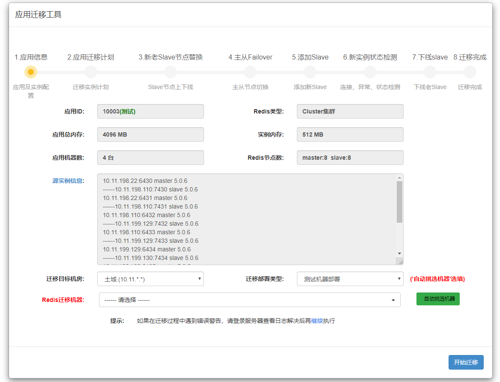

+ (2) 应用迁移计划：这一步主要查看节点的变更信息，新增实例（Slave）的IP和端口号，点击继续进行新老Salve节点的替换；

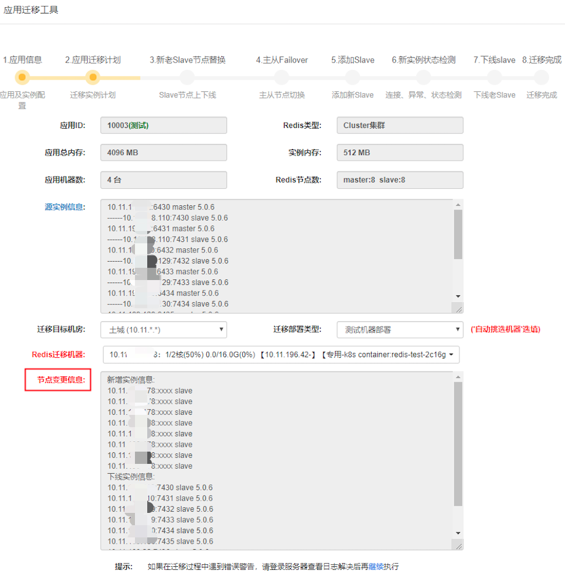

+ (3) 新老Salve节点替换: 替换完成之后查看最新实例信息，点击继续，进行主从切换；

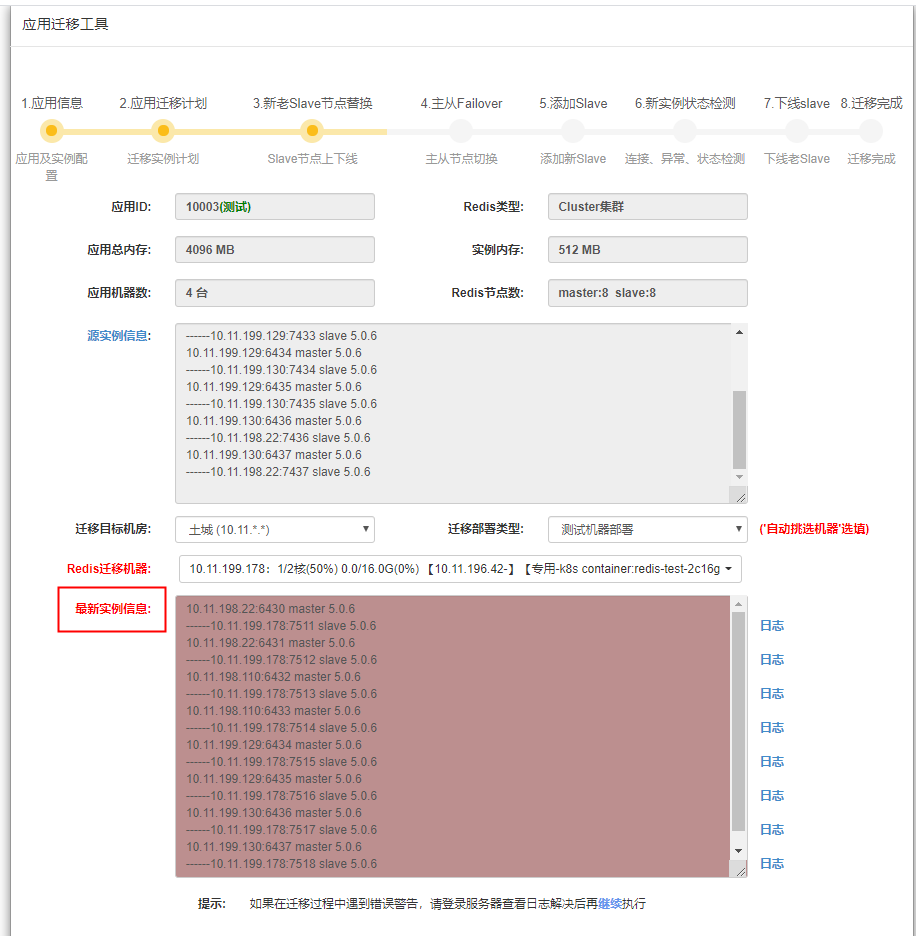

+ (4) 主从Failover: 完成主从节点切换，点击继续，添加新的Slave；

+ (5) 添加Slave: 添加新的Slave；

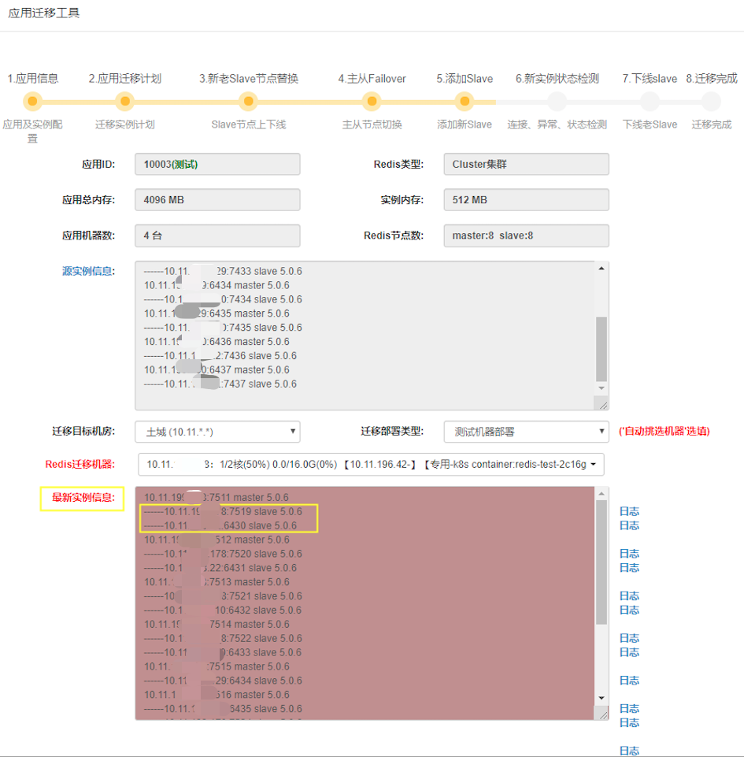

+ (6) 新实例状态检测：检查新实例的连接状态，是否异常，点击继续，下线老的Slave；

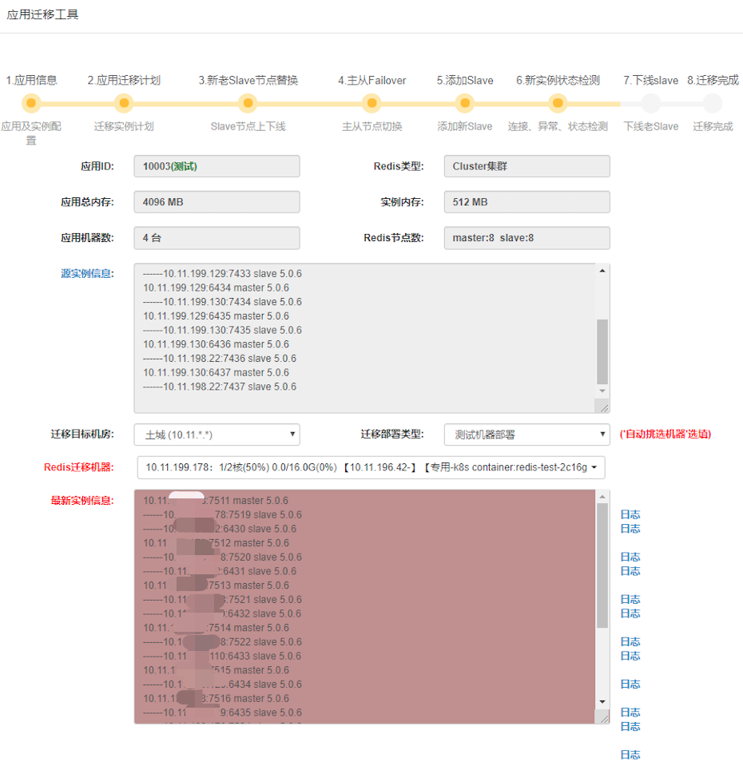

+ (7) 下线Slave: 下线老的Slave；

+ (8) 迁移完成: 完成迁移。

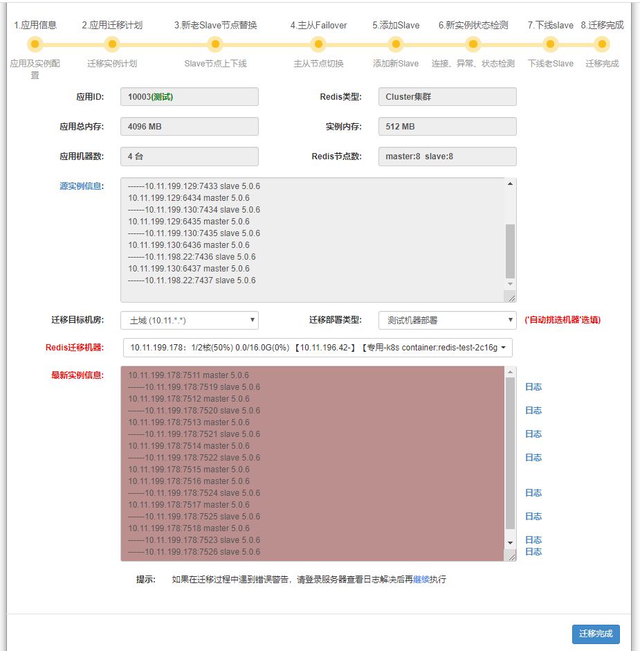

<a name="cc3"/>
#### 3.应用下线

下线当前应用，销毁所有存活节点。点击“应用下线”，跳转到应用下线任务流，可查看下线情况。

<a name="cc4"/>
#### 4.版本升级

升级应用的redis版本。详细操作可参考：[运维手册-Redis版本管理.应用版本升级](../access/redisVersion.md)。