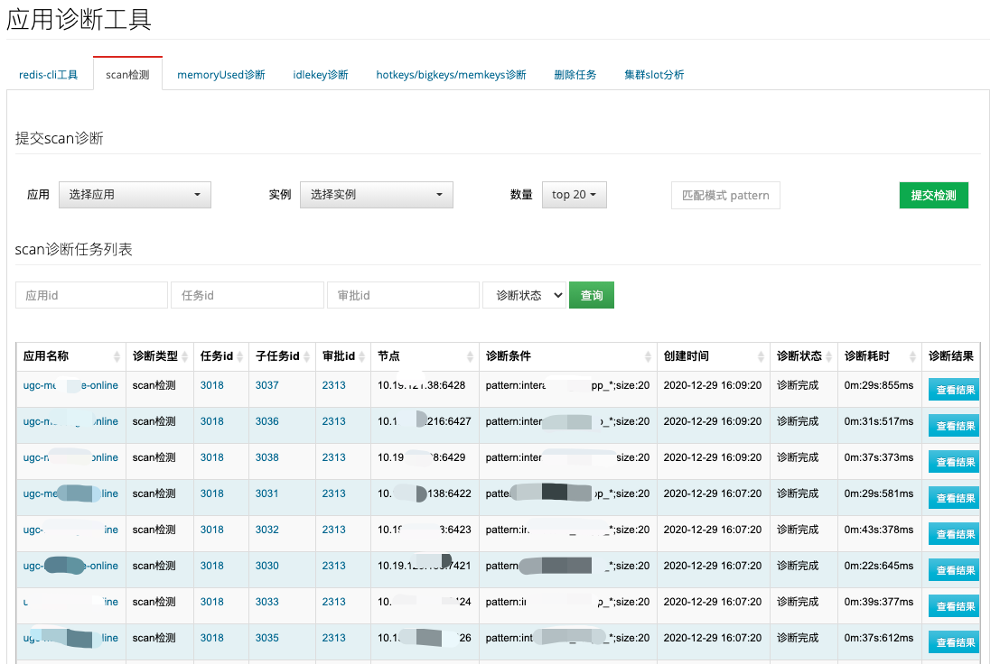
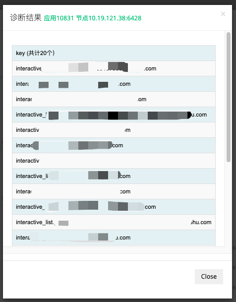
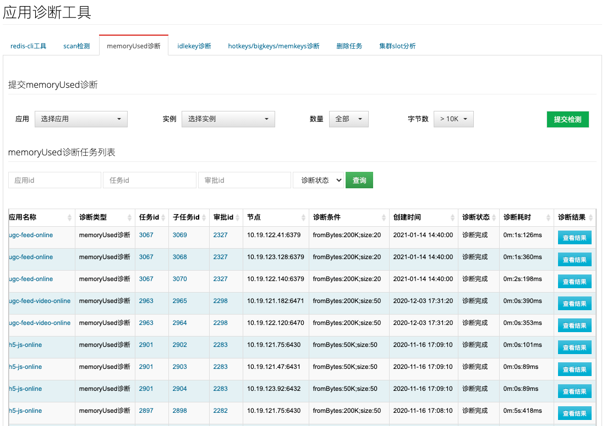
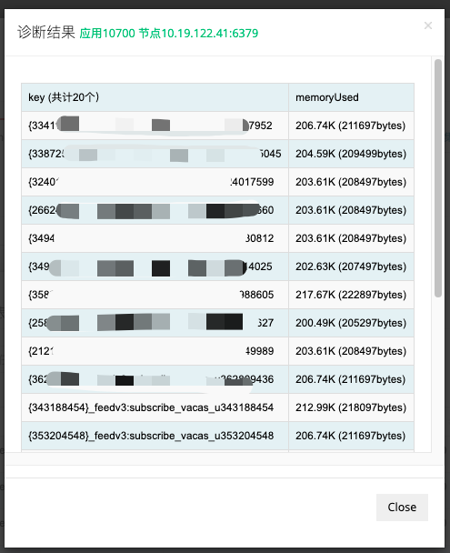
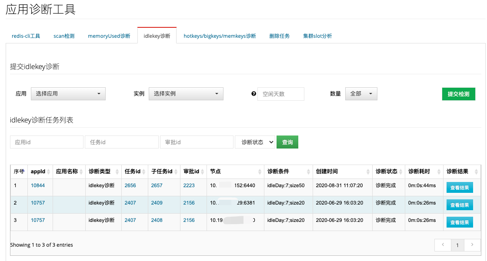
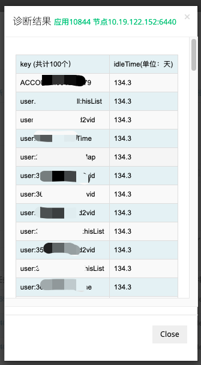
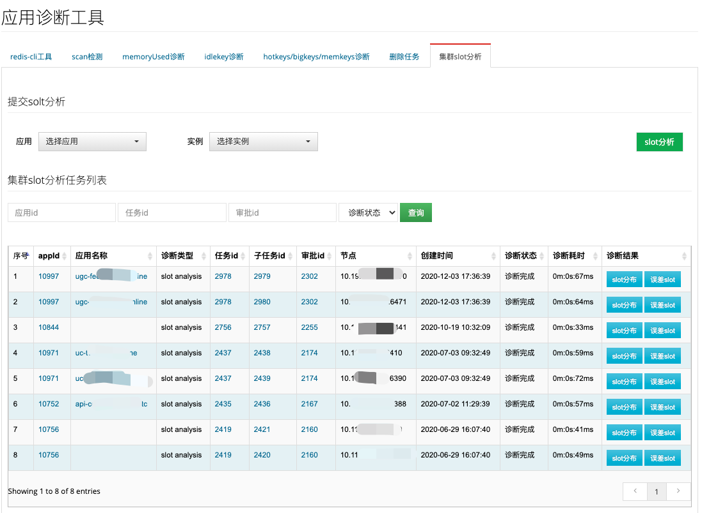
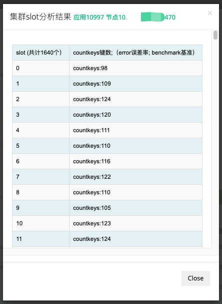

## 应用诊断工具

提供给应用诊断的便捷工具，方便管理员排查应用的问题。

### redis-cli工具

集成redis-cli工具，选择应用和实例，可执行redis-cli命令。

### scan检测

提交scan诊断，选择应用、实例等，扫描匹配的key：

扫描完成后，可查看结果：

### memoryUsed诊断

提交memoryUsed诊断，选择应用、实例、内存占用量，扫描出大key：

执行完成后，可查看结果：

### idlekey诊断

提交idlekey诊断，选择应用、实例、空闲天数，扫描出key：

执行完成后，可查看结果：

### hotkeys/bigkeys/memkeys诊断

采样诊断应用的hotkeys/bigkeys/memkeys，并给出统计结果。

### 删除任务

执行匹配key的删除任务，并统计删除数量。

### 集群slot分析

提交redis集群的slot分布，选择应用、实例，分析出slot上key分布：

分析完成后，可查看结果：slot分布和误差较大的slot

