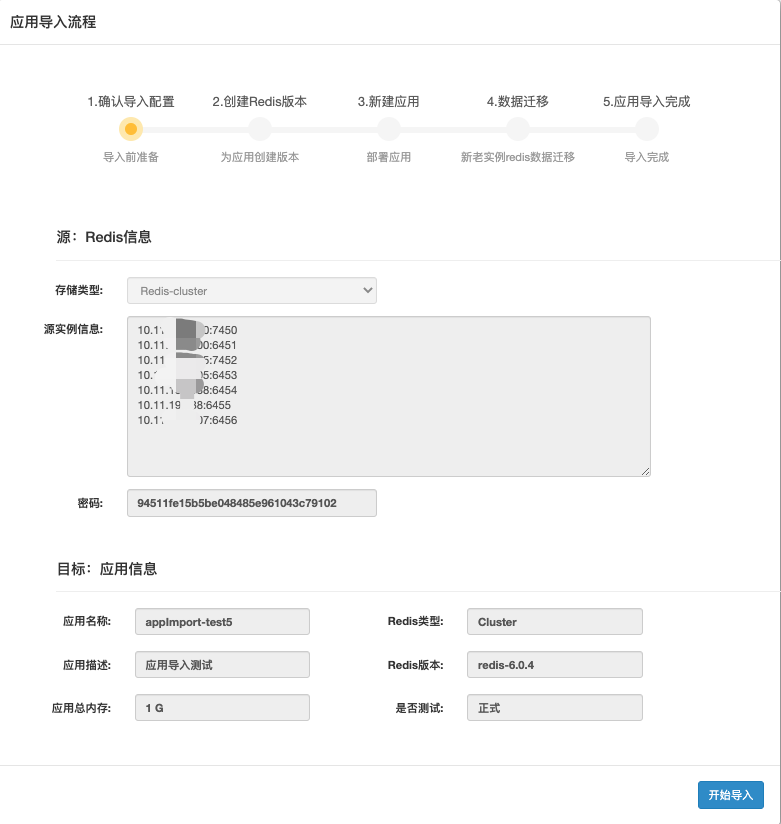
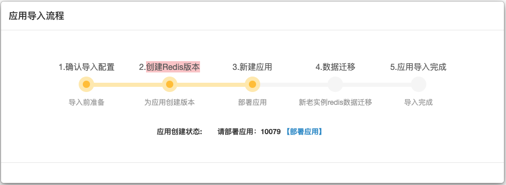
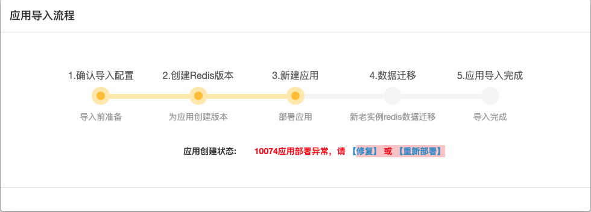
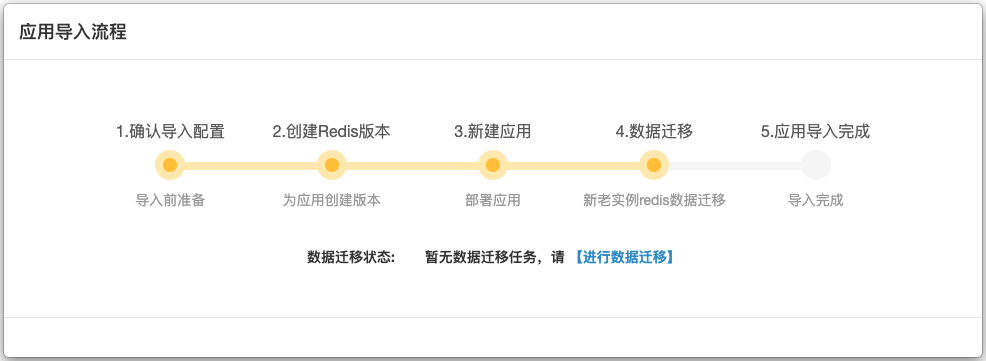
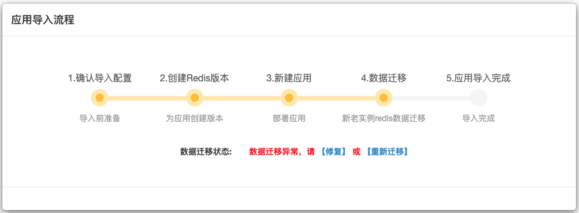
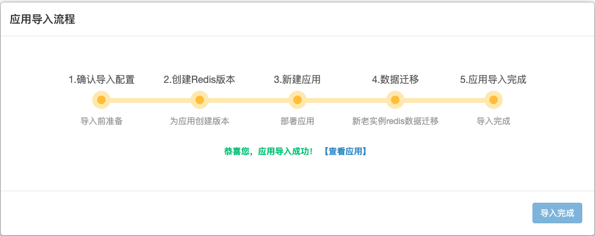

## 应用导入

在使用Cachecloud平台前，用户已有自己部署的redis实例，该功能支持将redis实例导入Cachecloud平台进行运维管理。用户提交的“导入应用”工单信息会记录在此，管理员点击“导入”或者"查看"可以追踪redis实例导入应用的情况。

应用导入共5个步骤，引导用户完成redis实例到Cachecloud应用的导入。

1. 确认导入配置：应用导入前的准备工作，确认源redis实例信息和目标应用信息无误后，点击“开始导入”。

2. 创建Redis版本：系统自动检测平台中是否有满足用户需求的版本号，如果没有，会提示“redis-x.x.x存在”，管理员先“【创建版本】”；如果有满足的版本，直接进入下一步“新建应用”。

3. 新建应用：管理员“部署应用”。

系统自动检测应用部署状态，如果部署出错，会提示管理员“【修复】 或 【重新部署】”应用。当应用部署成功，会进行到下一步“数据迁移”。

4. 数据迁移：进行源redis实例到目标应用间的数据迁移。

系统自动检测数据迁移状态，如果迁移出错，会提示管理员“【修复】 或 【重新迁移】”。当应用数据迁移完毕，会跳转到“应用导入完成提示”。

5. 应用导入完成：应用导入成功，用户可以通过Cachecloud平台管理该应用，旧的redis实例可做下线处理。
