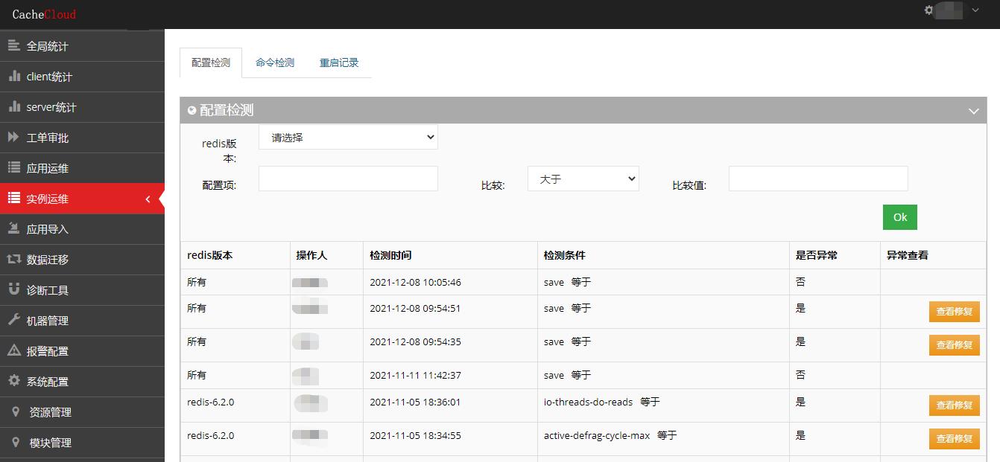
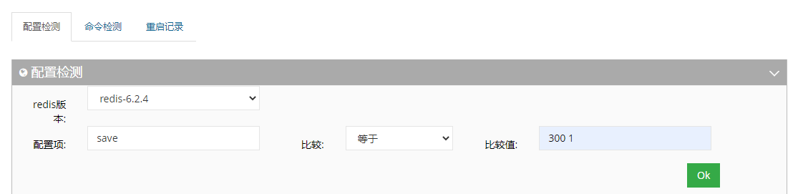
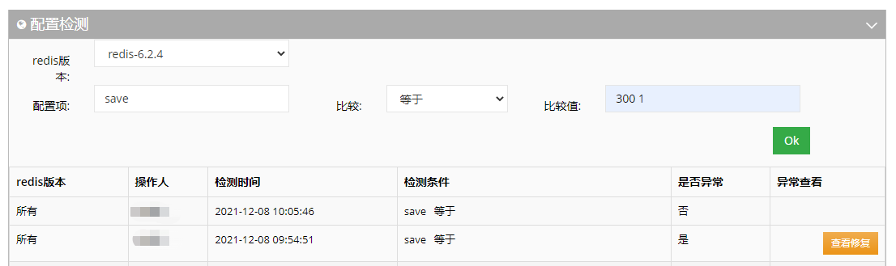
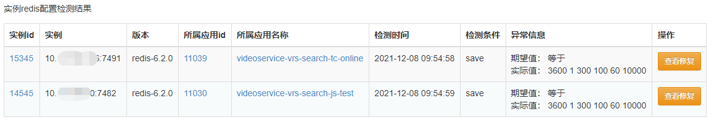
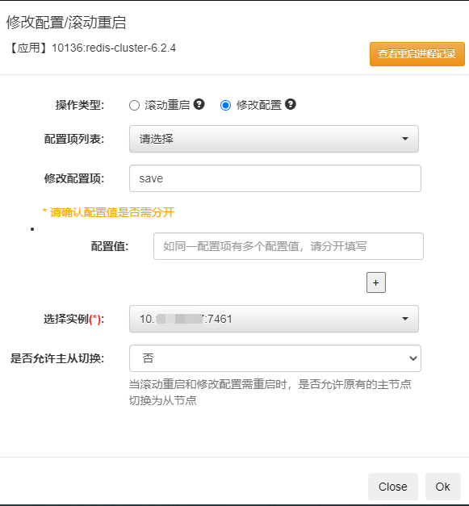
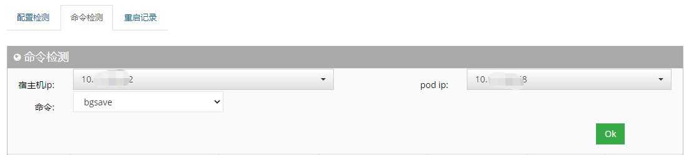
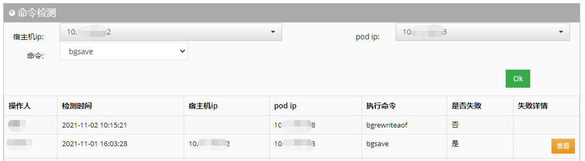
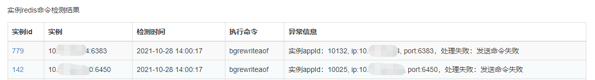
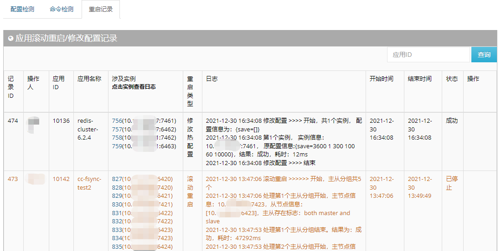

###### 目录
* [实例运维]
	- [1.配置检测](#cc1)
	- [2.命令检测](#cc2)
	- [3.重启记录](#cc3)

## 实例运维

管理员在实例运维中可进行实例配置检测、命令检测，并查看检测结果及修复配置检测问题；此外还可查看修改配置/滚动重启记录。

<a name="cc1"/>

#### 1.配置检测

配置检测，可检测redis实例某个配置项是否符合检测规则。

<a name="cc1-1"/>

#### 设定检测条件

a. 指定redis版本（可选所有及指定某个redis版本）   
b. 填写配置项（配置项需严格按照config中名称进行指定）   
c. 指定比较类型   
d. 指定比较值（如不填写，则与空值进行比较（等同于配置不存在））    

<a name="cc1-2"/>

#### 查看检测异常及修复

a. 确认是否有异常，如果有异常，点击异常查看一列中的“查看修复“按钮    

b. 点击“查看修复“按钮，跳转到实例配置检测异常结果详情页面    

c. 点击异常结果详情页面中的“查看修复“按钮，可跳转到应用运维——应用运维——应用实例页面。    
目前cluster集群下的redis实例可支持直接弹框修改，其他的redis实例，可自行点击对应实例的“修改配置”

<a name="cc2"/>

#### 2.命令检测
命令检测，可检测redis实例执行bgsave/bgrewriteaof命令时，是否会出现crash异常。

<a name="cc2-1"/>

#### 设定检测条件

a. 指定宿主机ip（可选）  
b. 指定pod ip（可选）   
c. 指定命令（bgsave/bgrewriteaof）    
说明：目前支持的两个命令检测操作较重，特别对于单个实例占用内存较大的情况，请不要经常使用，或精确指定执行的范围。

<a name="cc2-2"/>

#### 查看检测结果

a. 确认是否失败，如果失败，点击失败详情一列中的“查看“按钮    

b. 点击“查看“按钮，跳转到实例命令检测结果详情页面    

<a name="cc3"/>

#### 3.重启记录

可查看应用滚动重启/修改配置记录，并可根据应用id进行查询。    
