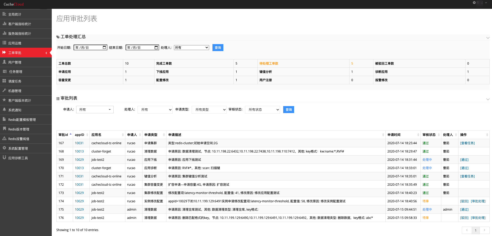
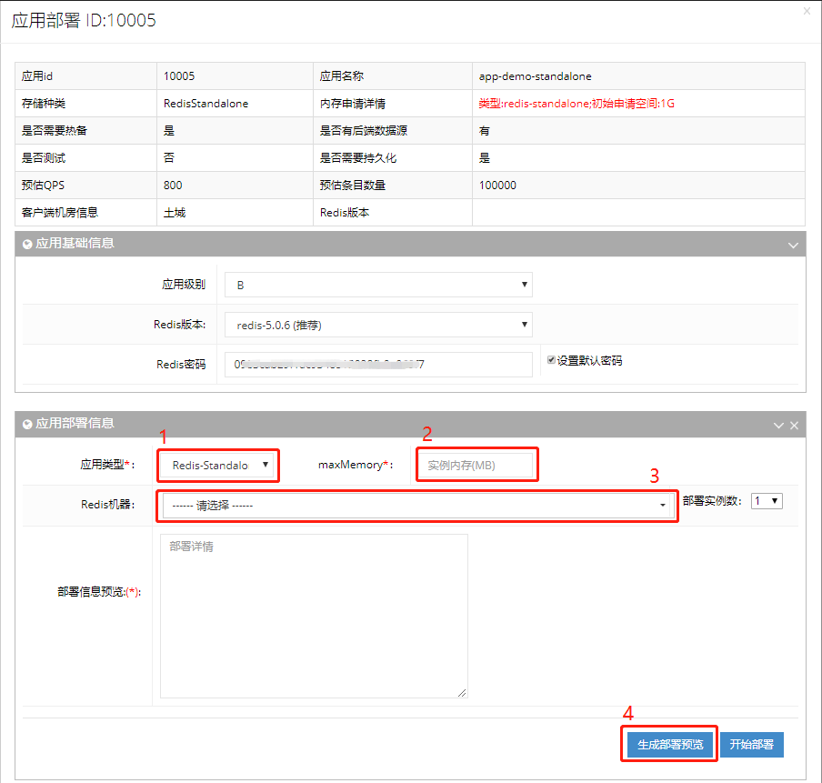
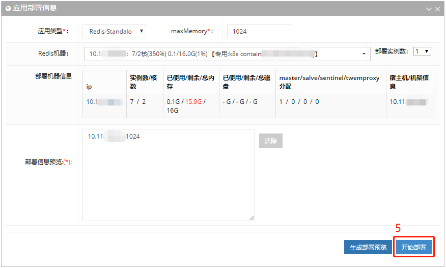
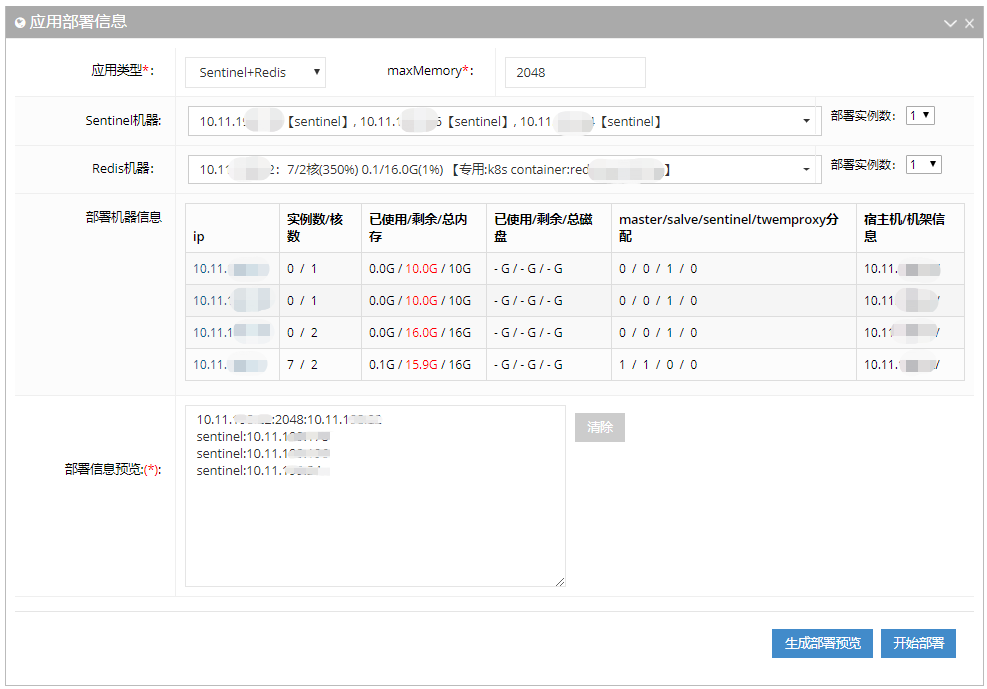
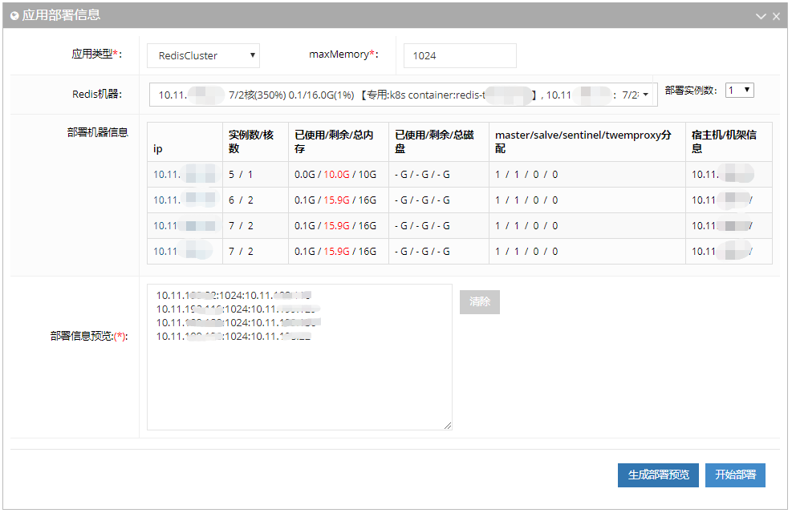
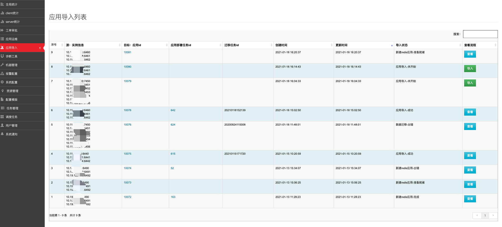
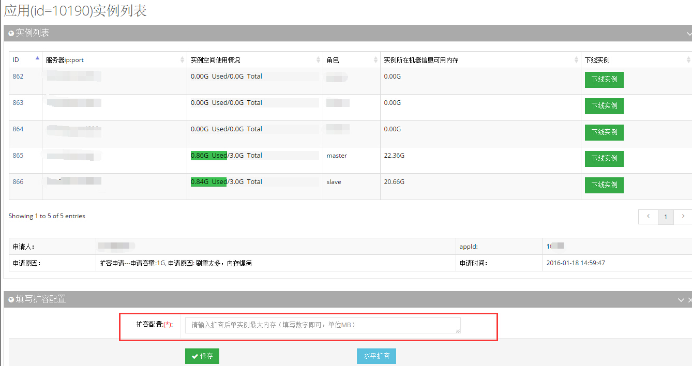
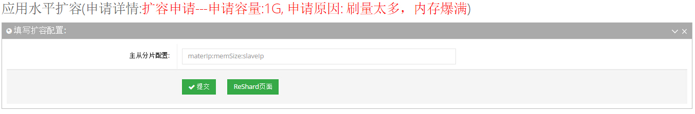
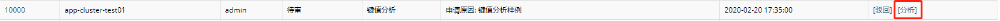
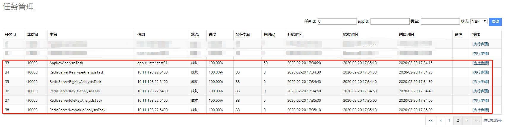

## 工单审批

##### 目录

* [1. 工单类型](#cc1-1)
* [2. 开通应用](#cc1-2)
* [3. 应用导入](#cc1-3)
* [4. 扩容申请](#cc1-4)
* [5. 数据迁移](#cc1-5)
* [6. 数据清理](#cc1-6)
* [7. 应用诊断](#cc1-7)
* [8. 配置修改申请](#cc1-8)
* [9. 注册用户申请](#cc1-9)
* [10. 键值分析](#cc1-10)

Cacheloud系统提供完善的工单申请-审批流程。用户可以提交自己名下相关应用的工单申请，由管理员驳回/处理、通过后，一条完整的工单流程执行完毕。

工单审批界面展示了"工单处理汇总情况"和"审批列表"，用户提交的申请在此进行审批处理。工单状态分为：待审、处理中、通过、驳回，工单受理后显示处理人。

 

<a name="cc1-1"/>

### 1. 工单类型

如下图所示，来自用户的工单有以下几种：

+ 应用申请：用户需要申请开通redis standalone、redis sentinel和redis cluster；
+ 导入应用：用户将现有redis实例导入cachecloud平台，进行集中管理；
+ 应用扩容：用户需要对当前的应用进行内存容量扩容；
+  应用数据迁移：新老应用间数据迁移；
+  清理数据：删除固定前缀的key；
+  应用诊断：诊断应用问题，包括扫描key，诊断bigkey/hotkey等，集群slot分析；
+  应用下线：对无用应用进行下线处理，回收资源；
+ 应用配置修改：用户希望对当前的redis配置做调整；
+ 键值分析：用户申请分析应用BigKey/过期键/键值分布等情况；
+ 注册用户申请：管理员只需要开通或驳回就可以了。

<a name="cc1-2"/>

### 2. 开通应用

	(1). 不同类型的redis，开通使用不同的格式。
	(2). 一键开通中唯一需要的就是机器的IP。
	添加机器时，要综合考虑，用户提交关于客户端的基本信息：QPS、容量、机房、主从等信息，决定选用的什么配置、什么机房的机器。

#### (1) redis-standalone开通
- 如下图，按照步骤填选：

- 点击自动生成“部署预览”，确认部署信息后，点击“开始部署”：

#### (2) redis-sentinel开通

步骤同上

#### (3) redis-cluster开通

步骤同上

详细操作可参考：[运维手册-应用部署](../../wiki/operate/appDeploy.md)。

待应用导入开通，点击”通过“，该工单审批完成。

<a name="cc1-3"/>

### 3. 应用导入

在使用Cachecloud平台前，用户已有自己部署的redis实例，该功能支持将redis实例导入Cachecloud平台进行运维管理。用户提交的“导入应用”工单信息会记录在此，管理员点击“导入”或者"查看"可以追踪redis实例导入应用的情况。

应用导入共5个步骤，引导用户完成redis实例到Cachecloud应用的导入，具体操作请参考：[运维功能-应用导入](../../wiki/function/operation-import.md)。

待应用导入完毕，点击”通过“，该工单审批完成。

<a name="cc1-4"/>
### 4. 扩容申请

- 垂直扩容
在“扩容配置”一栏填写扩容后单实例最大内存即可

- 水平扩容

水平扩容相对麻烦且费时一些，在开通时候管理员尽量根据用户提交的信息(QPS，容量等)，尽量提前预支一些实例，如果还是抗不住，就可做水平扩容。

a. 添加一个redis-cluster节点，格式为masterIp:memSize:slaveIp，并meet到集群中；

b. 迁移slot: 迁移slot速度较慢，CacheCloud支持slot断点续传的功能。

<a name="cc1-5"/>

### 5. 数据迁移

支持redis数据同步工作，点击”审批处理“跳转到数据迁移界面，具体操作请参考：[运维功能-数据迁移](../../wiki/operate/migrateTool.md)。
待数据迁移完毕，点击”通过“，该工单审批完成。

<a name="cc1-6"/>

### 6. 数据清理

待数据清理完毕，点击”通过“，该工单审批完成。

<a name="cc1-7"/>

### 7. 应用诊断

待应用诊断完毕，点击”通过“，该工单审批完成。

<a name="cc1-8"/>

### 8. 配置修改申请
填写需要修改的配置项和配置值。

     
<a name="cc1-9"/>

### 9. 键值分析
点击“分析”，进行键值分析

跳转到键值分析任务流

<a name="cc1-10"/>

### 10. 注册用户申请
直接点击通过或者驳回即可。
