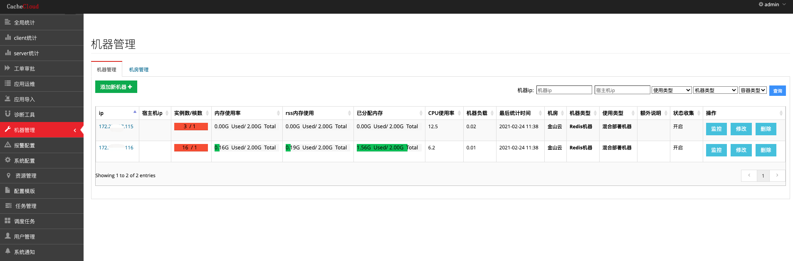
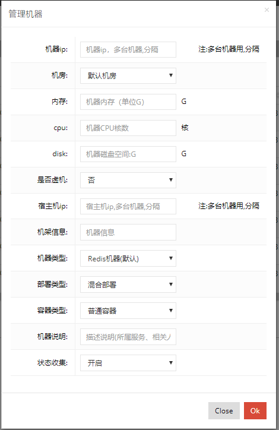
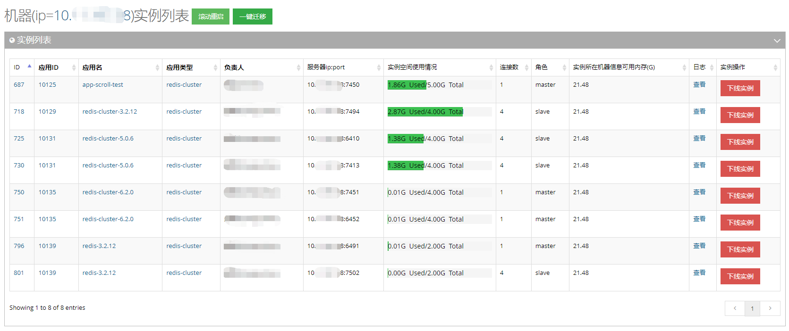
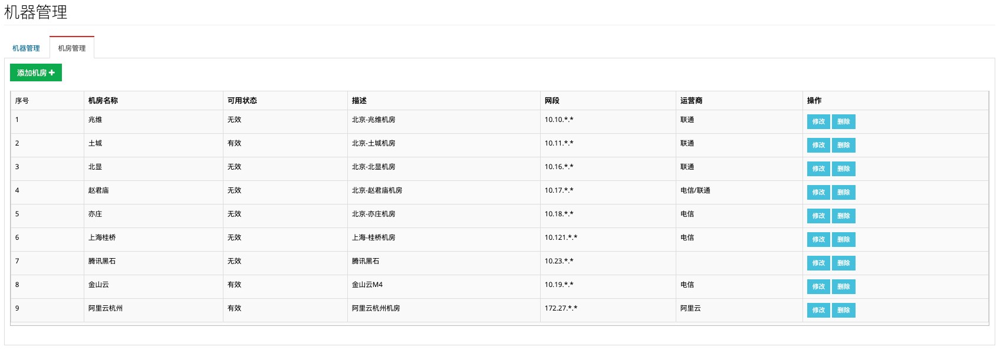
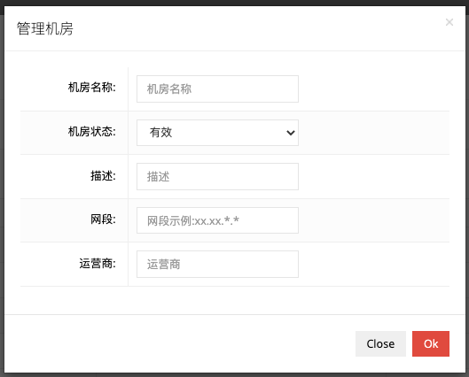

## 机器管理

提供对机器机房的管理运维操作。

### 机器管理

新机器除了要用脚本进行初始化安装CacheCloud的环境以外，还要统一进行管理，CacheCloud后台提供了机器的增删改查功能，还有一些指标的(cpu，网络，负载)监控功能。

支持批量添加、管理机器。

注：CacheCloud之所以没有提供完整的机器监控功能，是因为各个公司一般都有自己专门的机器运维和监控工具，其中或自己开发或使用像ganglia、nagios等软件搭建。

#### 机器实例管理

点击机器管理页面列表中ip一列中的某个ip即可跳转到机器实例管理页面，提供机器下所有实例滚动重启、指定实例一键迁移、单实例的下线等功能。

### 机房管理

同时支持添加管理机器。

支持批量添加、管理机器。

