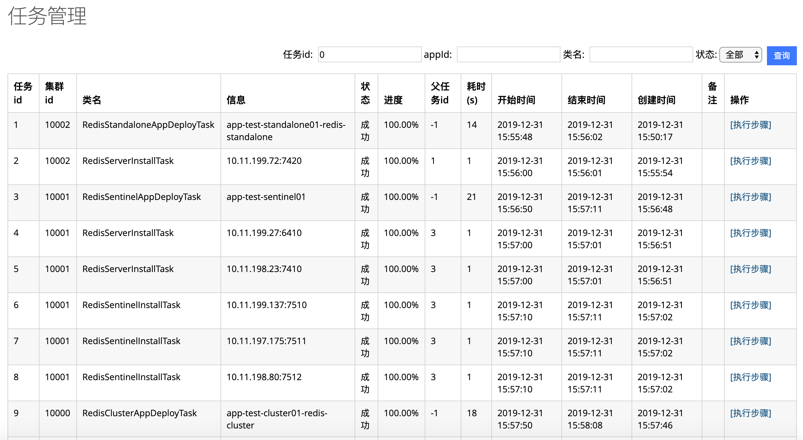
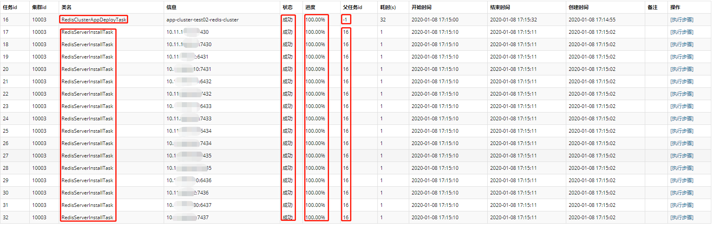
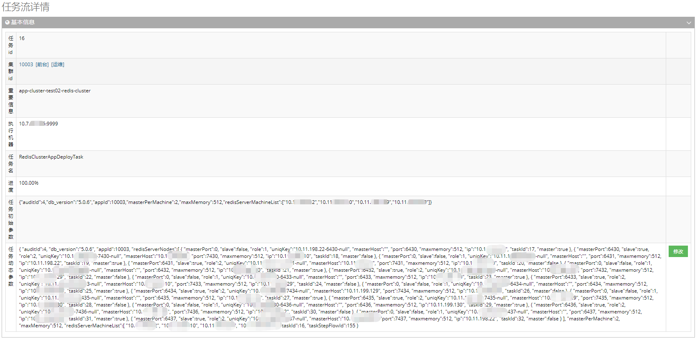
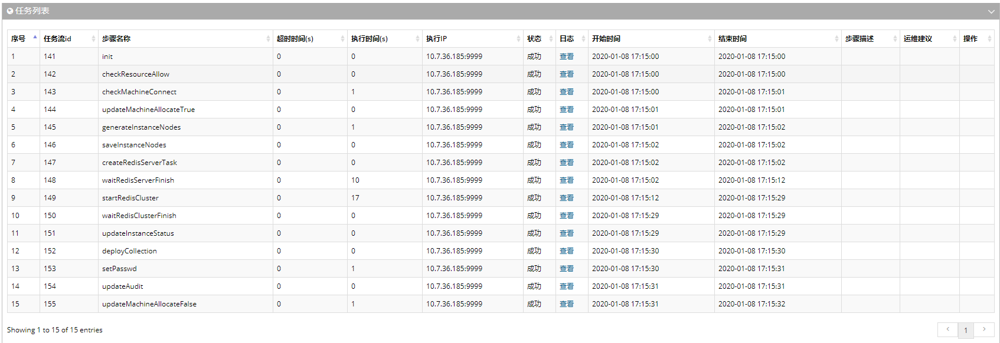
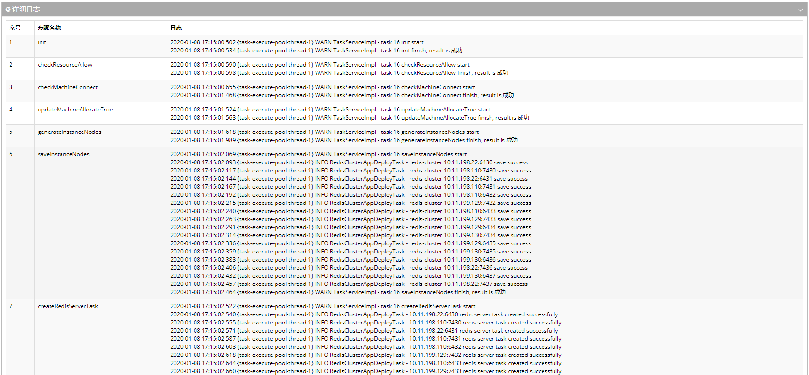
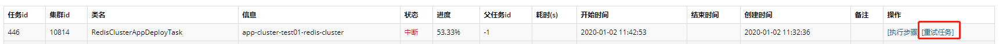

## Redis任务流管理

CacheCloud平台引入任务流机制，将用户操作提交为异步任务，复杂任务拆分为多个子任务，每个子任务又按照步骤依次执行，每个任务/步骤直接是相互独立，可查看任务关系、任务信息、执行状态、运行日志等信息。

- 下面以“RedisClusterAppDeployTask”任务为例进行使用讲解。

1. 管理员提交“redis-cluster开通”任务（参考[应用运维-Redis Cluster](#cc2-1-cluster)）；
2. 系统自动生成“RedisClusterAppDeployTask”*（部署redis-cluster应用）父任务及多个“RedisServerInstallTask”（在机器上安装redis server）子任务，可查看各任务的基本信息、状态、进度等信息；
3. 点击“执行步骤”可查看任务的具体执行步骤，包括任务的基本信息（各种参数），任务流/步骤列表，任务详细日志（帮助问题排查）；
4. 对运行中的任务可以暂停，对暂停/失败的任务亦可提交“重试任务”。

  

