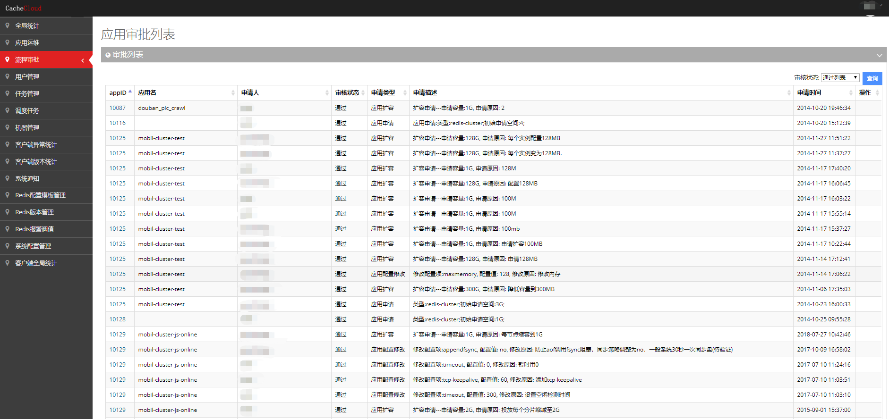
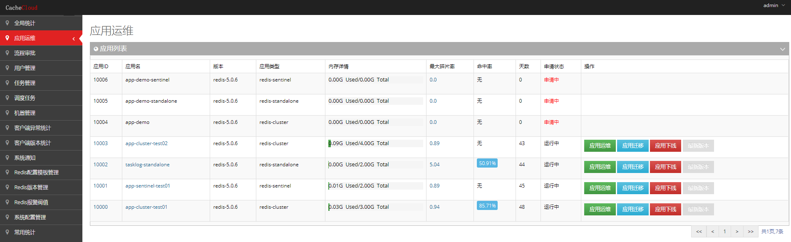
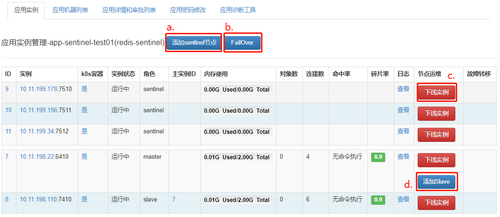
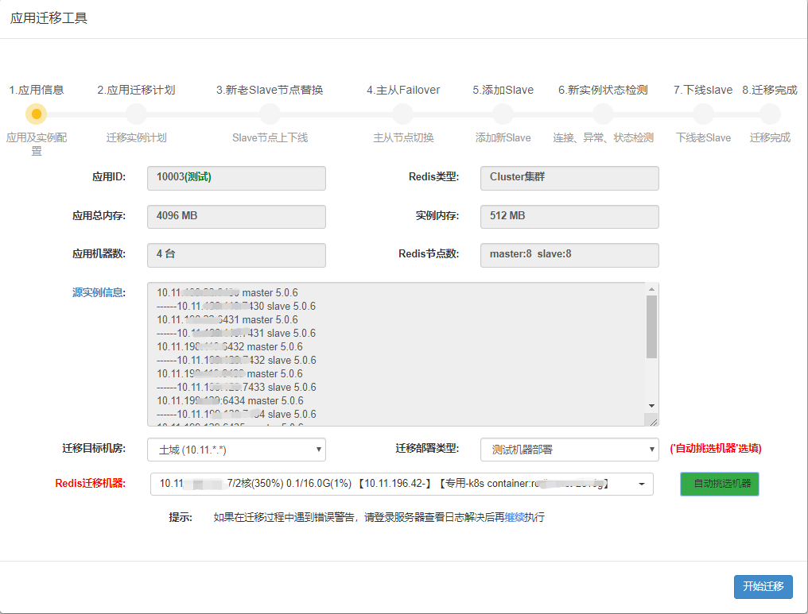
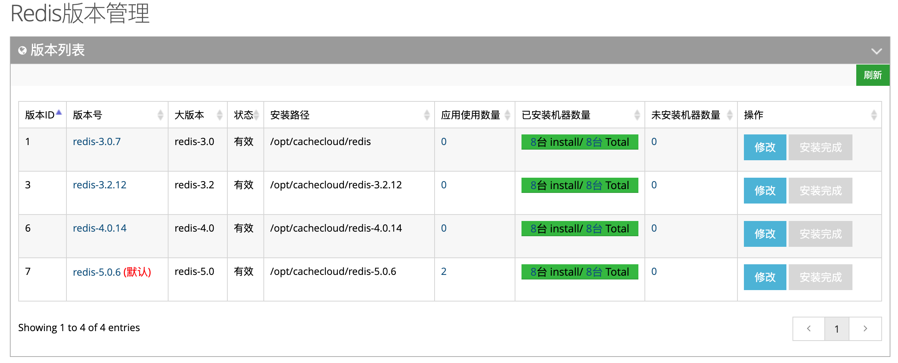
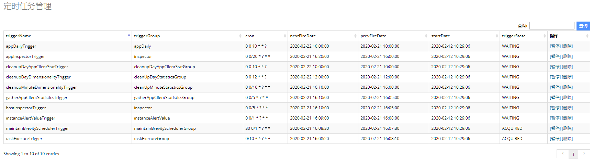

&nbsp;&nbsp;&nbsp;&nbsp;&nbsp;&nbsp;&nbsp;CacheCloud除了有面向用户的界面，还有面向管理员的运维界面，帮助管理员做一些如工单处理、日常运维管理等工作。

<a name="cc1"/>

## 一、用户工单运维

<a name="cc1-1"/>

### 1. 工单类型

&nbsp;&nbsp;&nbsp;&nbsp;&nbsp;&nbsp;&nbsp;如下图所示，来自用户的工单有以下几种：

+ 应用申请：用户需要申请开通redis standalone、redis sentinel和redis cluster；
+ 应用扩容：用户需要对当前的应用进行内存容量扩容；
+ 应用配置修改：用户希望对当前的redis配置做调整；
+ 键值分析：用户申请分析应用BigKey/过期键/键值分布等情况；
+ 注册用户申请：管理员只需要开通或驳回就可以了。

<a name="cc1-2"/>

### 2. 开通应用
	(1). 不同类型的redis，开通使用不同的格式。
	(2). 一键开通中唯一需要的就是机器的IP。
	添加机器时，要综合考虑，用户提交关于客户端的基本信息：QPS、容量、机房、主从等信息，决定选用的什么配置、什么机房的机器。

#### (1) redis-standalone开通
- 如下图，按照步骤填选：

- 点击自动生成“部署预览”，确认部署信息后，点击“开始部署”：

#### (2) redis-sentinel开通

步骤同上

#### (3) redis-cluster开通

步骤同上

详细操作可参考：[运维手册-应用部署](../../wiki/operate/appDeploy.md)。

<a name="cc1-3"/>

### 3. 扩容申请
- 垂直扩容
在“扩容配置”一栏填写扩容后单实例最大内存即可

- 水平扩容

水平扩容相对麻烦且费时一些，在开通时候管理员尽量根据用户提交的信息(QPS，容量等)，尽量提前预支一些实例，如果还是抗不住，就可做水平扩容。

a. 添加一个redis-cluster节点，格式为masterIp:memSize:slaveIp，并meet到集群中；

b. 迁移slot: 迁移slot速度较慢，CacheCloud支持slot断点续传的功能。

<a name="cc1-4"/>

### 4. 配置修改申请
填写需要修改的配置项和配置值。

     
<a name="cc1-5"/>

### 5. 键值分析
点击“分析”，进行键值分析

跳转到键值分析任务流

<a name="cc1-6"/>

### 6. 注册用户申请
直接点击通过或者驳回即可。

<a name="cc2"/>

## 二、管理员运维

<a name="cc2-1"/>

### 1. 应用运维

在应用运维中可管理应用实例，查看应用机器列表，应用详情和审批列表，修改应用密码，并提供了应用诊断工具。

- 管理应用实例

**Redis Sentinel**

a. 一键添加sentinel节点  
b. 一键Failover  
c. 上下线实例  
d. 添加slave节点  
e. 查看操作日志 

<a name="cc2-1-cluster"/>

**Redis Cluster**

a. 添加Slave  
b.一键Failover  
c.上下线实例  
d. 查看操作日志 

- 应用机器列表

查看该应用分布机器的使用情况，包括内存使用率、已分配内存、cpu使用率等信息。

- 应用详情和审批列表

- 应用密码修改

- 应用诊断工具

目前提供对应用拓扑规范检查的功能，提交任务流处理。

<a name="cc2-2"/>

### 2. 应用迁移

应用一键迁移，对当前应用所有节点进行failover，迁移到其他机器。详细操作可参考：[运维手册-应用迁移](../../wiki/operate/appMigrate.md)。

<a name="cc2-3"/>

### 3. 应用下线

下线当前应用，销毁所有存活节点。点击“应用下线”，跳转到应用下线任务流，可查看下线情况。

<a name="cc2-4"/>

### 4. Redis版本更新

升级应用的redis版本。详细操作可参考：[运维手册-Redis版本管理.应用版本升级](../access/redisVersion.md)。

<a name="cc3"/>

## 三、 机器管理
新机器除了要用脚本进行初始化安装CacheCloud的环境以外，还要统一进行管理，CacheCloud后台提供了机器的增删改查功能，还有一些简单的(cpu，网络，负载)监控功能。

CacheCloud之所以没有提供完整的机器监控功能，是因为各个公司一般都有自己专门的机器运维和监控工具，其中或自己开发或使用像ganglia、nagios等软件搭建。

<a name="cc4"/>

## 四、 用户管理

管理CacheCloud平台用户信息。

<a name="cc5"/>

## 五、Redis版本管理

统一管理redis版本，提供查看安装各redis版本的机器信息，修改版本信息，一键安装等功能。
详细操作可参考：[运维手册-版本管理](../access/redisVersion.md)。

<a name="cc6"/>

## 六、Redis任务流管理

CacheCloud平台引入任务流机制，将用户操作提交为异步任务，复杂任务拆分为多个子任务，每个子任务又按照步骤依次执行，每个任务/步骤直接是相互独立，可查看任务关系、任务信息、执行状态、运行日志等信息。

- 下面以“RedisClusterAppDeployTask”任务为例进行使用讲解。

1. 管理员提交“redis-cluster开通”任务（参考[应用运维-Redis Cluster](#cc2-1-cluster)）；
2. 系统自动生成“RedisClusterAppDeployTask”*（部署redis-cluster应用）父任务及多个“RedisServerInstallTask”（在机器上安装redis server）子任务，可查看各任务的基本信息、状态、进度等信息；
3. 点击“执行步骤”可查看任务的具体执行步骤，包括任务的基本信息（各种参数），任务流/步骤列表，任务详细日志（帮助问题排查）；
4. 对运行中的任务可以暂停，对暂停/失败的任务亦可提交“重试任务”。

  

  

<a name="cc7"/>

## 七、Redis报警阈值管理

管理redis报警阈值，支持对应用整体/单个实例进行报警配置。

<a name="cc8"/>

## 八、Redis配置模板管理

此功能是Redis全局配置模板(每次开启应用时用到)，并非用于修改线上配置。可对redis的不同版本不同配置项进行增删改查操作，请谨慎修改。

<a name="cc9"/>

## 九、调度任务

对CacheCloud平台的定时任务进行管理，可开启/暂停/删除某个定时任务。

<a name="cc10"/>

## 十、系统配置管理

对CacheCloud平台的基本配置信息进行管理。具体配置模板信息如下：

-----

