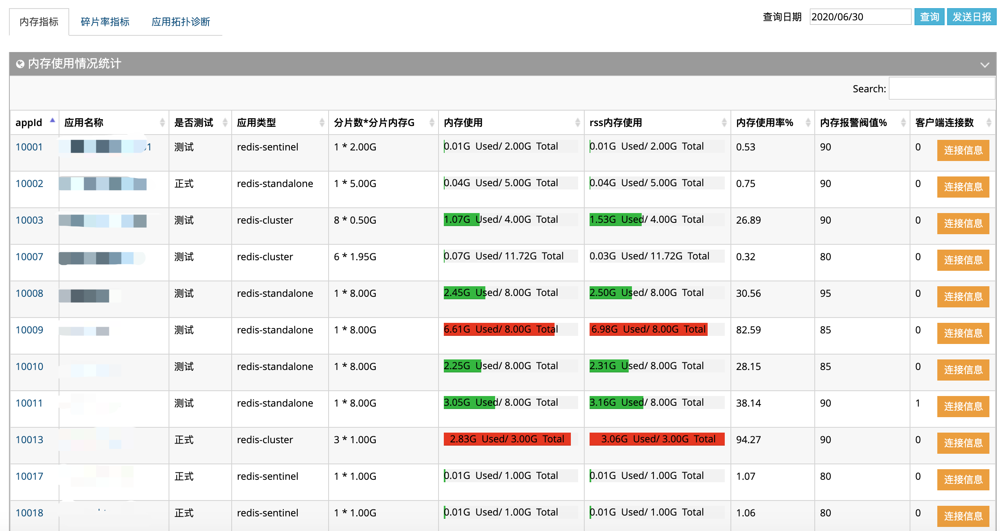
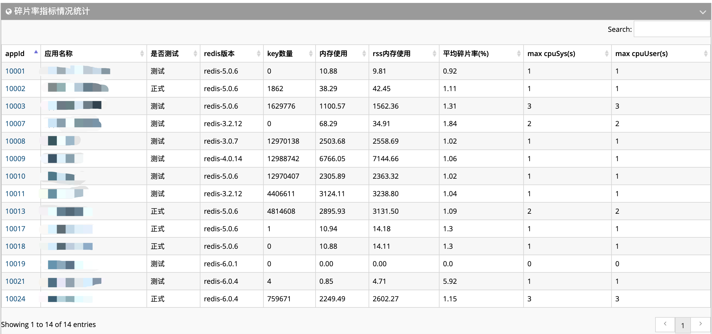
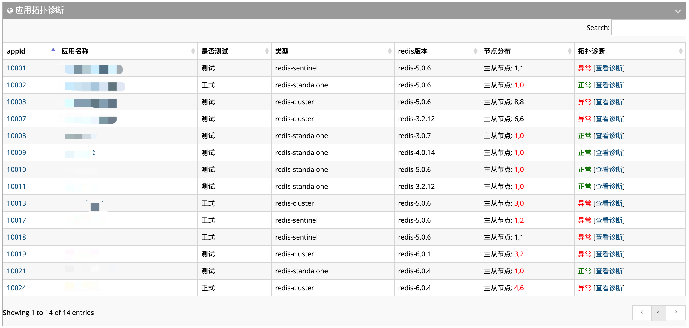

## 服务端指标统计汇总

- 1.应用内存指标:用于快速发现需要伸缩内存的应用，统计了内存使用率、分片数、客户端连接数等指标。

     
- 2.应用碎片率指标:用于快速发现高碎片率应用，统计了rss内存使用、redis版本、键数量等指标。
 
      
- 3.应用拓扑诊断指标:用于快速发现应用拓扑是否异常，例如:主从节点是否同一台机器、故障转移是否满足、宿主环境资源分布等。      
