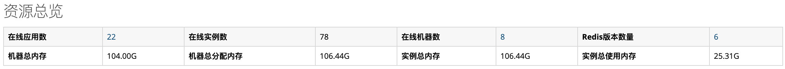
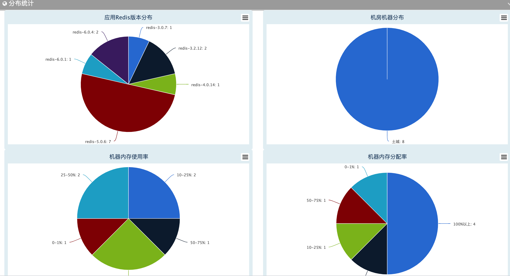
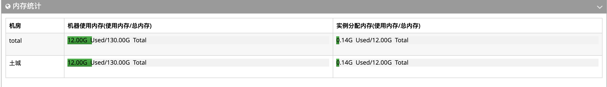
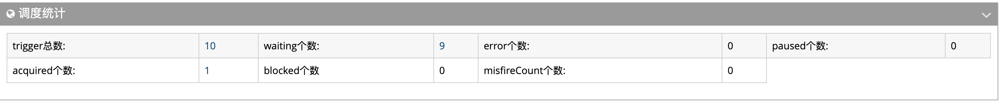
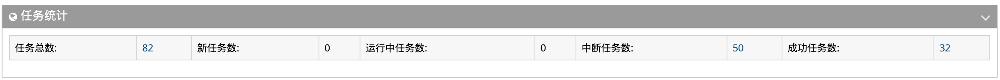

## 服务端全局统计

- 1.资源总览：统计所有在线运行应用数量、实例数量、机器数量、redis版本数量以及机器内存分配和使用情况汇总。
    

- 2.内存使用分布及统计：统计不同机房维度机器内存使用率、分配率情况。

    
    

- 3.调度任务统计：当前系统运行调度任务数量。

    

- 4.任务流统计: 当前系统执行所有任务流的状态：总任务数/成功任务数/失败任务数。

    

---------- 
    