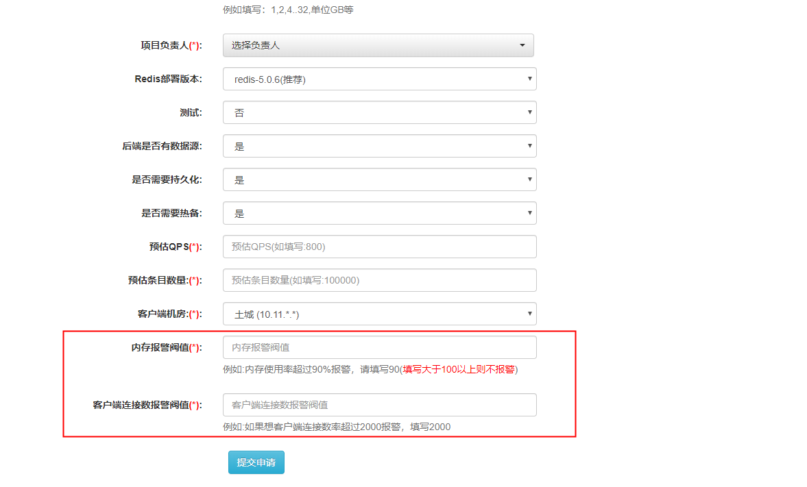
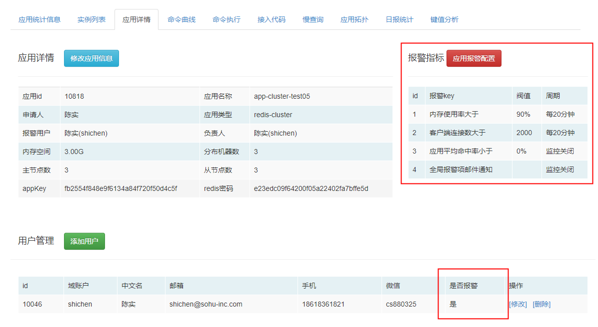
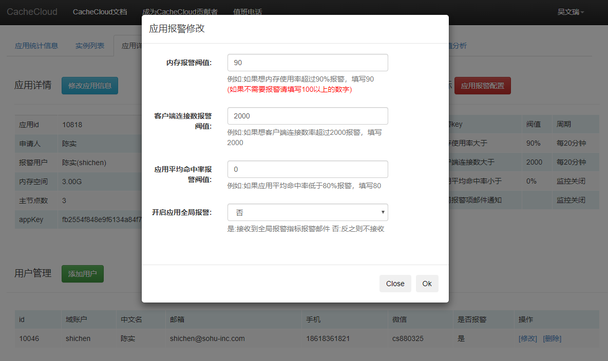
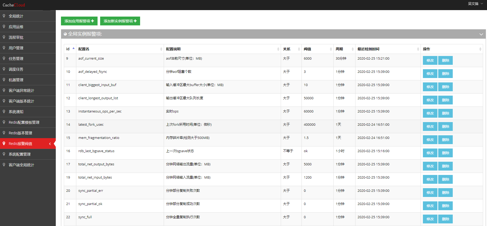
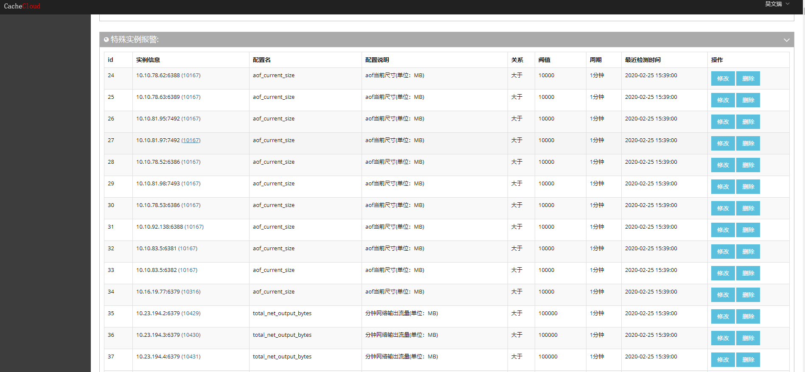
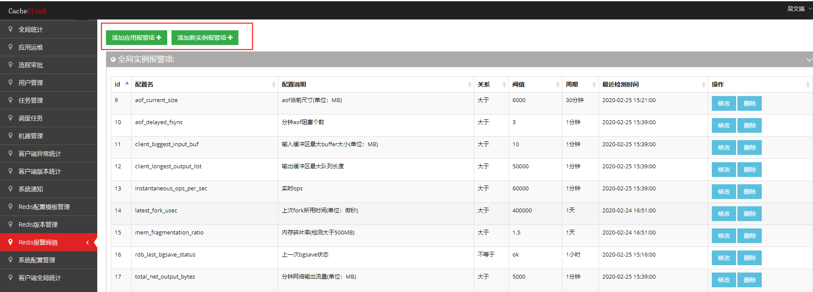

## 一、应用报警配置

应用报警是指用户对自己申请的应用重要指标设置的报警，主要监控应用的内存使用率，客户端连接数等指标。

在用户申请应用时，CacheCloud会要求设置内存报警和客户端连接数报警的阈值；

对已存在的应用，通过CacheCloud后台应用详情页面，可查看当前应用报警指标的配置，以及配置接收报警的用户；

点击“应用报警配置”，对报警的阈值进行修改。

## 二、Redis报警配置

Redis报警是CacheCloud后台对用户申请的应用和Redis实例相关监控指标设置的报警。

进入CacheCloud后台页面，在Redis报警阈值页面，可看到目前配置的全局监控指标和特殊实例监控指标：

Redis全局报警指标如下：

| 配置名 | 说明  | 监控周期 |  关系  |  参考阈值 |
| :-------------------------- |:----------------------------- | :------------------------------------------:|  :------------------------------------------:|  :------------------------------------------:|
| aof_current_size | aof当前尺寸(单位：MB) | 30分钟 | 大于 | 6000 |
| aof_delayed_fsync | 分钟aof阻塞个数 | 1分钟 | 大于 | 3 |
| client_biggest_input_buf | 输入缓冲区最大buffer大小(单位：MB) | 1分钟 | 大于 | 10 |
| client_longest_output_list | 输出缓冲区最大队列长度 | 1分钟 | 大于 | 50000 |
| instantaneous_ops_per_sec | 实时ops | 1分钟 | 大于 | 60000 |
| latest_fork_usec | 上次fork所用时间（单位：微妙 | 1天 | 大于 | 400000 |
| mem_fragmentation_ratio | 内存碎片率（检测大于500MB的） | 1天 | 大于 | 1.5 |
| rdb_last_bgsave_status | 上一次bgsave状态 | 1小时 | 不等于 | ok |
| total_net_output_bytes | 分钟网络输出流量(单位：MB) | 1分钟 | 大于 | 5000 |
| total_net_input_bytes | 分钟网络输入流量(单位：MB)	| 1分钟 | 大于 | 1200 |
| sync_partial_err | 分钟部分复制失败次数 | 1分钟 | 大于 | 0 |
| sync_partial_ok | 分钟部分复制成功次数 | 1分钟 | 大于 | 0 |
| sync_full | 分钟全量复制执行次数 | 1分钟 | 大于 | 0 |
| rejected_connections | 分钟拒绝连接数	 | 1分钟 | 大于 | 0 |
| master_slave_offset_diff | 主从节点偏移量差(单位：字节)	 | 5分钟 | 大于 | 20000000 |
| cluster_state | 集群状态 | 1分钟 | 不等于 | ok |
| cluster_slots_ok | 集群成功分配槽个数	 | 1分钟 | 不等于 | 16384 |

CacheCloud默认按照全局报警配置监控所有Redis实例，如果某些应用或者实例需要特殊配置报警阈值，可通过以下按钮，添加特殊报警项。

 	

