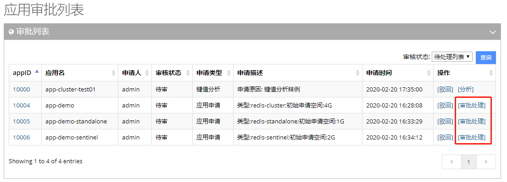
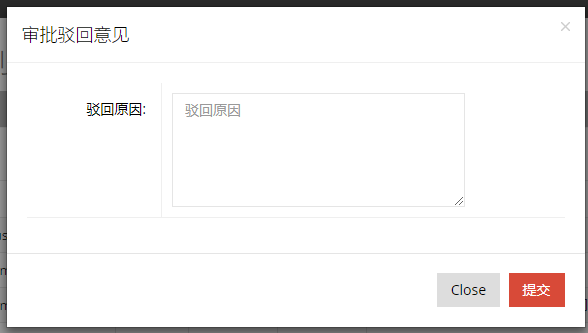
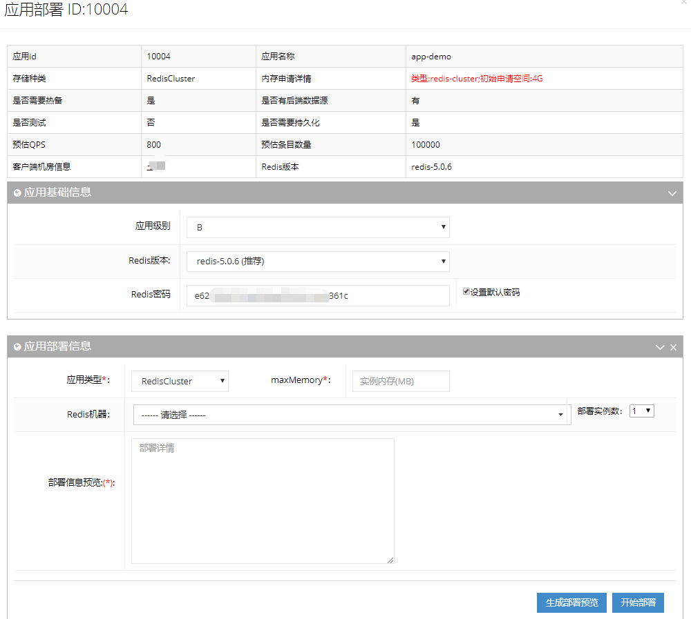
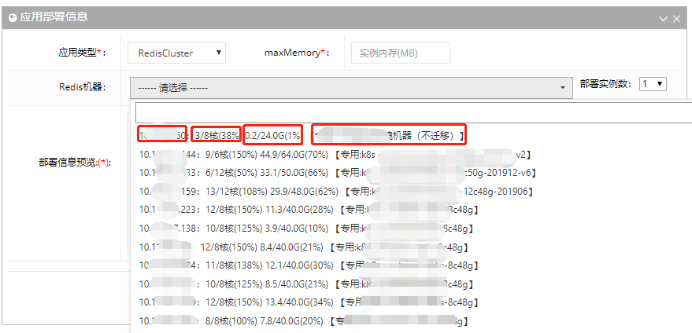
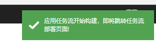
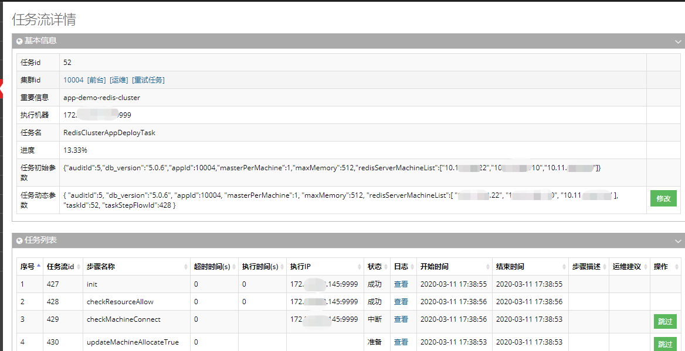

## 应用部署

​    用户提交应用申请（详细操作可参考：[系统功能-客户端.应用申请](../../wiki/function/client.md)）后，管理员在可在后台-流程审批页面驳回或开通应用，如下图：

### 驳回应用需要填写原因  
  

### 开通应用  
点击“审批处理”开始应用部署，如下图：   
  
应用部署可分为以下步骤：  

1. 查看应用申请详情，如存储种类，是否测试、客户端机房信息、内存申请详情、Redis版本等，按照申请要求开通应用，可做适当调整。
2. 填写应用基础信息，应用级别：S/A/B(默认)/c，重要性依次降低；选择Redis版本；给应用（Redis）的默认密码。
3. 填写应用部署信息，
      - 应用类型：RedisStandalone/sentinel+Redis/RedisCluster等；

      - maxMemory：单个实例的内存，单位MB；

      - 选择部署Redis机器及每台机器部署的实例数。机器信息分为四个部分：机器ip（代表所属机房），使用/总核数（使用率），使用/总内存（使用率）以及特殊说明。  
        **注意**：可参考机器信息挑选机器，注意一个应用下的实例尽量部署在统一机房，一个实例最少占用一核，剩余内存需大于单实例的内存。
        
4. 信息填写完毕后，点击“生成部署预览”，可生成部署机器信息和部署信息预览，如下图，  
      
      - 部署机器信息展示了挑选的机器的ip、已存在的实例数/核数、已使用/剩余/总内存、需要部署的实例角色数量、机器所在的宿主机/机器信息，可参考挑选机器原则重新挑选。  
        
      - 部署信息预览，不同类型的redis，开通使用不同的格式：  
        cluster类型：master_ip:memory:slave_ip (至少三组，测试应用可以没有slave)，如上图；  
        sentinel类型：master_ip:memory:slave_ip，sentinel_ip (至少三组，可跨机房)，如图：  
          
        standalone类型：master_ip:memory，如图：  
          
        如果部署信息不满足要求，可重新填写信息，挑选机器，重新“生成部署预览”。

  5. 确认部署预览信息无误后，点击开始部署，跳转到应用任务流部署页面，检查应用部署情况：  
       
       
     确认应用部署成功后，回到后台-流程审批页面，点击“通过”，就此整个应用开通完成。

### 总结

        (1).不同类型的redis，使用不同的格式部署。
        (2).一键部署中唯一需要的就是机器的IP。
        (3).添加机器时，要综合考虑，用户提交关于客户端的基本信息：QPS、容量、机房、主从等信息，决定挑选的什么配置、什么机房的机器。
        (4).应用开始部署后，部署任务流页面确认应用部署完毕，需要跳回到审批页点击“通过”，就此整个应用开通才算完成。