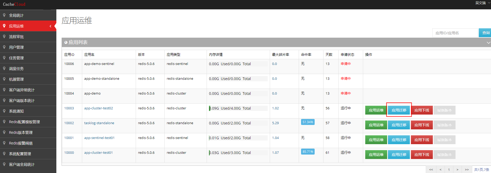

## 应用升级

应用升级即对应用的redis版本进行升级，小版本和大版本采取不同升级方式。

### 1. 应用小版本升级

使用“应用迁移工具”，逐步替换节点。

#### 1）进入CacheCloud后台

在CacheCloud后台的“应用运维”页面，选择要进行迁移的应用，点击“应用迁移”。 这种迁移方式不会更换应用的appId，通过主从节点的failover实现，是对客户端无感知迁移。

#### 2）使用迁移工具进行迁移

应用迁移整体包含八个主要步骤，具体可参考：[应用迁移文档](../../wiki/function/operation-app#cc2)

+ (1) 应用信息：查看源应用的实例IP，角色和Redis版本等信息，选择迁移的目标机房和迁移机器；
+ (2) 应用迁移计划：这一步主要查看节点的变更信息，新增实例（Slave）的IP和端口号，点击继续进行新老Salve节点的替换；
+ (3) 新老Salve节点替换: 替换完成之后查看最新实例信息，点击继续，进行主从切换；
+ (4) 主从Failover: 完成主从节点切换，点击继续，添加新的Slave；
+ (5) 添加Slave: 添加新的Slave；
+ (6) 新实例状态检测：检查新实例的连接状态，是否异常，点击继续，下线老的Slave；
+ (7) 下线Slave: 下线老的Slave；
+ (8) 迁移完成: 完成迁移。

### 2. 应用大版本升级

redis大版本间由于各版本配置不兼容的问题，无法使用“应用迁移工具”进行应用升级，我们推荐使用“应用迁移工具”实现大版本的升级工作。

#### 1）创建新的redis应用
+ 用户申请redis应用，参考[“系统功能-我的申请-创建工单-应用申请”](../../wiki/function/job)。
+ 管理员审批、开通应用，参考[“开通应用”](../../wiki/function/operation-job#cc1-2)。

#### 2）进行新老redis应用数据迁移
+ 新老应用数据迁移，参考[“数据迁移”](../../wiki/function/operation-migrate)。
+ 数据迁移完毕，通知客户端更新到新应用。