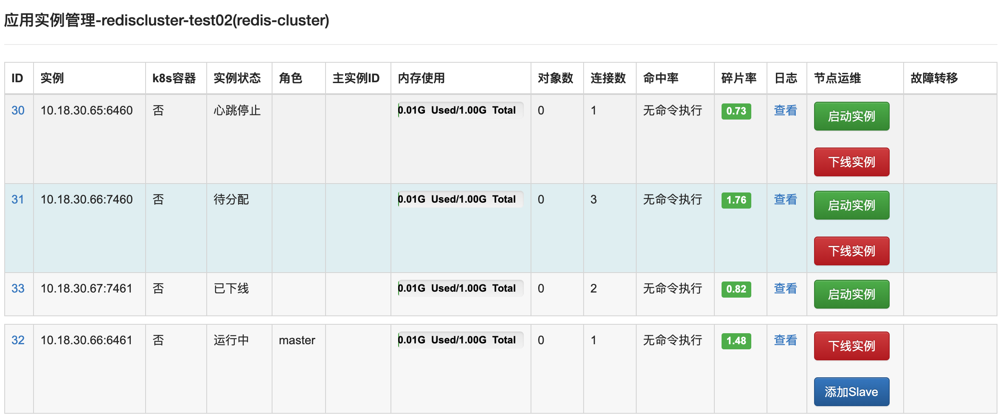

## 基础概念：

### 一. 应用、实例、机器、CacheCloud客户端、CacheCloud服务端

- 1.1 `实例`

&nbsp;&nbsp;&nbsp;&nbsp;&nbsp;&nbsp;&nbsp;一个Redis进程，例如在ip为10.10.xx.xx启动了端口为6379的Redis进程。

&nbsp;&nbsp;&nbsp;&nbsp;&nbsp;&nbsp;&nbsp;实例可以是Redis单机数据节点、Redis-Sentinel类型下的Redis数据节点和sentinel节点，也可以是Redis-Cluster下的Redis数据节点。

- 1.2 `应用`

&nbsp;&nbsp;&nbsp;&nbsp;&nbsp;&nbsp;&nbsp;一个redis集群是由若干个实例组成的，分配给每个CacheCloud用户的redis集群就是一个应用（包含应用id）。

&nbsp;&nbsp;&nbsp;&nbsp;&nbsp;&nbsp;&nbsp;一个应用可以是一个Redis单机、一个Redis-Sentinel集群，或者一个Redis-Cluster集群。但是对于CacheCloud用户来说，不需要知道每个Redis实例的ip:port信息，只需要一个appId就可以获取这些细节。主流云服务都采用appId的形式分配给用户，提供各种云服务。

- 1.3 `机器`

&nbsp;&nbsp;&nbsp;&nbsp;&nbsp;&nbsp;&nbsp;机器资源可以理解为是物理机、虚拟机、docker容器、k8s容器等。一台机器可以部署多个应用，多个实例。

- 1.4 `CacheCloud客户端`

&nbsp;&nbsp;&nbsp;&nbsp;&nbsp;&nbsp;&nbsp;提供用户通过appId快速接入CacheCloud系统的api（可以理解成获取应用对应Redis实例的REST接口或者封装好的jar包）。

- 1.5 `CacheCloud服务端`

&nbsp;&nbsp;&nbsp;&nbsp;&nbsp;&nbsp;&nbsp;CacheCloud用户通过appId获取Redis服务地址的服务端。用于收集，展示和管理实例、应用、机器各个层面的数据，帮助CacheCloud用户快速掌握Redis集群使用状态。

<a name="cc1-2"/>

### 二、实例状态：待分配、心跳停止、已下线、运行中

+ `待分配`：在应用开通期间，实例处于分配的过程中，如果分配成功则是运行中状态；
+ `心跳停止`：通过系统监控判断实例有可能下线状态，但是由于网络等原因，实例可能并没有下线，所以需要管理员人工确认；
+ `已下线`：管理员对Redis实例进行下线操作；
+ `运行中`：正在运行的Redis实例状态。

