## 基础运维

<a name="cc1"/>

### 1. 客户端服务机房问题
&nbsp;&nbsp;&nbsp;&nbsp;&nbsp;&nbsp;Redis是比较依赖于网络环境的，较差的网络环境会带来一系列问题，最明显的就是访问速度，之前做过一个统计，跨机房要比同一个机房慢数倍。

&nbsp;&nbsp;&nbsp;&nbsp;&nbsp;&nbsp;所以用户在申请应用的时候，要填写自己的服务所在的机房，这样CacheCloud的管理员会根据您的机房情况给予合理的分配。

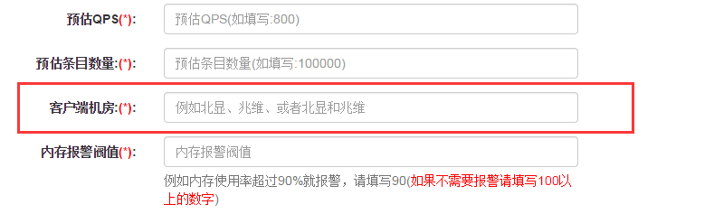

<a name="cc2"/>

### 2. 配置修改问题
&nbsp;&nbsp;&nbsp;&nbsp;&nbsp;&nbsp;Cachecloud中各种类型(Redis-standalone、Redis-sentinel, Redis-cluster)，在开启应用时，使用我们认为最优的配置。

&nbsp;&nbsp;&nbsp;&nbsp;&nbsp;&nbsp;但是，每个用户自己服务类型不同，需求可能会不同，例如对于maxmemory-policy、list-max-ziplist-entries、list-max-ziplist-value等配置就会有所不同，如果有需要修改配置，用户可以自行提交配置修改。

&nbsp;&nbsp;&nbsp;&nbsp;&nbsp;&nbsp;修改方法如下：
+ (1) 进入应用页面的“拓扑结构”选项卡，点击ID进入实例页面
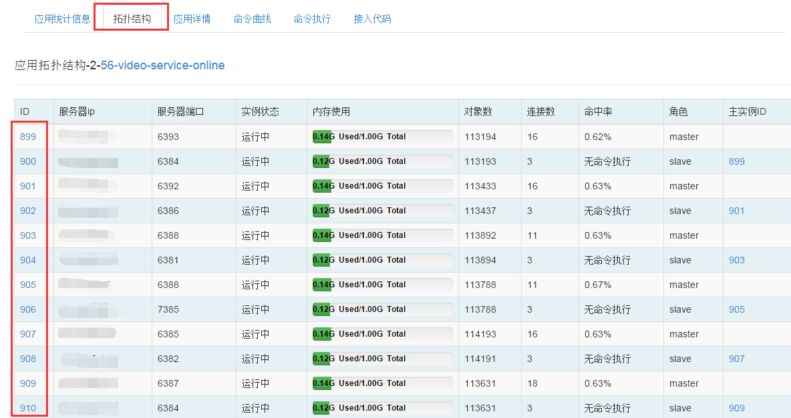

+ (2) 进入“配置查询”选项卡
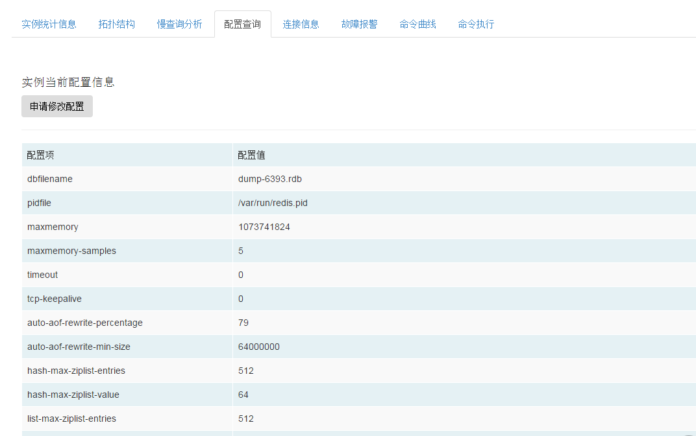

+ (3) 点击“申请修改配置”，填写相应字段和值
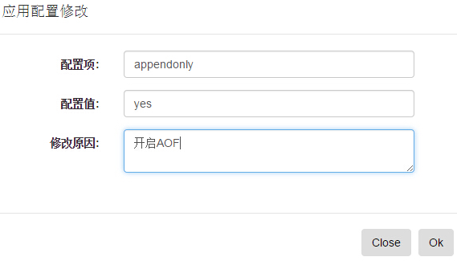

+ (4) 后台管理员接收到申请邮件，进行处理，处理完成后，用户将收到相应处理邮件

#### 注： 修改的配置会对应用的所有节点生效，因为所有节点的配置是统一的。

<a name="cc3"/>

### 3. maxmemory-policy配置说明

&nbsp;&nbsp;&nbsp;&nbsp;&nbsp;&nbsp;Cachecloud对于每个Redis节点都设置了maxmemory, 所以需要有对应的maxmemory-policy，默认策略是volatile-lru。

&nbsp;&nbsp;&nbsp;&nbsp;&nbsp;&nbsp;Redis提供了6种策略应对maxmemory, 用户可以根据自己的需求选择对应的策略。
+ volatile-lru -> 用lru算法删除过期的键值
+ allkeys-lru -> 用lru算法删除所有键值
+ volatile-random -> 随机删除过期的键值
+ allkeys-random -> 随机删除任何键值
+ volatile-ttl -> 删除最近要到期的键值（监控TTL）
+ noeviction -> 不会写操作，返回一个错误

<a name="cc4"/>

### 4. 数据清理问题
&nbsp;&nbsp;&nbsp;&nbsp;&nbsp;&nbsp;Cachecloud测试应用用户可以自行清理内存，处于安全的考虑正式应用需要联系管理员进行清理。
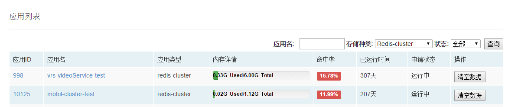

<a name="cc5"/>

### 5. 应用选型问题
&nbsp;&nbsp;&nbsp;&nbsp;&nbsp;&nbsp;如上图所示，目前CacheCloud提供了3种类型的存储类型


&nbsp;&nbsp;&nbsp;&nbsp;&nbsp;&nbsp;用户可以根据自己的需要选择适合自己的类型，下面对Redis的三种类型使用场景进行简单说明：
* (1) 底层数据（例如mysql, hbase等等）允许被穿透，而且不考虑高可用性，可以考虑Redis-Standalone类型。
    * 缺点： 非高可用、受单机影响扩展性(容量，读写等)有限
    * 优点：结构简单

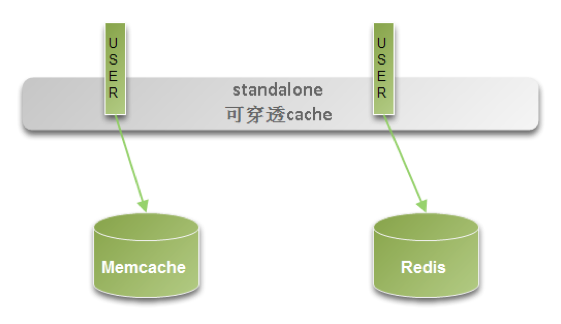

* (2) 如想保证Redis的高可用（通过主从和sentinel机制），可以选择Redis-Sentinel类型
    * 缺点：受单机影响扩展性(容量，读写等)有限
    * 优点：高可用，结构相对简单

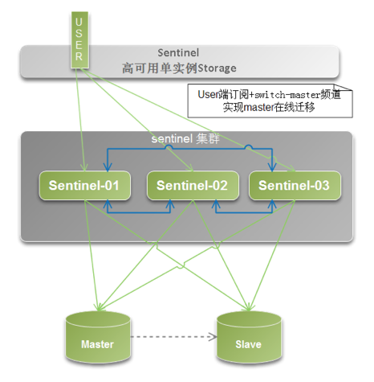

* (3) 如想保证高可用、可扩展、大容量等要求，可以选择Redis-Cluster
下面给一些建议：
    * 并不是说Redis-Cluster比其他两种类型好，用户需要根据自己的需求选择（比如内存需求量不大，保证高可用选择Redis-Sentinel类型就足够了）
    * 如果当前或者未来需要的内存量超过6个G， 建议选择Redis-Cluster类型。

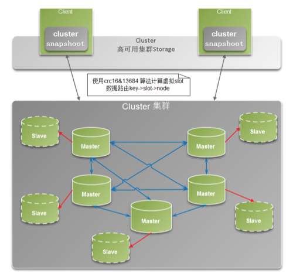

<a name="cc6"/>

### 6. Jedis连接池GenericObjectPoolConfig配置
&nbsp;&nbsp;&nbsp;&nbsp;&nbsp;&nbsp;Jedis源码中使用了common-pool2作为连接池管理工具，无论是对于Redis-Standalone, Redis-Sentinel, Redis-Cluster进行操作，通常是通过jedis连接池(JedisPool, JedisSentinelPool)获取连接，所以需要选择合理的连接池配置。
通常的代码如下（可以参考cachecloud中代码接入模块）：
```Java
GenericObjectPoolConfig poolConfig = new GenericObjectPoolConfig();
poolConfig.setMaxTotal(GenericObjectPoolConfig.DEFAULT_MAX_TOTAL * 5); 
poolConfig.setMaxIdle(GenericObjectPoolConfig.DEFAULT_MAX_IDLE * 3); 
poolConfig.setMinIdle(GenericObjectPoolConfig.DEFAULT_MIN_IDLE * 2); 
poolConfig.setJmxEnabled(true); 
poolConfig.setMaxWaitMillis(3000); 
PipelineCluster redisCluster = ClientBuilder.redisCluster(appId) 
    .setJedisPoolConfig(poolConfig) 
    .setTimeout(1) 
    .setMaxRedirections(5) 
    .build();
```
	其中poolConfig就是对于连接池的配置，其中有几个配置较为重要。
	maxActive: 链接池中最大连接数,默认为8. (并非越大越好，具体原因可以参考GenericObjectPool的实现)
	maxIdle: 链接池中最大空闲的连接数,默认为8.
	minIdle: 连接池中最少空闲的连接数,默认为0.
	maxWait: 当连接池资源耗尽时，调用者最大阻塞的时间，超时将跑出异常。单位，毫秒数;默认为-1.表示永不超时.
	jmxEnabled： 当设置为true, 且服务开启的jmx服务时，使用jconsole, jvisualvm等工具将看到如下关于连接池的很全面的统计，这些统计结果有助于优化自己的配置。

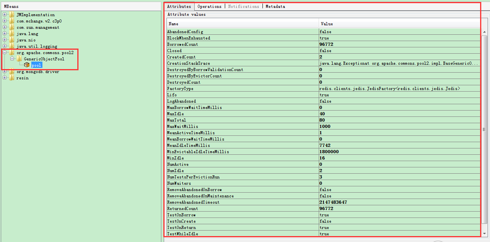

### 其余配置如下：
+	 1. minEvictableIdleTimeMillis: 连接空闲的最小时间，达到此值后空闲连接将可能会被移除。负值(-1)表示永远不移除。默认-1。这个也很重要，一般不用移除，每次makeObject()开销比较大。
+    2. numTestsPerEvictionRun: 对于“空闲连接”检测线程而言，每次检测的连接资源的个数。默认为3。
+    3. testOnBorrow: 向调用者输出“连接”资源时，是否检测有效，如果无效则从连接池中移除，并尝试继续获取。默认为false。借资源时候是否要验证，比如jedis对象验证是ip:port是否发生改变，且执行一个ping命令。
+    4. testOnReturn:  向连接池“归还”连接时，是否检测“连接”对象的有效性。默认为false。还资源时候是否要验证，同上。
+    5. testWhileIdle:  向调用者输出“连接”对象时，是否检测它的空闲超时；如果“连接”空闲超时，将会被移除。默认为false。空闲是否要定时检查一遍所有的对象。
+    6. timeBetweenEvictionRunsMillis:  “空闲连接”检测线程，检测的周期，毫秒数。如果为负值，表示不运行“检测线程”。默认为-1。
+    7. whenExhaustedAction: 当“连接池”中active数量达到阀值时，即“连接”资源耗尽时，连接池需要采取的手段, 默认为1。

<a name="cc7"/>

### 7. Redis-Sentinel类型的客户端调用过程（建议）
(1) 初始化JedisSentinelPool (通常是单例的，可以通过java代码或者spring实现)，具体方法可以参考CacheCloud接入代码模块
```Java
//spring 配置
<bean id="redisSentinelFactory" class="com.sohu.tv.mobil.common.data.RedisSentinelFactory" init-method="init">
    <property name="appId" value="appId"/>
</bean>
<bean id="redisSentinelPool" factory-bean="redisSentinelFactory" factory-method="getJedisSentinelPool"/>

package xx.xx;
import com.sohu.tv.builder.ClientBuilder;
import org.apache.commons.pool2.impl.GenericObjectPoolConfig;
import org.slf4j.Logger;
import org.slf4j.LoggerFactory;
import redis.clients.jedis.JedisSentinelPool;
public class RedisSentinelFactory {

    private final Logger logger = LoggerFactory.getLogger(this.getClass());

    private JedisSentinelPool jedisSentinelPool;

    private int appId;

    public void init(){
        //根据自己需要设置poolConfig
        GenericObjectPoolConfig poolConfig = new GenericObjectPoolConfig();
        poolConfig.setMaxTotal(GenericObjectPoolConfig.DEFAULT_MAX_TOTAL * 10);
        poolConfig.setMaxIdle(GenericObjectPoolConfig.DEFAULT_MAX_IDLE * 5);
        poolConfig.setMinIdle(GenericObjectPoolConfig.DEFAULT_MAX_IDLE * 2);
        poolConfig.setMaxWaitMillis(1000L);
        poolConfig.setJmxEnabled(true);
        try {
            //根据自己需要设置超时时间
            jedisSentinelPool = ClientBuilder.redisSentinel(appId)
                .setTimeout(2000)
                .setPoolConfig(poolConfig)
                .build();
        } catch (Exception e) {
            logger.error(e.getMessage(), e);
        }
    }

    public JedisSentinelPool getJedisSentinelPool() {
        return jedisSentinelPool;
    }

    public void setAppId(int appId) {
        this.appId = appId;
    }
}
```

(2) 每次调用的建议写法：
```Java
		Jedis jedis = null;
        try {
            jedis = redisSentinelPool.getResource();
            //jedis command
        } catch (Exception e) {
            logger.error(e.getMessage(), e);
        } finally {
            if (jedis != null)
                jedis.close();
        }
```
其中jedis.close()并非关闭连接（可能是jedis定义上带来的歧义），如果看jedis源码会发现close实现如下:
```Java
    public void close() {
        if (dataSource != null) {
            if (client.isBroken()) {
                this.dataSource.returnBrokenResource(this);
            } else {
                this.dataSource.returnResource(this);
            }
        } else {
            client.close();
        }
    }
```
它会帮助你决定returnBrokenResource还是returnResource来归回jedis连接对象，其中dataSource!=null说明使用pool管理jedis连接(具体可以参考JedisPool, JedisSentinelPool的实现中 setDataSource)。

<a name="cc8"/>

### 8. Redis-Cluster类型的客户端调用过程（建议）
相比于Redis-Sentinel类型Jedis-Cluster的调用相对简单(Jedis源码内部对于cluster节点的选择以及pool的管理做了透明处理)
+ (1) 初始化JedisCluster(通常是单例的，可以通过java代码或者spring实现)，具体方法可以参考cachecloud接入代码模块。
+ (2) 每次调用直接使用jedisCluster.command即可。

<a name="cc9"/>

### 9. 数据库个数问题
&nbsp;&nbsp;&nbsp;&nbsp;&nbsp;&nbsp;Redis实例（Redis-Cluster除外）默认提供了16个数据库，用户可以使用select x来实现数据库的切换，但是这个功能从总体上弊大于利，不建议使用，默认使用数据库0即可。
具体原因：
如果你在其他语言的客户端中执行Redis命令，并且该客户端没有像redis-cli那样一直显示目标数据库的号码，那么在数次切换数据库之后，你很可能会忘记自己当前正在使用的是哪个数据库。当出现这种情况时，为了避免对数据库进行误操作，在执行Redis命令特别是像FLUSHDB这样的危险命令之前，最好先执行一个SELECT命令，显式地切换到指定的数据库，然后才执行别的命令，总之会陷入混乱。

<a name="cc10"/>

### 10. Redis-Sentinel类型应用统计中publish命令
&nbsp;&nbsp;&nbsp;&nbsp;&nbsp;&nbsp;细心的人会发现即使你的Redis-Sentinel类型的应用没做过任何publish操作，命令统计依然会有周期性publish的调用记录。

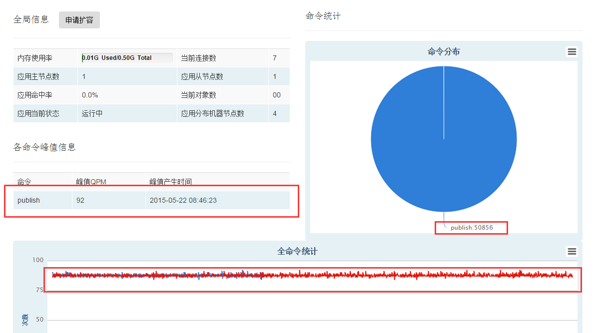


原因是因为sentinel为了保证高可用性，订阅节点上 __sentinel__:hello 频道上publish的信息，确认redis节点的可用性。
所以这个统计用户不需要关心，可以忽略。

<a name="cc11"/>

### 11. 命令执行模块问题
&nbsp;&nbsp;&nbsp;&nbsp;&nbsp;&nbsp;为了保证数据安全，对于测试应用可以执行任意命令。

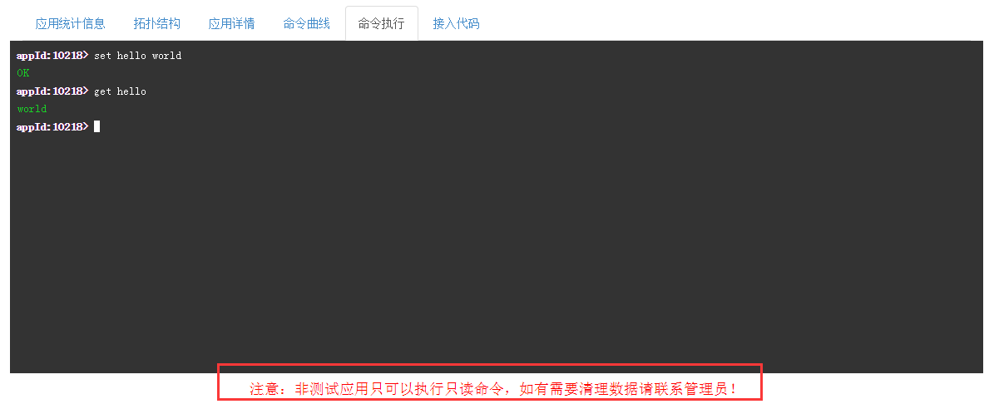

对于线上应用，只允许执行如下命令：

	debug,exists,object,ttl,type,scan,get,getbit,getrange,mget,setrange,strlen,hexists,hget,hgetall,hkeys,hlen,hmget,hvals,hscan,lindex,llen,
	lrange,scard,sismember,sscan,srandmember,zcard,zcount,zrange,zrangebyscore,zrank,zrevrange,zscore,zscan,dbsize,info,time,lastsave;
