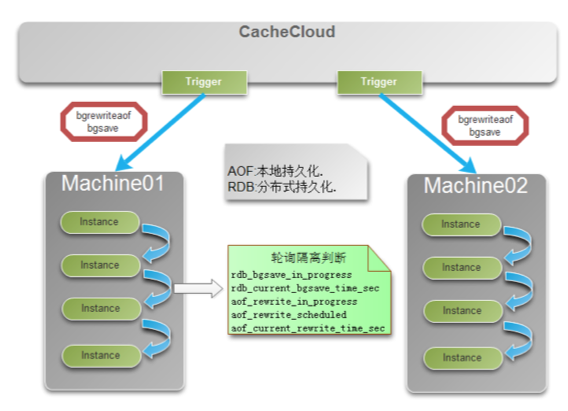
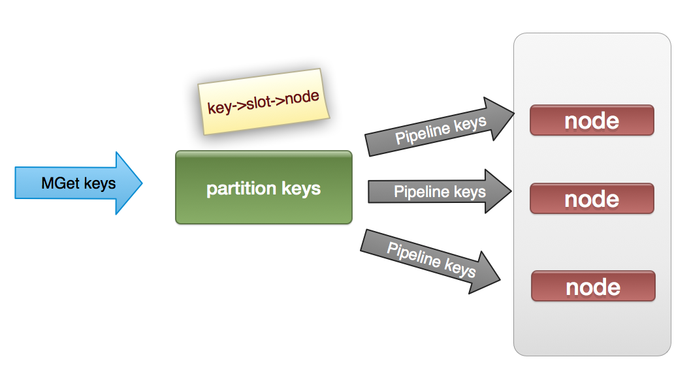

## 系统运维优化

### 1. aof持久化隔离自动运维

异步工作线程扫描每台机器aof文件增长率。
对于达到aof重写机制的实例在本机轮流触发重写，实现重写隔离机制。

#### 2. redis复制流程分析和优化

+ 2.1 redis复制操作
分为全量复制和增量复制，全量复制开销主要在三方面：
    + (a) master节点bgsave是rdb落地操作。
    + (b) rdb文件在主从之间传输开销。
    + (c) slave节点加载rdb文件，避免不必须的全量复制。

+ 2.2 增量复制用于网络不稳定等原因造成rdb重传的问题
    + (a) 使用psync master_run_id offset 向主节点获取miss数据，
    + (b) master检查repl-backlog-buffer是否存在offset内的数据，
    + (c) 存在时，发送增量数据
    + (d) 不存在时做全量复制操作

+ 2.3 总结：增量复制是否生效依赖于以下三点，根据应用场景做优化
    + repl-backlog-size参数大小
    + 主从节点写入量
    + 主从网络环境

### 3. redis-cluster 批量操作（mget）优化

redis-cluster节点不支持mget，mset等批量操作，client端只能批量get模拟mget操作，与redis节点通信io复杂度N(keys)。

CacheCloud-client端使用pipeline封装mget等批量操作，与redis节点通信io复杂度为N(nodes)。

