### 一、CacheCloud数据迁移工具能做什么？

&nbsp;&nbsp;&nbsp;&nbsp;&nbsp;&nbsp;Cachecloud数据迁移工具支持redis数据同步工作，可以完成如下功能：

+ 支持任意两种类型的source和target进行数据迁移，如RDB文件、Redis Standalone、Redis Sentinel、Redis Cluster、CacheCloud应用；
+ 迁移过程中，源集群不影响对外提供服务；
+ 高效性，多线程并发迁移；
+ 迁移过程便捷，流程可视化；
+ 集成redis-migrate-tool、redis-shake redis数据同步的工具。
+ 数据迁移具有实时性，所以使用合理可以基本保证数据一致性(原理可以参考第二小节)；
+ 数据校验功能。

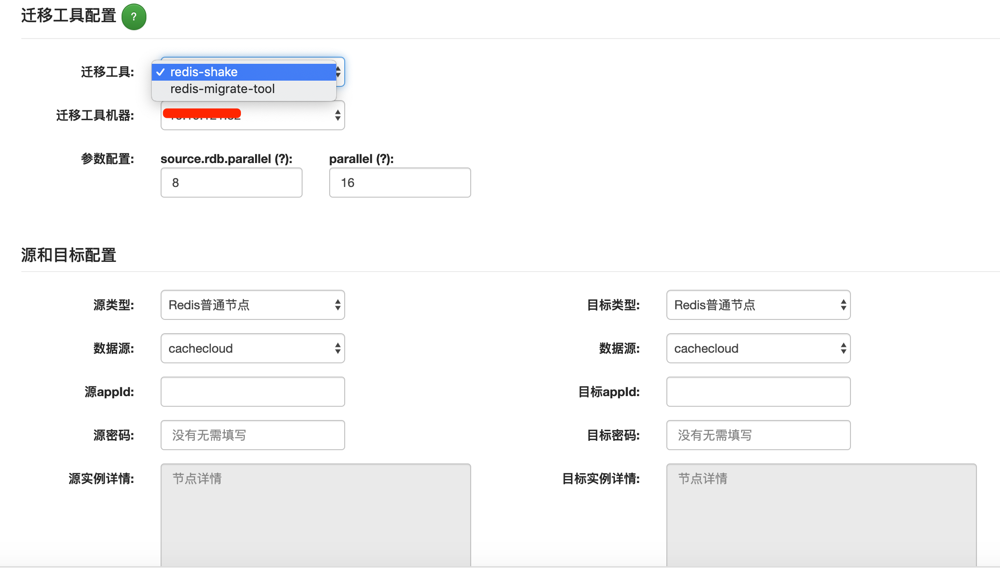

### 二、CacheCloud数据迁移工具是如何实现的？

&nbsp;&nbsp;&nbsp;&nbsp;&nbsp;&nbsp;CacheCloud数据迁移工具底层使用了redis-migrate-tool和redis-shake两种主流redis数据同步的工具。所以这里有必要对这两种数据迁移工具做简单说明。

+ [redis-migrate-tool](https://github.com/vipshop/redis-migrate-tool)

    redis-migrate-tool是用c语言开发的Redis数据迁移工具，可以做到在stadalone、sentinel、cluster、rdb(不支持做为target)彼此迁移数据，
服务于唯品会公司数千个Redis节点，从数据迁移的准确性、稳定性、高效性等方面都能满足的生产环境的需求。  
使用文档：[https://github.com/vipshop/redis-migrate-tool](https://github.com/vipshop/redis-migrate-tool)

+ [redis-shake](https://github.com/alibaba/RedisShake)

    redis-migrate-tool仅支持Redis3-4的迁移，不支持redis5-5/4/3 版本数据同步(rdb文件解析异常)，而且已经不在维护，故升级为阿里云开源的redis-shake工具。
    该工具友好地支持2.8-5.0版本的数据同步/解析、恢复、备份，支持多种部署结构迁移场景，后续会支持断点续传、多活等，且由Redis&MongoDB团队持续优化和维护。  
    使用文档： [https://github.com/alibaba/RedisShake](https://github.com/alibaba/RedisShake)
         

&nbsp;&nbsp;&nbsp;&nbsp;&nbsp;&nbsp;迁移工具是基于复制的原理，所以是实时迁移的，这点比起redis自带的redis-trib.rb的import 功能要方便很多。
故CacheCloud选择它们作为数据迁移的基础组件，通过可视化的方式完成参数配置、节点数据迁移、进度查询、日志查询、配置查询和历史记录等一系列功能，使得数据迁移更简单、便捷。

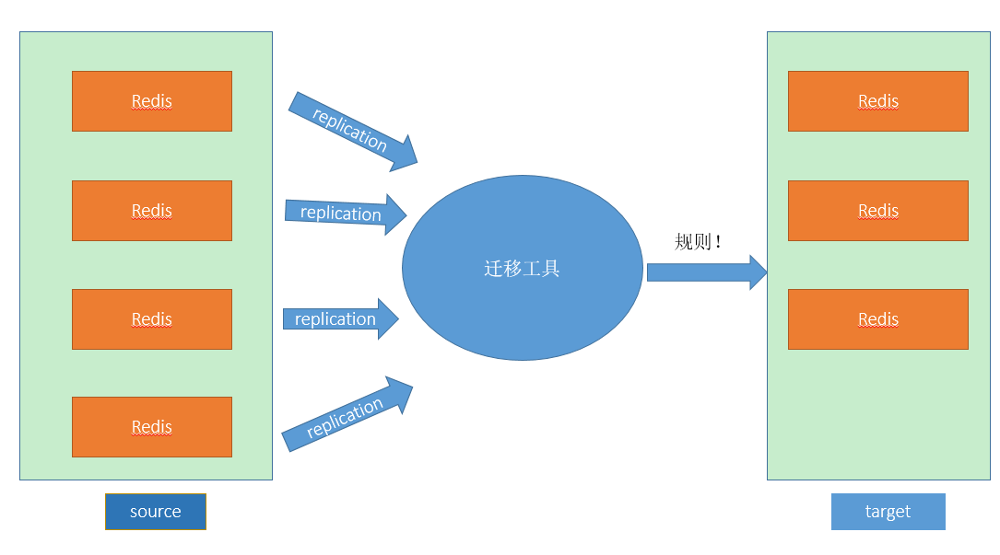

### 三、CacheCloud数据迁移工具如何部署和使用

1. 准备迁移工具机器
    + 初始化机器，在“管理后台-机器管理”页面点击“添加新机器”，请参考相关文档；
    + 添加机器时候，选择机器类型为“Redis迁移工具机器”，建议单独使用一台机器做迁移，因为迁移的过程可能会占用机器的很多资源。  
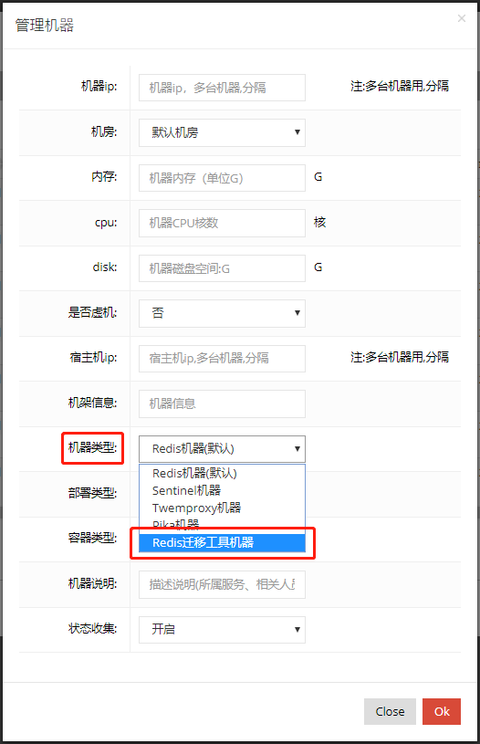

2. 安装部署redis-migrate-tool/redis-shake  
    + redis-migrate-tool  
在“管理后台-系统配置管理”中配置安装目录，  
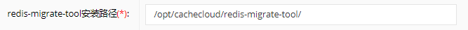  
    安装方法可以参考redis-migrate-tool主页或者按照如下安装:
        ```
        $ cd /opt/cachecloud/
        $ wget https://github.com/vipshop/redis-migrate-tool/archive/master.zip
        $ mv master master.zip
        $ unzip master.zip
        $ mv redis-migrate-tool-master redis-migrate-tool
        $ cd redis-migrate-tool
        $ mkdir data
        $ autoreconf -fvi
        $ ./configure
        $ make
        $ src/redis-migrate-tool -h
        ```
      最为重要的一步是, 注意这里的cachecloud-open是ssh的用户名
      ```	
      $ chown -R ${cachecloud-ssh-username}.${cachecloud-ssh-username} /opt/cachecloud/redis-migrate-tool
      ```
    + redis-shake  
    在“管理后台-系统配置管理”中配置安装目录：  
    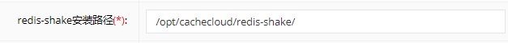  
    安装方法可以参考redis-shake主页或者按照如下安装：
        ```
        1.下载redis-shake安装包，下载地址 https://github.com/alibaba/RedisShake/releases
        2.解压到/opt/cachecloud/redis-shake目录下
        3.创建文件夹conf（存放配置文件）、 logs（存放日志）和pid（存放进程信息）
        4.下载redis-full-check安装包，下载地址 https://github.com/alibaba/RedisFullCheck/releases
        5.解压到/opt/cachecloud/redis-full-shake目录下
        6.创建文件夹data（存放比对数据结果）
        ```
3. 添加迁移任务  
    a. 点击“迁移数据工具”进入迁移数据记录列表页面。  
    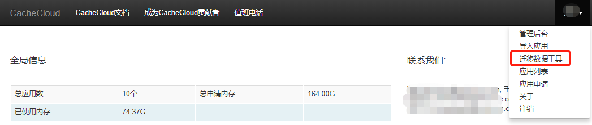  
    b. 在移数据记录列表中可以查看历史迁移任务信息，任务的配置文件、迁移状态、迁移日志，停止任务，进行数据校验等运维操作。
    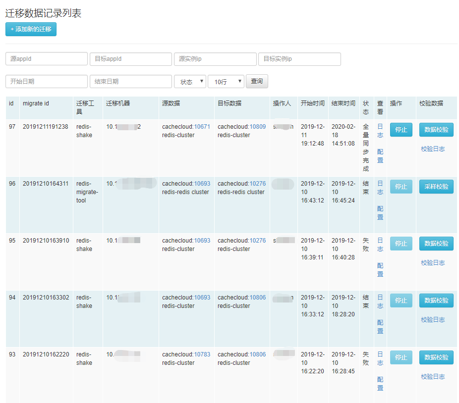  
    c. 点击“点击添加新的迁移按钮”，选择迁移工具，迁移机器，配置源和目标信息，点击验证按钮，按照通过后就开启了一个迁移的任务，回到迁移列表，就可以观察迁移日志、关闭迁移任务、迁移状态查询等。   
    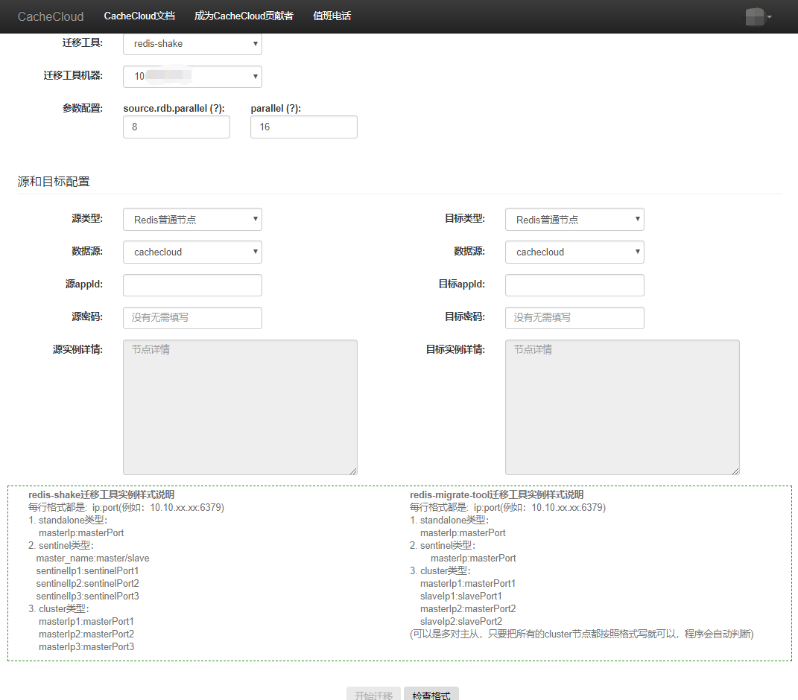  
  
4. 数据校验  
  - 数据迁移完毕后，点击“数据校验”按钮，跳转到如下界面，说明校验程序已经启动：  
    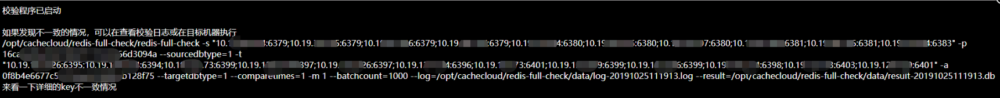  
  - 可通过点击“校验日志”，查看log（默认log 5s刷新）：  
    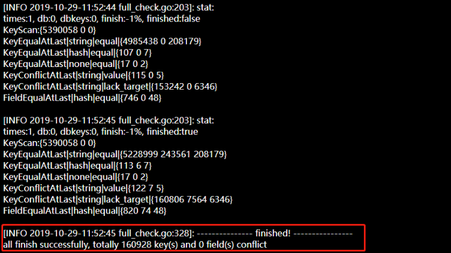  
  - 查看数据校验结果    
    校验数据报错在校验机器的/opt/cachecloud/redis-full-check/data目录下：  
    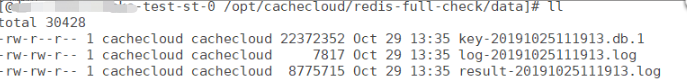  
    查看不一致结果记录到result文件：  
    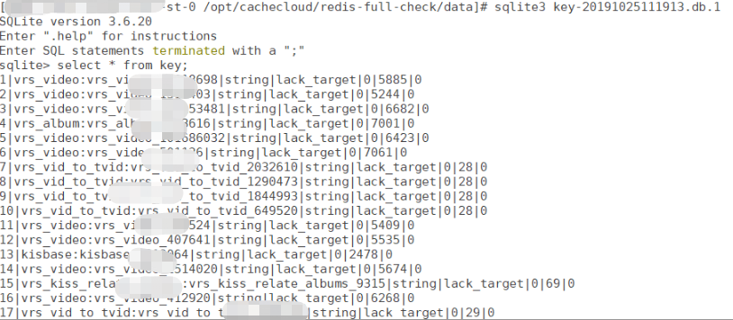  
### 四、客户端怎么迁移
1. 当迁移工作基本完成后，我们就需要迁移客户端了，为了方便演示我们假设只有两个客户端。  
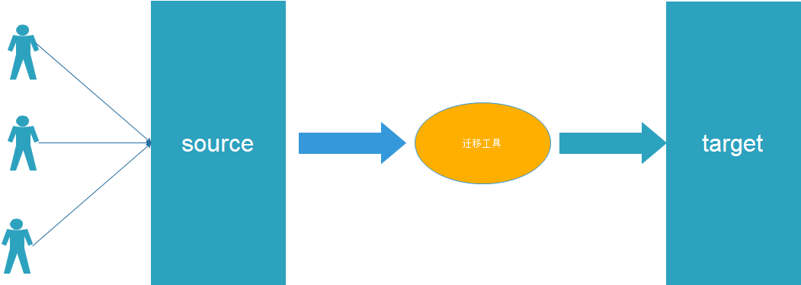 
2. 迁移第一个客户端，观察客户端是否出现异常。  
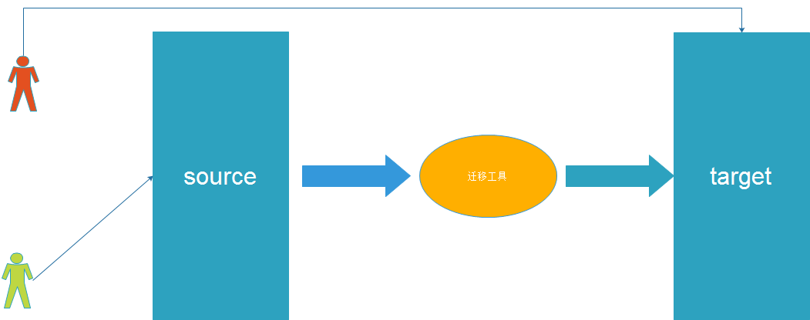  
3. 迁移第二个客户端，继续观察。  
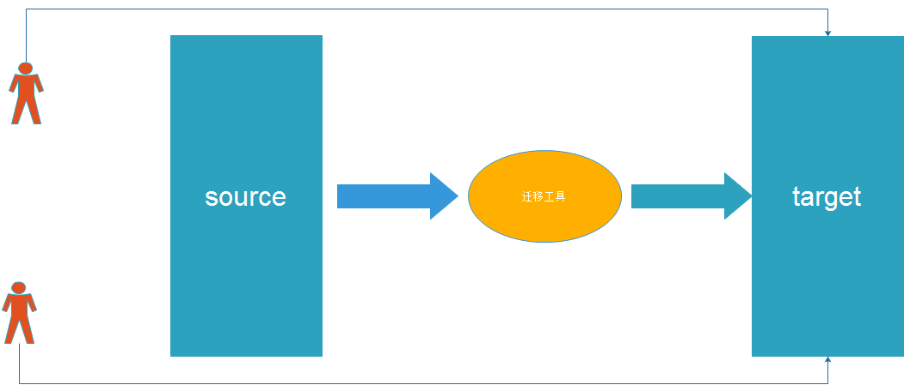  
4. 检查source应用是否还有调用。  
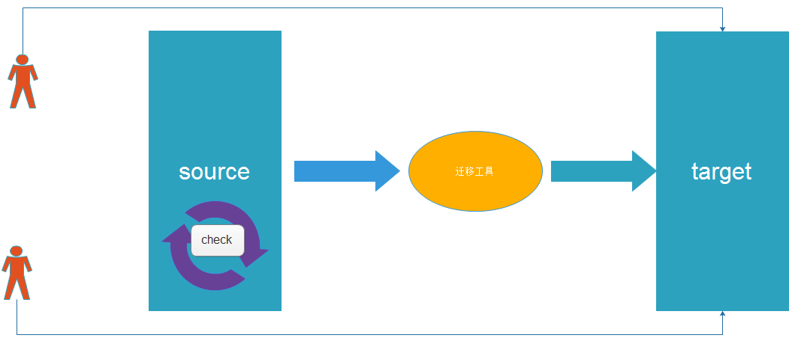  
5. 下线source应用和迁移工具。  
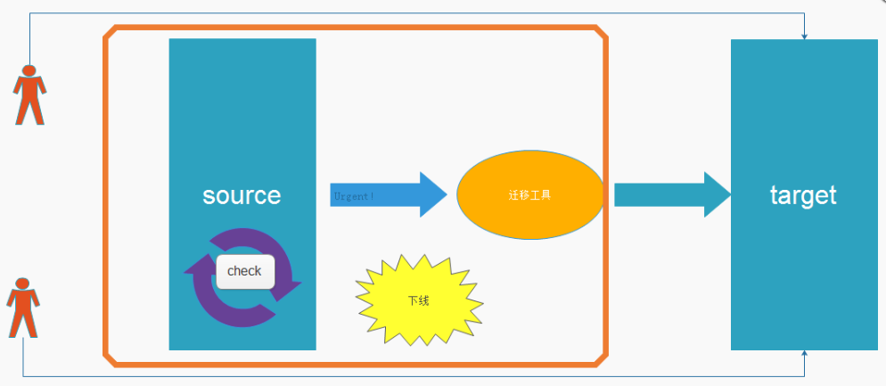   
### 五、一些建议
- 尽可能单独找一台机器作为迁移机器，因为迁移的过程可能会占用机器的很多资源；
- redis-migrate-tool/redis-shake很具体的原理问题和细节可以到社区或CacheCloud群里找作者提问；
- redis-shake使用或迁移日志中的问题可以参考：  
    [https://github.com/alibaba/RedisShake/wiki/FAQ](https://github.com/alibaba/RedisShake/wiki/FAQ)  
    [https://github.com/alibaba/RedisShake/issues](https://github.com/alibaba/RedisShake/issues)
- 迁移工具页面还有很多要优化的地方，后期会听取大家意见逐渐改善。


​     
