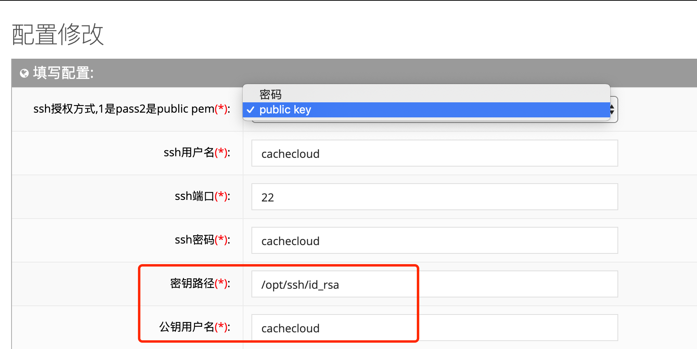

## Redis机器授权方式

### 1.用户名/密码访问

参考系统配置初始化参数，机器ssh用户名：${yourusername}/机器ssh密码${yourpassword}

<a name="cc52"/>

### 2.公钥访问

参考系统配置初始化参数，密钥路径：${path}/公钥用户名：${yourusername}

> 生成公钥/私钥文件流程:

#### 1.生成公钥/私钥文件
```	
1).执行命令:ssh-keygen -t rsa -C ${yourusername} -f /opt/id_rsa(-f可指定文件路径)
2).目录: /opt
3).公钥文件:id_rsa.pub
4).私钥文件:id_rsa    
```

#### 2.公钥/私钥配置方式

- 2.1 公钥配置

所有Redis机器需要基于cachecloud用户目录下写入公钥信息并授权
````
1).写入公钥信息:
echo "***" >> /home/cachecloud/.ssh/authorized_keys  （***为上面生成id_rsa.pub公钥信息）
2).文件权限:
chmod 755 /home/cachecloud/.ssh/authorized_keys
````

- 2.2 私钥配置

cachecloud后台机器上配置私钥
````
1).指定私钥文件路径：/opt/ssh/id_rsa
2).授权私钥文件权限：chmod 600 /opt/ssh/id_rsa
3).通过cachecloud用户登录redis机器: ssh -i /opt/ssh/id_rsa -l cachecloud ${ip}
````

#### 3.后台配置公钥/私钥信息

- 密钥路径：cachecloud机器上id_rsa文件路径
- 公钥用户名： 连接Redis机器的用户名

