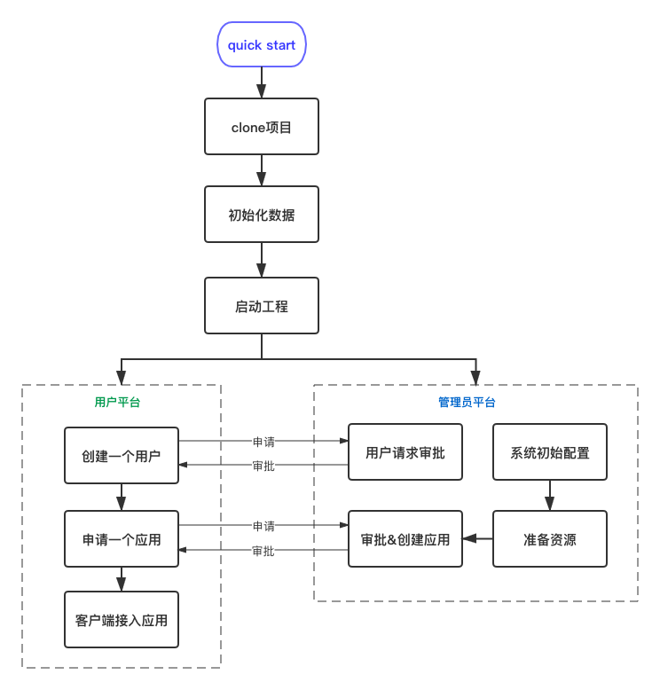
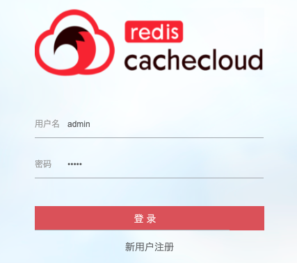
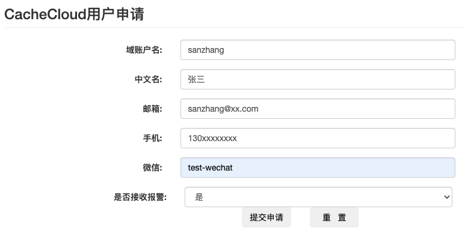
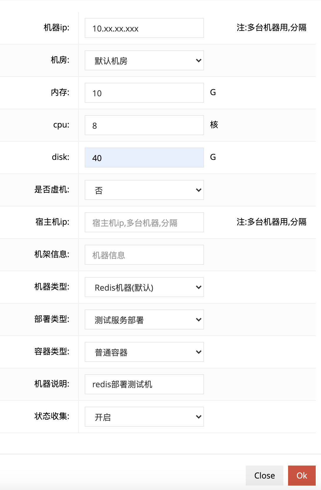
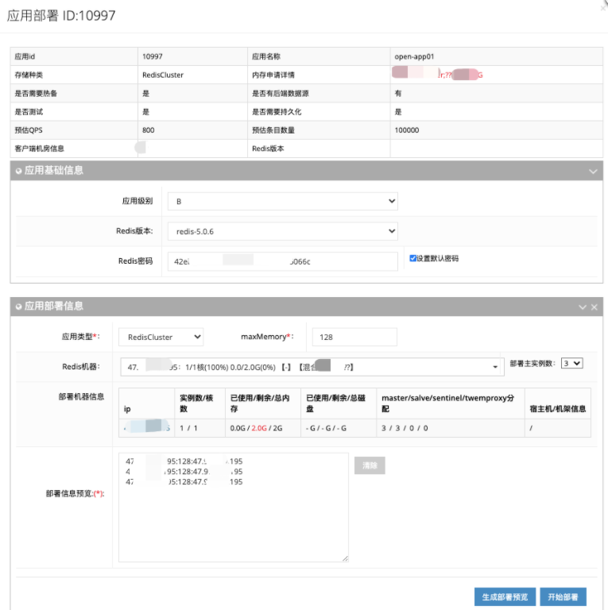
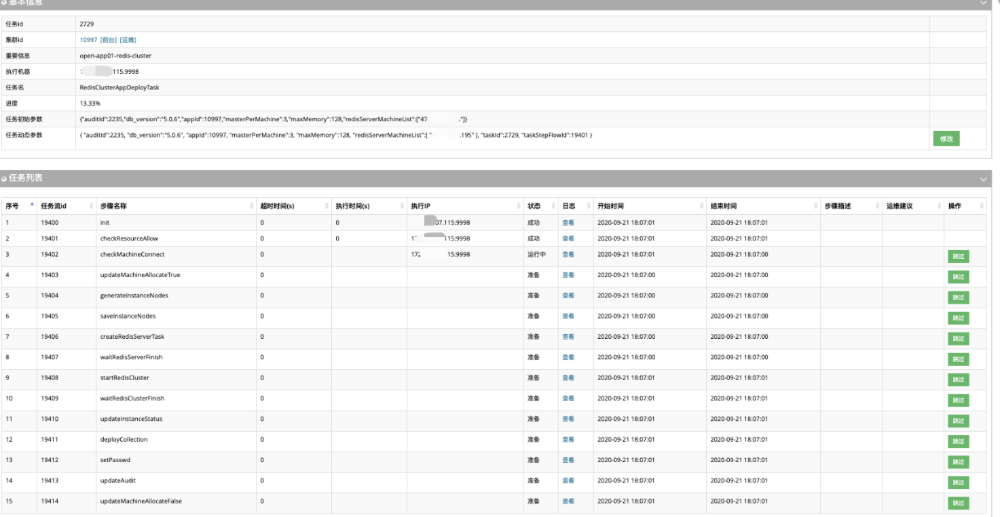

##### 目录
* [一、准备war包](#cc1)
* [二、初始化数据](#cc2)
* [三、启动工程](#cc3)
* [四、系统初始配置](#cc4)
* [五、创建一个用户](#cc5)
* [六、准备资源](#cc6)
* [七、创建一个应用](#cc7)

<a name="cc1"/>

## 快速接入 quick start 
”快速接入“ 帮助你快速启动cachecloud中台，并创建一个应用。

<a name="cc1"/>

### 一、准备war包	
a.下载war包：

[2.2版本 cachecloud-web.war](http://43.137.44.6/redis-ecs/cachecloud-web.war)

[3.0版本 cachecloud-web.war](http://43.137.44.6/redis-ecs/3.0/cachecloud-web.war)

[3.1版本 cachecloud-web.war](http://43.137.44.6/redis-ecs/3.1/cachecloud-web.war)

b.也可以clone源码，自行打包：

	//clone项目
	git clone https://github.com/sohutv/cachecloud.git
	//打包
	mvn clean package

<a name="cc2"/>

### 二、初始化数据
导入项目sql目录下初始化库表结构，默认插入admin超级管理员。

创建数据库：

	url: jdbc:mysql://xxx:3306/cachecloud_open
	user: xxx
	password: xxx

导入建表文件：/cachecloud-open/cachecloud-web/sql/cc2.0.sql

<a name="cc3"/>

### 三、启动工程
准备配置文件：application-open.yml，放到war包同目录下

	#配置应用名称
	spring:
	  application:
	    name: cloud.cachecloud-web.open
	#配置访问端口,默认8080
	server:
	  port: 8080
	#配置数据库
	cachecloud:
	  primary: #mysql数据库
	    url: ${jdbcUrl}
	    user: ${username}
	    password: ${password}

启动工程

 	//启动web工程
	nohup java -jar -Dspring.profiles.active=open cachecloud-web.war &
	
访问web：<http://localhost:8080/manage/login> 使用默认管理员账户登录：用户名 admin 密码 admin

<a name="cc4"/>

### 四、系统初始配置
系统已有默认配置，如需更改，请参考 [系统配置说明](../access/config.md)。

<a name="cc5"/>

### 五、创建一个用户
新用户注册：<http://localhost:8080/user/register> 提交用户注册申请。

管理员审核（<http://localhost:8080/manage/app/auditList>）通过后，用户可登录/使用系统。

<a name="cc6"/>

### 六、准备资源

<a name="cc61"/>

* 1.准备脚本
	
	下载 [cachecloud-init.sh](http://43.137.44.6/redis-ecs/script)
	
		cachecloud-init.sh脚本作用：
		a.初始化环境变量
		b.创建用户;
		c.创建默认redis路径并授权;
		d.默认安装"redis-3.0.7" "redis-3.2.12" "redis-4.0.14" "redis-5.0.9";
		  注意：Redis6.0及以上版本需要依赖操作系统gcc4.9.0以上版本编译
		e.@usage: sh cachecloud-init.sh [username]

<a name="cc62"/>

* 2.执行脚本

	采用”用户名/密码“授权方式，请确保机器的用户名/密码与cachecloud后台”系统配置“页面的”机器ssh用户名/机器ssh密码“一致。

		a.使用root登录目标服务器;
		b.将cachecloud-init.sh脚本拷贝到目标服务器当前用户目录下/opt ;
		c.执行 sh cachecloud-init.sh ${username}，默认username="cachecloud-open"；
		d.两次确认密码;
		e.一路安装直到成功。

<a name="cc63"/>

* 3.添加机器

	将刚准备好资源的机器添加到cachecloud中台：<http://localhost:8080/manage/machine/index?tabTag=machine>

	

<a name="cc7"/>

### 七、创建一个应用

<a name="cc71"/>

* 1.申请应用

	用户申请应用<http://localhost:8080/admin/app/init>。
	
<a name="cc72"/>
	
* 2.部署应用

	a.管理员审批应用申请：<http://localhost:8080/manage/app/auditList>，点击”审批处理“。
	
	
	
	b.应用部署：点击”生成部署预览“，确认拓扑无误，点击”开始部署“，跳转到应用部署任务流。

	
		
	c.通过：等待应用部署成功后，在审批页点击”通过“，就此应用开通成功。用户接入使用可参考：[客户端接入文档](../access/client.md)。
	
	(提示：任务流日志是存储在redis中的，即项目启动时配置文件application-open.yml中的cachecloud.redis信息)
	
	
	
<a name="cc73"/>
	
* 3.导入应用

	该功能支持将外部redis实例导入Cachecloud平台进行运维管理。具体操作参考：[应用导入](../../wiki/function/operation-import.md)
