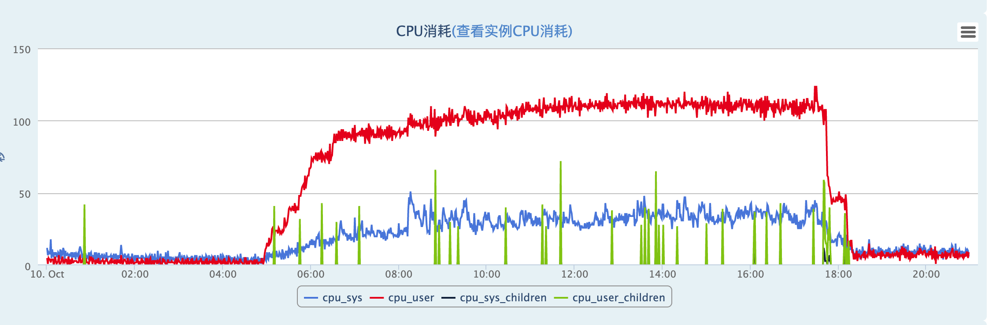
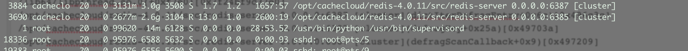
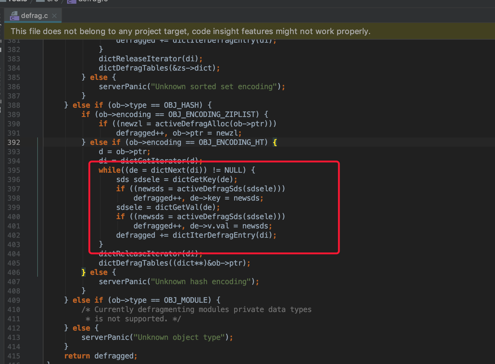

## activeDefrag引起redis周期性延迟

<a name="c1"/>

### 1.问题描述

redis客户端连接Redis节点会出现周期性超时情况，CC监控排查到cpu使用率异常。



客户端机器测试redis节点延迟情况:

````
redis-cli -h 10.19.122.69 -p 6387 -a 5d948b734065a8f163cb931701b7ade2 --latency-history
** min: 0, max: 2894, avg: 3.87 (1077 samples) -- 15.01 seconds range ** 
min: 0, max: 30, avg: 1.20 (1332 samples) -- 15.02 seconds range
min: 0, max: 218, avg: 1.40 (1308 samples) -- 15.01 seconds range
min: 0, max: 25, avg: 1.23 (1327 samples) -- 15.00 seconds range
min: 0, max: 20, avg: 1.25 (1326 samples) -- 15.01 seconds range
min: 0, max: 21, avg: 1.24 (1326 samples) -- 15.01 seconds range
min: 0, max: 74, avg: 1.33 (1315 samples) -- 15.01 seconds range
min: 0, max: 37, avg: 1.25 (1325 samples) -- 15.00 seconds range
** min: 0, max: 2435, avg: 3.65 (1094 samples) -- 15.01 seconds range ** 
min: 0, max: 18, avg: 1.22 (1329 samples) -- 15.01 seconds range
** min: 0, max: 2810, avg: 3.80 (1081 samples) -- 15.00 seconds range ** 
min: 0, max: 30, avg: 1.23 (1329 samples) -- 15.02 seconds range
min: 0, max: 210, avg: 1.38 (1309 samples) -- 15.00 seconds range
min: 0, max: 28, avg: 1.27 (1323 samples) -- 15.01 seconds range
min: 0, max: 21, avg: 1.24 (1328 samples) -- 15.02 seconds range
min: 0, max: 70, avg: 1.35 (1320 samples) -- 15.08 seconds range
min: 0, max: 28, avg: 1.23 (1328 samples) -- 15.01 seconds range
min: 0, max: 37, avg: 1.26 (1324 samples) -- 15.01 seconds range
** min: 0, max: 2456, avg: 3.64 (1094 samples) -- 15.00 seconds range ** 
min: 0, max: 19, avg: 1.23 (1327 samples) -- 15.00 seconds range
min: 0, max: 2953, avg: 3.90 (1073 samples) -- 15.00 seconds range
min: 0, max: 29, avg: 1.20 (1331 samples) -- 15.01 seconds range
....
````

上面带**的最大耗时均为秒级，redis节点周期性的出现延迟。

<a name="c2"/>

### 2. 故障定位

排查慢查询，命令分析，IO问题定位 均无法定位问题，集中把异常的节点变为从节点，主节点使用dkmanager机器，延迟问题得到恢复。
在延迟的从节点上开启watchdog观察redis本身的慢调用栈。

````
# 超过100毫秒记录redis调用栈
CONFIG SET watchdog-period 100
````
跟踪redis日志，发现周期性输出如下调用栈。
````
Backtrace:
/opt/cachecloud/redis-4.0.11/src/redis-server 0.0.0.0:6387 [cluster](logStackTrace+0x3c)[0x4673fc]
/opt/cachecloud/redis-4.0.11/src/redis-server 0.0.0.0:6387 [cluster](watchdogSignalHandler+0x1b)[0x4674ab]
/lib64/libpthread.so.0(+0xf7e0)[0x7f24bf9c37e0]
/opt/cachecloud/redis-4.0.11/src/redis-server 0.0.0.0:6387 [cluster](dictIterDefragEntry+0x6c)[0x496c3c]
/opt/cachecloud/redis-4.0.11/src/redis-server 0.0.0.0:6387 [cluster](defragKey+0x25a)[0x49703a]
/opt/cachecloud/redis-4.0.11/src/redis-server 0.0.0.0:6387 [cluster](defragScanCallback+0x9)[0x497209]
/opt/cachecloud/redis-4.0.11/src/redis-server 0.0.0.0:6387 [cluster](dictScan+0x23a)[0x426e7a]
/opt/cachecloud/redis-4.0.11/src/redis-server 0.0.0.0:6387 [cluster](activeDefragCycle+0x1da)[0x49666a]
/opt/cachecloud/redis-4.0.11/src/redis-server 0.0.0.0:6387 [cluster](databasesCron+0x7b)[0x42ae3b]
/opt/cachecloud/redis-4.0.11/src/redis-server 0.0.0.0:6387 [cluster](serverCron+0x193)[0x42cae3]
/opt/cachecloud/redis-4.0.11/src/redis-server 0.0.0.0:6387 [cluster](aeProcessEvents+0x32f)[0x424ecf]
/opt/cachecloud/redis-4.0.11/src/redis-server 0.0.0.0:6387 [cluster](aeMain+0x2b)[0x42509b]
/opt/cachecloud/redis-4.0.11/src/redis-server 0.0.0.0:6387 [cluster](main+0x500)[0x42d750]
/lib64/libc.so.6(__libc_start_main+0xfd)[0x7f24bf63ed1d]
/opt/cachecloud/redis-4.0.11/src/redis-server 0.0.0.0:6387 [cluster][0x422409]
3884:signal-handler (1570711815) --------
````
堆栈信息定位是 redis内部定时任务触发的在线内存碎片整理逻辑，redis 定时任务和网络IO事件共享单线程架构。

慢调用栈输出时间点和客户端延迟时间点吻合，初步定位是该问题导致。

关闭在线碎片整理，延迟调用问题恢复。

````
min: 0, max: 2488, avg: 3.61 (1098 samples) -- 15.00 seconds range
min: 0, max: 28, avg: 1.17 (1335 samples) -- 15.00 seconds range
min: 0, max: 2972, avg: 3.94 (1072 samples) -- 15.00 seconds range
min: 0, max: 27, avg: 1.14 (1340 samples) -- 15.02 seconds range
min: 0, max: 30, avg: 1.19 (1334 samples) -- 15.01 seconds range
min: 0, max: 223, avg: 1.34 (1316 samples) -- 15.01 seconds range
min: 0, max: 28, avg: 1.15 (1338 samples) -- 15.01 seconds range
min: 0, max: 17, avg: 1.14 (1339 samples) -- 15.01 seconds range
# config set activedefrag no 关闭在线碎片整理时间点
min: 0, max: 16, avg: 0.36 (1439 samples) -- 15.01 seconds range 
min: 0, max: 1, avg: 0.06 (1482 samples) -- 15.01 seconds range
min: 0, max: 1, avg: 0.05 (1482 samples) -- 15.01 seconds range
min: 0, max: 1, avg: 0.07 (1482 samples) -- 15.01 seconds range
min: 0, max: 7, avg: 0.07 (1481 samples) -- 15.01 seconds range
````

开启和关闭节点CPU表现:



<a name="c3"/>

### 3.进一步定位

查看redis关于碎片整理的源码，Redis碎片代码整理粒度: 

<span style="color:red;font:blod">当redis_version <= 4.0.xx ，在线内存整理以键作为最小扫描单位，针对非字符串的结构需要迭代所有的元素指针才能返回，复杂度为O(N)。因此对于非字符串bigkeys碎片整理，返回时间不再可控从而造成阻塞。</span>

Redis 4.0.x 源码: redis<= 4.0.x之前的代码碎片整理迭代逻辑，至少扫描16个键或指针整理数超过1000，检查cpu使用超时退出。

````
//defrag.c
do {
    cursor = dictScan(db->dict, cursor, defragScanCallback, defragDictBucketCallback, db);
    /* Once in 16 scan iterations, or 1000 pointer reallocations
     * (if we have a lot of pointers in one hash bucket), check if we
     * reached the tiem limit. */
    if (cursor && (++iterations > 16 || server.stat_active_defrag_hits - defragged > 1000)) {
        if ((ustime() - start) > timelimit) {
            return;
        }
        iterations = 0;
        defragged = server.stat_active_defrag_hits;
    }
} while(cursor);
````

Redis 5.0.x 源码: 

<span style="color:red;font:blod">redis> 5.0.x 升级日志 "Active defragmentation version 2",

碎片扫描粒度：16次迭代或512次指针移动或64个碎片扫描，检测超时时间。</span>

````
//degrag.c
/* Perform incremental defragmentation work from the serverCron.
 * This works in a similar way to activeExpireCycle, in the sense that
 * we do incremental work across calls. */
void activeDefragCycle(void) {
        // ....
        do {
            /* before scanning the next bucket, see if we have big keys left from the previous bucket to scan */
            //扫描完整个db后，按 bigkeys 的元素进行迭代扫描
            if (defragLaterStep(db, endtime)) {
                quit = 1; /* time is up, we didn't finish all the work */
                break; /* this will exit the function and we'll continue on the next cycle */
            }
            // 按键迭代扫描
            cursor = dictScan(db->dict, cursor, defragScanCallback, defragDictBucketCallback, db);
 
            /* Once in 16 scan iterations, 512 pointer reallocations. or 64 keys
             * (if we have a lot of pointers in one hash bucket or rehasing),
             * check if we reached the time limit.
             * But regardless, don't start a new db in this loop, this is because after
             * the last db we call defragOtherGlobals, which must be done in once cycle */
            if (!cursor || (++iterations > 16 ||
                            server.stat_active_defrag_hits - prev_defragged > 512 ||
                            server.stat_active_defrag_scanned - prev_scanned > 64)) {
                if (!cursor || ustime() > endtime) {
                    quit = 1;
                    break;
                }
                iterations = 0;
                prev_defragged = server.stat_active_defrag_hits;
                prev_scanned = server.stat_active_defrag_scanned;
            }
        } while(cursor && !quit);
    } while(!quit);
 
    latencyEndMonitor(latency);
    latencyAddSampleIfNeeded("active-defrag-cycle",latency);
}
````


<span style="color:red">碎片扫描逻辑默认对元素数超过1000的结构放入链表中延迟处理，待整个DB扫描完毕后再单独按元素扫描，解决bigkeys引起的阻塞和时效性问题。</span>

<span style="color:green">5.0 新增参数配置:</span>

````
# Maximum number of set/hash/zset/list fields that will be processed from the main dictionary scan
# active-defrag-max-scan-fields 1000
````
<a name="c4"/>

### 4.优化方案

- <span style="color:green">优化方案:</span>
    - redis版本 <= 4.0.x，关闭碎片整理 config set activedefrag no；
    - redis版本 <= 4.0.x，扫描bigkey并优化，防止因遍历bigkey导致阻塞；
    - 升级到redis版本到4.0.14 或 5.0.x以上版本,新增配置对bigkey遍历键项数 active-defrag-max-scan-fields 1000(默认配置)；