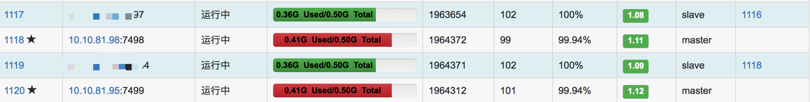
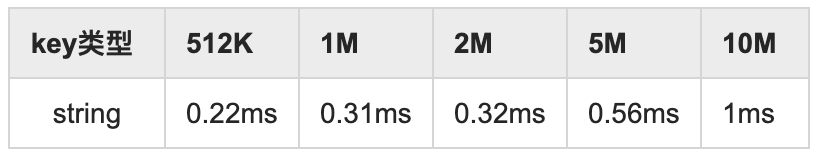
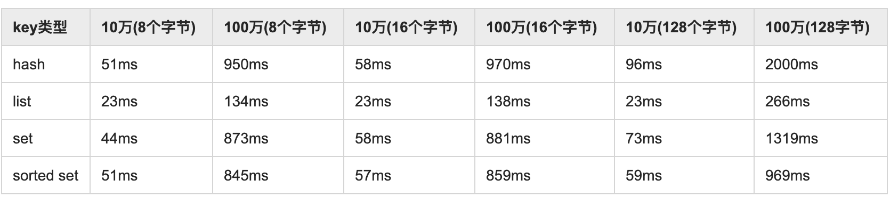
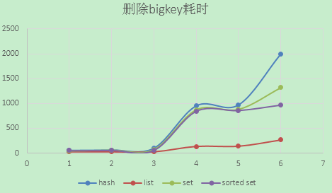

## bigkey的寻找和优化

* [一、什么是bigkey](#cc1)
* [二、bigkey的危害](#cc2)
* [三、如何发现](#cc3)
* [四、如何删除](#cc4)
* [五、如何优化](#cc5)
* [六、总结](#cc6)

### 一、什么是bigkey

虽然叫bigkey，但实际上它是指key对应的value所占的内存空间比较大，例如一个字符串类型的value可以最大存到512M，一个列表类型的value最多可以存储2的32次方减1个元素(大约4G)。
如果按照数据结构来细分的话，一般分为字符串类型bigkey和非字符串类型bigkey：

1. 字符串类型：它的big体现在单个value值很大，一般认为超过100KB就是bigkey。
2. 非字符串类型：哈希、列表、集合、有序集合，它们的big体现在元素个数太多。
 
### 二、bigkey的危害

bigkey的危害比较多的，主要体现在以下方面:

1. 内存空间不均匀(平衡)：在Redis集群中，bigkey会造成部分节点的内存空间使用不均匀。

    

2. 超时阻塞：由于Redis单线程的特性，操作bigkey的比较耗时，也就意味着阻塞Redis可能性越大，这样会造成客户端阻塞或者引起故障切换。

3. 网络拥塞：bigkey也就意味着每次获取要产生的网络流量较大，假设一个bigkey为1M，客户端每秒访问量为1000，那么每秒产生1000M的流量，对于普通的千兆网卡(按照字节算是128MB/s)的服务器来说简直是灭顶之灾，而且一般服务器会采用单机多实例的方式来部署，也就是说一个bigkey可能会对其他实例造成影响，其后果不堪设想。

4. 过期删除：如果没有使用Redis 4.0的过期异步删除(lazyfree-lazy-expire yes)，就会存在阻塞Redis的可能性，而且这个过期删除不会从主节点的慢查询发现（因为这个删除不是客户端产生的，是内部循环事件，可以从latency命令中获取或者从slave节点慢查询发现）。

5. [内存碎片整理](activefrag.md)：在redis4.0.*版本如果开启碎片整理且存在超大bigkey，可能会导致客户端出现周期性超时问题。


### 三、如何发现

1. redis-cli --bigkeys

    redis-cli提供了--bigkeys来查找bigkey，例如下面就是一次执行结果：

    ````
    -------- summary -------

    Sampled 215036 keys in the keyspace!
    Total key length in bytes is 13428208 (avg len 62.45)

    Biggest string found 'v4_firstPageData_*****' has 2549527 bytes
    Biggest    set found 'ASSOCIATE_TRACE_CHILDREN_*******' has 7322 members
    Biggest   zset found 'TEMPLATE_STRATEGY_*****_' has 10 members

    159497 strings with 3183765503 bytes (74.17% of keys, avg size 19961.29)
    0 lists with 0 items (00.00% of keys, avg size 0.00)
    55535 sets with 130291 members (25.83% of keys, avg size 2.35)
    0 hashs with 0 fields (00.00% of keys, avg size 0.00)
    4 zsets with 25 members (00.00% of keys, avg size 6.25)
    0 streams with 0 entries (00.00% of keys, avg size 0.00)
    ````
    可以看到--bigkeys扫描给出了每种数据结构的top1 bigkey，同时给出了每种数据类型的键值个数以及平均大小。

    --bigkeys对问题的排查非常方便，但是在使用它时候也有几点需要注意：
    ````
    1. 建议对从节点执行，由于--bigkeys是通过scan扫描完成的；
    2. 建议在从节点机器上去执行，减少网络开销；
    3. 如果没有从节点，可通过-i 参数控制执行频率(-i 0.1 每100ms执行一次)
    ````

2. debug object

    Redis提供了debug object ${key}命令获取键值的相关信息：
    ````
    127.0.0.1:6379> hlen hash_obj
    (integer)500000
    127.0.0.1:6379> debug object hash_obj
    Value at:0x7fc06c1b1430 refcount:1 encoding:raw serializedlength:87256350 lru:11686193 lru_seconds_idle:20
    (1.08s)
    ````
    其中serializedlength表示key对应的value序列化之后的字节数,这样你就可以用scan + debug object的方式遍历Redis所有的键值.
    不过debug object命令执行如果遇到bigkey也可能会阻塞客户端，建议对从节点执行。

3. memory usage

    memory usage ${key} 用于分析某个key在redis内部实际占用多少内存(单位：字节)，从Redis 4.0开始及以上版本支持。
    ````
    127.0.0.1:6379> memory usage bighash (bighash占用内存686KB)
    (integer) 686755
    127.0.0.1:6379> DEBUG OBJECT bighash （bighash序列化大小为227KB）
    Value at:0x7f00c8e884b0 refcount:1 encoding:hashtable serializedlength:227790 lru:7578074 lru_seconds_idle:288
    127.0.0.1:6379> hlen bighash
    (integer) 10000
    127.0.0.1:6379> memory usage key:001016520509
    (integer) 65
    ````
    如果你使用Redis 4.0+，你就可以用scan + memory usage替代scan + debug object的方式遍历Redis所有的键值,执行速度也较快。

4. 监控报警

    bigkey的大操作，通常会引起客户端输入或者输出缓冲区的异常，Redis提供了info clients里面包含的客户端输入缓冲区的字节数以及输出缓冲区的队列长度，可以重点关注下：

    ````
    instanceId:9427> info clients
    # Clients
    connected_clients:58
    client_longest_output_list:0
    client_biggest_input_buf:0
    blocked_clients:0
    
    以下为6.0版本，会记录历史最大输入、输出缓冲区队列
    127.0.0.1:6379> info clients
    # Clients
    connected_clients:1
    client_recent_max_input_buffer:2
    client_recent_max_output_buffer:0
    ````
    如果想知道具体哪个客户端ip，可以使用client list命令来查找。
    ````
    127.0.0.1:6379> client list
    id=3 addr=127.0.0.1:56040 fd=9 name= age=161 idle=0 flags=N db=0 sub=0 psub=0 multi=-1 qbuf=26 qbuf-free=32742 obl=0 oll=0 omem=0 events=r cmd=client
    ````

### 四、如何删除

当发现Redis中有bigkey时并且确认要删除时，如何优雅地删除bigkey？下面给出一组测试数据分别对string、hash、list、set、sorted set五种数据结构的bigkey进行删除，bigkey的元素个数和每个元素的大小不尽相同。


1. 下图为删除512K~10M的字符串类型数据所花费的时间，总体来说由于字符串类型结构相对简单，删除速度比较快，但是随着value值的不断增大，删除速度也逐渐变慢。

    

2. 下图展示了非字符串类型在不同数量级、不同元素大小下对bigkey执行del的时间，总体上看元素个数越多，元素越大删除时间越长，并相对于字符串类型，这种删除速度已经足够可以阻塞掉Redis。

    

    

看到除了string类型，其他四种数据结构元素数量和每个元素字节数越大删除的速度越慢，这样的删除速度势必会阻塞Redis。既然不能用del，那有没有比较优雅的方式进行删除呢，这时候就需要将第三章介绍的scan命令的若干类似命令拿出来：sscan、hscan、zscan。

1. 字符串：

  一般来说，对于string类型使用del命令不会产生阻塞。
  
2. hash：
  
  使用hscan命令，每次获取部分(例如100个)field-value，在利用hdel删除每个field(为了快速可以使用pipeline)。
  
    ````
    public void delBigHash(String bigKey) {
        Jedis jedis = new Jedis("127.0.0.1", 6379);
        // 游标
        String cursor = "0";
        while (true) {
            ScanResult<Map.Entry<String, String>> scanResult = jedis.hscan(bigKey, cursor, new ScanParams().count(100));
            // 每次扫描后获取新的游标
            cursor = scanResult.getStringCursor();
            // 获取扫描结果
            List<Entry<String, String>> list = scanResult.getResult();
            if (list == null || list.size() == 0) {
                continue;
            }
            String[] fields = getFieldsFrom(list);
            // 删除多个field
            jedis.hdel(bigKey, fields);
            // 游标为0时停止
            if (cursor.equals("0")) {
                break;
            }
        }
        //最终删除key
        jedis.del(bigKey);
    }
     
    /**
     * 获取field数组
     * @param list
     * @return
     */
    private String[] getFieldsFrom(List<Entry<String, String>> list) {
        List<String> fields = new ArrayList<String>();
        for(Entry<String, String> entry : list) {
            fields.add(entry.getKey());
        }
        return fields.toArray(new String[fields.size()]);
    }
    ````

3. list

    Redis并没有提供lscan这样的API来遍历列表类型，但是提供了ltrim这样的命令可以渐进式的删除列表元素，直到把列表删除。

4. set

    使用sscan命令，每次获取部分(例如100个)元素，在利用srem删除每个元素。

    ````
    public void delBigSet(String bigKey) {
        Jedis jedis = new Jedis("127.0.0.1", 6379);
        // 游标
        String cursor = "0";
        while (true) {
            ScanResult<String> scanResult = jedis.sscan(bigKey, cursor, new ScanParams().count(100));
            // 每次扫描后获取新的游标
            cursor = scanResult.getStringCursor();
            // 获取扫描结果
            List<String> list = scanResult.getResult();
            if (list == null || list.size() == 0) {
                continue;
            }
            jedis.srem(bigKey, list.toArray(new String[list.size()]));
            // 游标为0时停止
            if (cursor.equals("0")) {
                break;
            }
        }
        //最终删除key
        jedis.del(bigKey);
    }
    ````

5. sorted set

    使用zscan命令，每次获取部分(例如100个)元素，在利用zremrangebyrank删除元素。

    ````
    /**
     * 137258ms
     * @param bigKey
     */
    public void delBigSortedSet(String bigKey) {
        long startTime = System.currentTimeMillis();
        Jedis jedis = new Jedis(HOST, PORT);
        // 游标
        String cursor = "0";
        while (true) {
            ScanResult<Tuple> scanResult = jedis.zscan(bigKey, cursor, new ScanParams().count(100));
            // 每次扫描后获取新的游标
            cursor = scanResult.getStringCursor();
            // 获取扫描结果
            List<Tuple> list = scanResult.getResult();
            if (list == null || list.size() == 0) {
                continue;
            }
            String[] members = getMembers(list);
            jedis.zrem(bigKey, members);
            // 游标为0时停止
            if (cursor.equals("0")) {
                break;
            }
        }
        // 最终删除key
        jedis.del(bigKey);
    }
     
    /**
     * 60529ms
     * @param bigKey
     */
    public void delBigSortedSet2(String bigKey) {
        Jedis jedis = new Jedis(HOST, PORT);
        long zcard = jedis.zcard(bigKey);
        int counter = 0;
        int incr = 100;
        while (counter < zcard) {
            jedis.zremrangeByRank(bigKey, 0, 100);
            //每次从左侧截掉100个
            counter+=incr;
        }
        // 最终删除key
        jedis.del(bigKey);
    }
    ````
  
### 五、如何优化

1. 拆

    - big list： list1、list2、...listN

    - big hash：可以做二次的hash，例如hash%100

    - 日期类：key20190320、key20190321、key_20190322

2. 本地缓存

减少访问redis次数，降低危害，但是要注意这里有可能因此本地的一些开销（例如使用堆外内存会涉及序列化，bigkey对序列化的开销也不小）

### 六、总结：

由于开发人员对Redis的理解程度不同，在实际开发中出现bigkey在所难免，重要的能通过合理的检测机制及时找到它们，进行处理。作为开发人员应该在业务开发时不能将Redis简单暴力的使用，应该在数据结构的选择和设计上更加合理，例如出现了bigkey，要思考一下可不可以做一些优化(例如二级索引)尽量的让这些bigkey消失在业务中，如果bigkey不可避免，也要思考一下要不要每次把所有元素都取出来(例如有时候仅仅需要hmget，而不是hgetall)，删除也是一样，尽量使用优雅的方式来处理。


