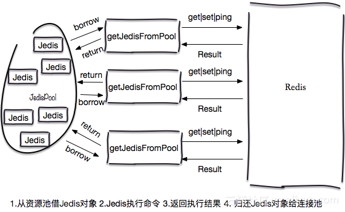
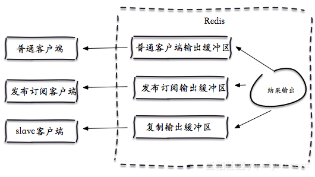

# 异常信息目录:

* [一、redis.clients.jedis.exceptions.JedisConnectionException: Could not get a resource from the pool](#e1)
* [二、redis.clients.jedis.exceptions.JedisConnectionException: Unexpected end of stream](#e2)
* [三、redis.clients.jedis.exceptions.JedisDataException: LOADING Redis is loading the dataset in memory](#e3)
* [四、redis.clients.jedis.exceptions.JedisDataException: ERR max number of clients reached](#e4)
* [五、redis.clients.jedis.exceptions.JedisConnectionException: java.net.SocketTimeoutException: Read timed out](#e5)
* [六、redis.clients.jedis.exceptions.JedisDataException: NOAUTH Authentication required](#e6)
* [七、redis.clients.jedis.exceptions.JedisDataException: EXECABORT Transaction discarded because of previous errors](#e7)
* [八、java.lang.ClassCastException: java.lang.Long cannot be cast to java.util.List](#e8)
* [九、redis.clients.jedis.exceptions.JedisDataException: WRONGTYPE Operation against a key holding the wrong kind of value](#e9)
* [十、redis.clients.jedis.exceptions.JedisDataException: OOM command not allowed when used memory > 'maxmemory'](#e10)
* [十一、redis.clients.jedis.exceptions.JedisConnectionException: java.net.SocketTimeoutException: connect timed out](#e11)

## 一.无法从连接池获取到Jedis连接

<a name="e1"/>
### 1.异常堆栈

- (1) 连接池参数blockWhenExhausted = true(默认)

如果连接池没有可用Jedis连接，会等待maxWaitMillis(毫秒)，依然没有获取到可用Jedis连接，会抛出如下异常:
````
redis.clients.jedis.exceptions.JedisConnectionException: Could not get a resource from the pool
    …
Caused by: java.util.NoSuchElementException: Timeout waiting for idle object
    at org.apache.commons.pool2.impl.GenericObjectPool.borrowObject(GenericObjectPool.java:449)
````

- (2) 连接池参数blockWhenExhausted = false
设置如果连接池没有可用Jedis连接，立即抛出异常：
````
redis.clients.jedis.exceptions.JedisConnectionException: Could not get a resource from the pool
    …
Caused by: java.util.NoSuchElementException: Pool exhausted
    at org.apache.commons.pool2.impl.GenericObjectPool.borrowObject(GenericObjectPool.java:464)
````

### 异常描述



上述异常是客户端没有从连接池(最大maxTotal个)拿到可用Jedis连接造成的，具体可能有如下原因：

- (1) 连接泄露 (较为常见)

JedisPool默认的maxTotal=8，下面的代码从JedisPool中借了8次Jedis，但是没有归还，当第9次(jedisPool.getResource().ping())

````
GenericObjectPoolConfig poolConfig = new GenericObjectPoolConfig();
JedisPool jedisPool = new JedisPool(poolConfig, "127.0.0.1", 6379);
//向JedisPool借用8次连接，但是没有执行归还操作。
for (int i = 0; i < 8; i++) {
    Jedis jedis = null;
    try {
        jedis = jedisPool.getResource();
        jedis.ping();
    } catch (Exception e) {
        logger.error(e.getMessage(), e);
    }
}
jedisPool.getResource().ping();
````

所以推荐使用的代码规范是：
````
执行命令如下：
Jedis jedis = null;
try {
    jedis = jedisPool.getResource();
    //具体的命令
    jedis.executeCommand()
} catch (Exception e) {
    //如果命令有key最好把key也在错误日志打印出来，对于集群版来说通过key可以帮助定位到具体节点。
    logger.error(e.getMessage(), e);
} finally {
    //注意这里不是关闭连接，在JedisPool模式下，Jedis会被归还给资源池。
    if (jedis != null) 
        jedis.close();
}
````

- (2) 业务并发量大，maxTotal确实设置过小。

举个例子：

一次命令时间（borrow|return resource + Jedis执行命令(含网络) ）的平均耗时约为1ms，一个连接的QPS大约是1000，
业务期望的QPS是50000，
那么理论上需要的资源池大小是50000 / 1000 = 50个，实际maxTotal可以根据理论值进行微调。

- (3) Jedis连接还的太慢

例如Redis发生了阻塞(例如慢查询等原因)，所有连接在超时时间范围内等待，并发量较大时，会造成连接池资源不足。

- (4) 其他问题

例如丢包、DNS、客户端TCP参数配置等.

<a name="e2"/>

## 二、客户端缓冲区异常

### 1.异常堆栈
````
redis.clients.jedis.exceptions.JedisConnectionException: Unexpected end of stream.
    at redis.clients.util.RedisInputStream.ensureFill(RedisInputStream.java:199)
    at redis.clients.util.RedisInputStream.readByte(RedisInputStream.java:40)
    at redis.clients.jedis.Protocol.process(Protocol.java:151)
......
````

### 2.异常描述：
这个异常是客户端缓冲区异常，产生这个问题可能有三个原因：

(1) 多个线程使用一个Jedis连接，正常的情况是一个线程使用一个Jedis连接，可以使用JedisPool管理Jedis连接，实现线程安全，防止出现这种情况，例如下面代码中两个线程用了一个Jedis连接：

````
new Thread(new Runnable() {

    public void run() {
        for (int i = 0; i < 100; i++) {
            jedis.get("hello");
        }
    }
}).start();

new Thread(new Runnable() {

    public void run() {
        for (int i = 0; i < 100; i++) {
            jedis.hget("haskey", "f");
        }
    }
}).start();
````

(2) 客户端缓冲区满了

Redis有三种客户端缓冲区：

普通客户端缓冲区(normal)：用于接受普通的命令，例如get、set、mset、hgetall、zrange等；

slave客户端缓冲区(slave)：用于同步master节点的写命令，完成复制；

发布订阅缓冲区(pubsub)：pubsub不是普通的命令，因此有单独的缓冲区。


Redis的客户端缓冲区配置具体格式是：
````
client-output-buffer-limit <class> <hard limit> <soft limit> <soft seconds>
````
(a) class: 客户端类型：(a) normal、(b) slave、(c) pubsub

(b) hard limit: 如果客户端使用的输出缓冲区大于hard limit，客户端会被立即关闭。

(c) soft limit和soft seconds: 如果客户端使用的输出缓冲区超过了soft limit并且持续了soft limit秒，客户端会被立即关闭

例如下面是一份Redis缓冲区的配置，所以当条件满足时，客户端连接会被关闭，就会出现Unexpected end of stream。

````
redis> config get client-output-buffer-limit
1) "client-output-buffer-limit"
2) "normal 524288000 0 0 slave 2147483648 536870912 480 pubsub 33554432 8388608 60"
````

(3) 长时间闲置连接被服务端主动断开，可以查询timeout配置的值以及自身连接池配置是否需要做空闲检测。

<a name="e3"/>

## 三、Redis正在加载持久化文件
 
### 1.异常堆栈：
````
redis.clients.jedis.exceptions.JedisDataException: LOADING Redis is loading the dataset in memory
````

### 2.异常描述：

Jedis调用Redis时，如果Redis正在加载持久化文件，无法进行正常的读写。

<a name="e4"/>

## 四、客户端连接数达到最大值

### 1.异常堆栈
````
redis.clients.jedis.exceptions.JedisDataException: ERR max number of clients reached
````

### 2.异常描述：
如果客户端连接数超过了Redis实例配置的最大maxclients，会抛出该异常。

<a name="e5"/>

## 五、客户端读写超时

### 1.异常堆栈
````
redis.clients.jedis.exceptions.JedisConnectionException: java.net.SocketTimeoutException: Read timed out
````

### 2.异常描述：
该问题原因可能有如下几种：

(1) 读写超时设置的过短。

(2) 有慢查询或者Redis发生阻塞。

(3) 网络不稳定。

<a name="e6"/>

## 六、密码相关的异常

### 1.异常堆栈

- 1) Redis设置了密码，客户端请求没传密码：
````
Exception in thread "main" redis.clients.jedis.exceptions.JedisDataException: NOAUTH Authentication required.
     at redis.clients.jedis.Protocol.processError(Protocol.java:127)
     at redis.clients.jedis.Protocol.process(Protocol.java:161)
     at redis.clients.jedis.Protocol.read(Protocol.java:215)
````

- 2) Redis没有设置密码，客户端传了密码：
````
Exception in thread "main" redis.clients.jedis.exceptions.JedisDataException: ERR Client sent AUTH, but no password is set
     at redis.clients.jedis.Protocol.processError(Protocol.java:127)
     at redis.clients.jedis.Protocol.process(Protocol.java:161)
     at redis.clients.jedis.Protocol.read(Protocol.java:215)
````

- 3) 客户端传了错误的密码：
````
redis.clients.jedis.exceptions.JedisDataException: ERR invalid password
    at redis.clients.jedis.Protocol.processError(Protocol.java:117)
    at redis.clients.jedis.Protocol.process(Protocol.java:151)
    at redis.clients.jedis.Protocol.read(Protocol.java:205)
````

<a name="e7"/>

## 七、事务异常

### 1.异常堆栈
````
redis.clients.jedis.exceptions.JedisDataException: EXECABORT Transaction discarded because of previous errors
````

### 2.异常描述：
这个是Redis的事务异常：事务中包含了错误的命令，例如如下sett是个不存在的命令。
````
127.0.0.1:6379> multi
OK
127.0.0.1:6379> sett key world
(error) ERR unknown command 'sett'
127.0.0.1:6379> incr counter
QUEUED
127.0.0.1:6379> exec
(error) EXECABORT Transaction discarded because of previous errors.
````

<a name="e8"/>

## 八、类转换错误

### 1.异常堆栈

````
java.lang.ClassCastException: java.lang.Long cannot be cast to java.util.List
         at redis.clients.jedis.Connection.getBinaryMultiBulkReply(Connection.java:199)
         at redis.clients.jedis.Jedis.hgetAll(Jedis.java:851)
         at redis.clients.jedis.ShardedJedis.hgetAll(ShardedJedis.java:198)
````

````
java.lang.ClassCastException: java.util.ArrayList cannot be cast to [B
         at redis.clients.jedis.Connection.getBinaryBulkReply(Connection.java:182)
         at redis.clients.jedis.Connection.getBulkReply(Connection.java:171)
         at redis.clients.jedis.Jedis.rpop(Jedis.java:1109)
         at redis.clients.jedis.ShardedJedis.rpop(ShardedJedis.java:258)
.......
````

### 2.异常描述：
Jedis正确的使用方法是：一个线程操作一个Jedis，通常来讲产生该错误是由于没有使用JedisPool造成的，例如如下代码在两个线程并发使用了一个Jedis。(get、hgetAll返回类型也是不一样的)

````
new Thread(new Runnable() {

    public void run() {
        for (int i = 0; i < 100; i++) {
            jedis.set("hello", "world");
            jedis.get("hello");
        }
    }
}).start();

new Thread(new Runnable() {

    public void run() {
        for (int i = 0; i < 100; i++) {
            jedis.hset("hashkey", "f", "v");
            jedis.hgetAll("hashkey");
        }
    }
}).start();
````

<a name="e9"/>

## 九、命令使用错误

### 1.异常堆栈
````
Exception in thread "main" redis.clients.jedis.exceptions.JedisDataException: WRONGTYPE Operation against a key holding the wrong kind of value
    at redis.clients.jedis.Protocol.processError(Protocol.java:127)
    at redis.clients.jedis.Protocol.process(Protocol.java:161)
    at redis.clients.jedis.Protocol.read(Protocol.java:215)
.....
````

### 2.异常描述：
例如key="hello"是字符串类型的键，而hgetAll是哈希类型的键，所以出现了错误。

````
jedis.set("hello","world");
jedis.hgetAll("hello");
````

<a name="e10"/>

## 十、Redis使用的内存超过maxmemory配置

### 1.异常堆栈
````
redis.clients.jedis.exceptions.JedisDataException: OOM command not allowed when used memory > 'maxmemory'.
````

### 2.异常描述：
Redis节点(如果是集群，则是其中一个节点)使用大于该实例的内存规格(maxmemory配置)。

### 3.解决方法：
原因可能有以下几个：

1).业务数据正常增加;

2).客户端缓冲区异常：例如使用了monitor、pub/sub使用不当等等;

3).纯缓存使用场景，但是maxmemory-policy配置有误(例如没有过期键的业务配置volatile-lru)。

<a name="e11"/>

## 十一、连接超时

### 1.异常堆栈
````
redis.clients.jedis.exceptions.JedisConnectionException: java.net.SocketTimeoutException: connect timed out
````

### 2.异常描述：

可能产生的原因：

1).连接超时设置的过短。

2).tcp-backlog满，造成新的连接失败。

3).客户端与服务端网络不正常。