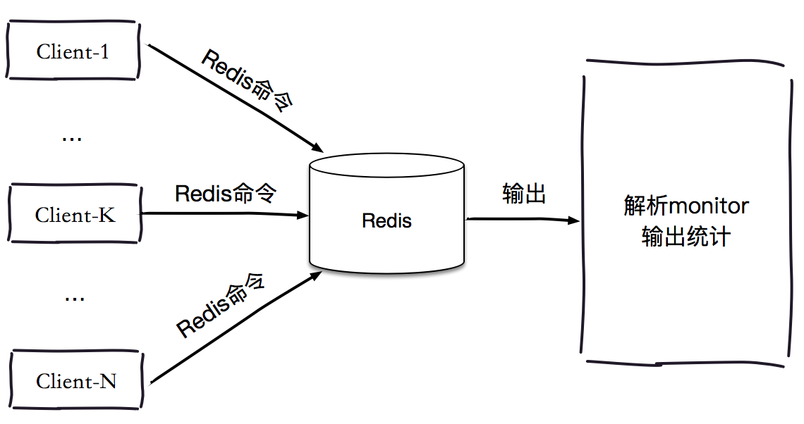
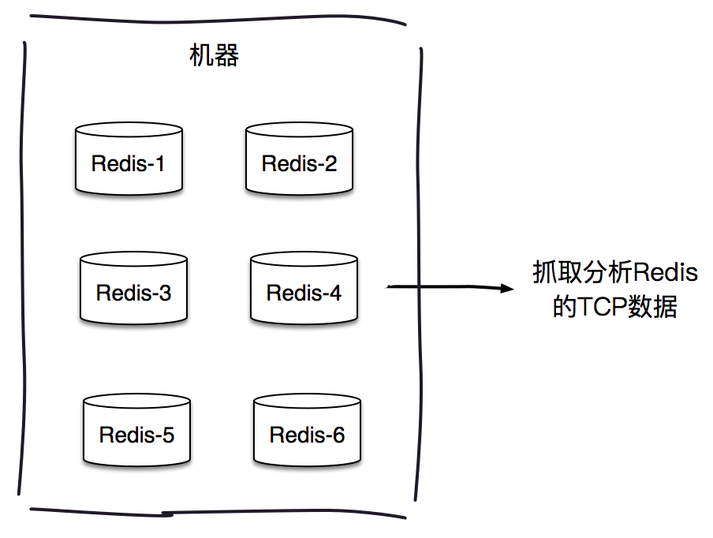

## 寻找热点key

热门新闻事件或商品通常会给系统带来巨大的流量，但对存储这类信息的Redis来说是一个巨大的挑战。以Redis Cluster为例，它会造成整体流量的不均衡，个别节点出现OPS过大的情况，极端情况下热点key甚至会超过Redis本身能够承受的OPS，因此寻找热点key对于开发和运维人员非常重要。

### 一、客户端
客户端其实是距离key"最近"的地方，因为Redis命令就是从客户端发出的，例如在客户端设置全局字典(key和调用次数)，每次调用Redis命令时，使用这个字典进行记录，如下所示。

```
public static final AtomicLongMap<String> ATOMIC_LONG_MAP = AtomicLongMap.create(); 
String get(String key) {
    counterKey(key);
    //ignore
}
String set(String key, String value) {
    counterKey(key);
    //ignore
}
void counterKey(String key) {
    ATOMIC_LONG_MAP.incrementAndGet(key);
}
```
<!--more-->

为了减少对客户端代码的侵入，可以在Redis客户端的关键部分进行计数，例如Jedis的Connection类中的sendCommand方法是所有命令执行的枢纽。

```
public Connection sendCommand(final ProtocolCommand cmd, final byte[]... args) {
    //从参数中获取key
    String key = analysis(args);
    //计数
    counterKey(key);
    //ignore
}
```

同时为了防止ATOMIC_LONG_MAP过大，可以对其进行定期清理。

```
public void scheduleCleanMap() {
    ERROR_NAME_VALUE_MAP.clear();
}
```

使用客户端进行热点key的统计非常容易实现，但是同时问题也非常多：

(1). 无法预知key的个数，存在内存泄露的危险。

(2). 对于客户端代码有侵入，各个语言的客户端都需要维护此逻辑，维护成本较高。

(3). 只能了解当前客户端的热点key，无法实现规模化运维统计。

当然除了使用本地字典计数外，还可以使用其他存储来完成异步计数，从而解决本地内存泄露问题。但是同样会存在第(2)(3)个问题。

### 二、代理端

像Twemproxy、Codis这些基于代理的Redis分布式架构，所有客户端的请求都是通过代理端完成的，如下图所示。此架构是最适合做热点key统计的，因为代理是所有Redis客户端和服务端的桥梁。但并不是所有Redis都是采用此种架构。


### 三、Redis服务端
使用monitor命令统计热点key是很多开发和运维人员首先想到，monitor命令可以监控到Redis执行的所有命令，下面为一次monitor命令执行后部分结果。

```
1477638175.920489 [0 10.16.xx.183:54465] "GET" "tab:relate:kp:162818"
1477638175.925794 [0 10.10.xx.14:35334] "HGETALL" "rf:v1:84083217_83727736"
1477638175.938106 [0 10.16.xx.180:60413] "GET" "tab:relate:kp:900"
1477638175.939651 [0 10.16.xx.183:54320] "GET" "tab:relate:kp:15907"
...
1477638175.962519 [0 10.10.xx.14:35334] "GET" "tab:relate:kp:3079"
1477638175.963216 [0 10.10.xx.14:35334] "GET" "tab:relate:kp:3079"
1477638175.964395 [0 10.10.xx.204:57395] "HGETALL" "rf:v1:80547158_83076533"
```
 


如上图所示，利用monitor的结果就可以统计出一段时间内的热点key排行榜，命令排行榜，客户端分布等数据，例如下面的伪代码统计了最近10万条命令中的热点key。


```
//获取10万条命令
List<String> keyList = redis.monitor(100000);
//存入到字典中，分别是key和对应的次数
AtomicLongMap<String> ATOMIC_LONG_MAP = AtomicLongMap.create(); 
//统计
for (String command : commandList) {
	ATOMIC_LONG_MAP.incrementAndGet(key);
}
//后续统计和分析热点key
statHotKey(ATOMIC_LONG_MAP);
```


Facebook开源的redis-faina 正是利用上述原理使用Python语言实现的，例如下面获取最近10万条命令的热点key、热点命令、耗时分布等数据。为了减少网络开销以及加快输出缓冲区的消费速度，monitor尽可能在本机执行。

redis-cli -p 6380 monitor | head -n 100000 | ./redis-faina.py

```
Overall Stats
========================================
Lines Processed  	50000
Commands/Sec     	900.48
Top Prefixes
========================================
tab        	27565	(55.13%)
rf         	15111	(30.22%)
ugc        	2051 	(4.10%)
...
Top Keys
========================================
tab:relate:kp:9350          	2110	(4.22%)
tab:relate:kp:15907         	1594	(3.19%)
...
Top Commands
========================================
GET      	25700	(51.40%)
HGETALL  	15111	(30.22%)
...
Command Time (microsecs)
========================================
Median  	622.75
75%     	1504.0
90%     	2820.0
99%     	6798.0
```

此种方法会有两个问题：

(1) 本书多次强调monitor命令在高并发条件下，会存在内存暴增和影响Redis性能的隐患，所以此种方法适合在短时间内使用。

(2) 只能统计一个Redis节点的热点key，对于Redis集群需要进行汇总统计。

### 四、机器层面

第四章我们介绍过，Redis客户端使用TCP协议与服务端进行交互，通信协议采用的是RESP。如果站在机器的角度，可以通过对机器上所有Redis端口的TCP数据包进行抓取完成热点key的统计，如下图所示。


 

此种方法对于Redis客户端和服务端来说毫无侵入，是比较完美的方案，但是依然存在两个问题：

(1)	需要一定的开发成本，但是一些开源方案实现了该功能，例如ELK(ElasticSearch Logstash Kibana)体系下的[packetbeat](https://www.elastic.co/guide/en/beats/packetbeat/current/index.html)插件，可以实现对Redis、MySQL等众多主流服务的数据包抓取、分析、报表展示。

(2)	由于是以机器为单位进行统计，要想了解一个集群的热点key，需要进行后期汇总。

最后通过下给出上述四种方案的特点。

方案 | 优点 | 缺点
--- |--- |---
客户端 | 实现简单 | 内存泄露隐患<br/>维护成本高<br/>只能统计单个客户端
代理 | 代理是客户端和服务端的桥梁，实现最方便最系统 | 增加代理端的开发部署成本 
服务端 | 实现简单 | monitor本身的使用成本和危害，只能短时间使用<br/>只能统计单个Redis节点
机器TCP流量 |对于客户端和服务端无侵入和影响 | 需要专业的运维团队开发，并且增加了机器的部署成本
		
最后我们给出三种解决热点key问题的思路，具体选用那种要根据具体业务场景来决定。

(1)	拆分复杂数据结构： 如果当前key的类型是一个二级数据结构，例如哈希类型。如果该哈希元素个数较多，可以考虑将当前hash进行拆分，这样该热点key可以拆分为若干个新的key分布到不同Redis节点上，从而减轻压力。

(2)	迁移热点key：以Redis Cluster为例，可以将热点key所在的slot单独迁移到一个新的Redis节点上，但此操作会增加运维成本。

(3)	本地缓存加通知机制：可以将热点key放在业务端的本地缓存中，因为是在业务端的本地内存中，处理能力要高出Redis数十倍，但当数据更新时，此种模式会造成各个业务端和Redis数据不一致，通常会使用发布订阅机制来解决类似问题。

