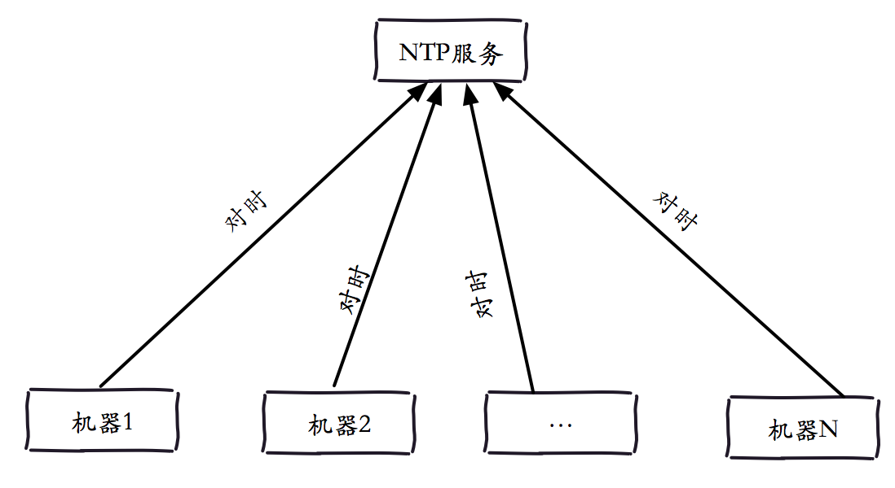

## Redis的Linux系统优化

通常来看，Redis开发和运维人员更加关注的是Redis本身的一些配置优化，例如AOF和RDB的配置优化、数据结构的配置优化等，但是对于操作系统是否需要针对Redis做一些配置优化不甚了解或者不太关心，然而事实证明一个良好的系统操作配置能够为Redis服务良好运行保驾护航。

众所周知Redis的作者对于Windows操作系统并不感冒，目前大部分公司都会将Web服务器、数据库服务器等部署在Linux操作系统上，Redis也不例外。所以接下来介绍Linux操作系统如何优化Redis，包含如下七个方面。


<a name="chapter1"/>

## 一. 内存分配控制

### 1. vm.overcommit_memory

Redis在启动时可能会出现这样的日志：

```
# WARNING overcommit_memory is set to 0! Background save may fail under low memory condition. To fix this issue add 'vm.overcommit_memory = 1' to /etc/sysctl.conf and then reboot or run the 
command 'sysctl vm.overcommit_memory=1' for this to take effect.
```

<!--more-->

在分析这个问题之前，首先要弄清楚什么是overcommit？Linux操作系统对大部分申请内存的请求都回复yes，以便能运行更多的程序。因为申请内存后，并不会马上使用内存，这种技术叫做overcommit。如果Redis在启动时有上面的日志，说明vm.overcommit_memory=0，Redis提示把它设置为1。

vm.overcommit_memory用来设置内存分配策略，它有三个可选值，如下表所示。

vm.overcommit_memory | 含义 
---|--- 
0 | 表示内核将检查是否有足够的可用内存。如果有足够的可用内存，内存申请通过，否则内存申请失败，并把错误返回给应用进程 
1 | 表示内核允许超量使用内存直到用完为止 
2 | 表示内核决不过量的("never overcommit")使用内存，即系统整个内存地址空间不能超过swap+50%的RAM值，50%是overcommit_ratio默认值，此参数同样支持修改 

```
注意：本文的可用内存代表物理内存与swap之和。
```

日志中的Background save代表的是bgsave和bgrewriteaof，如果当前可用内存不足，操作系统应该如何处理fork。如果vm.overcommit_memory=0，代表如果没有可用内存，就申请内存失败，对应到Redis就是fork执行失败，在Redis的日志会出现：
```
Cannot allocate memory 
```
Redis建议把这个值设置为1，是为了让fork能够在低内存下也执行成功。


### 2. 获取和设置

#### 获取：

```
cat /proc/sys/vm/overcommit_memory
0
```

#### 设置：

```
echo "vm.overcommit_memory=1" >> /etc/sysctl.conf
sysctl vm.overcommit_memory=1
```

### 3. 最佳实践

+ Redis设置合理的maxmemory，保证机器有20%~30%的闲置内存。
+ 集中化管理aof重写和rdb的bgsave。
+ 设置vm.overcommit_memory=1，防止极端情况下，会造成fork失败。

<a name="chapter2"/>

## 二. swappiness

### 1. 参数说明

swap对于操作系统来比较重要，当物理内存不足时，可以swap out一部分内存页，以解燃眉之急。但世界上没有免费午餐，swap空间由硬盘提供，对于需要高并发、高吞吐的应用来说，磁盘IO通常会成为系统瓶颈。在Linux中，并不是要等到所有物理内存都使用完才会使用到swap，系统参数swppiness会决定操作系统使用swap的倾向程度。swappiness的取值范围是0~100，swappiness的值越大，说明操作系统可能使用swap的概率越高，swappiness值越低，表示操作系统更加倾向于使用物理内存。swap的默认值是60，了解这个值的含义后，有利于Redis的性能优化。下表对swappiness的重要值进行了说明。

swapniess | 策略
---|--- 
0 | Linux3.5以及以上：宁愿OOM killer也不用swap<br/>Linux3.4以及更早：宁愿swap也不要OOM killer
1 | Linux3.5以及以上：宁愿swap也不要OOM killer 
60 | 默认值
100 | 操作系统会主动地使用swap

```
运维提示：OOM(Out Of Memory) killer机制是指Linux操作系统发现可用内存不足时，强制杀死一些用户进程（非内核进程），来保证系统有足够的可用内存进行分配。
```

从下表中可以看出，swappiness参数在Linux 3.5版本前后的表现并不完全相同，Redis运维人员在设置这个值需要关注当前操作系统的内核版本。

### 2. 设置方法

swappiness设置方法如下：

```
echo {bestvalue} > /proc/sys/vm/swappiness
```

但是上述方法在系统重启后就会失效，为了让配置在重启Linux操作系统后立即生效，只需要在/etc/sysctl.conf追加 vm.swappiness={bestvalue}即可。

```
echo vm.swappiness={bestvalue} >> /etc/sysctl.conf
```

需要注意/proc/sys/vm/swappiness是设置操作，/etc/sysctl.conf是追加操作。


### 3. 如何监控swap
#### (1) 查看swap的总体情况
Linux提供了free命令来查询操作系统的内存使用情况，其中也包含了swap的相关使用情况。下面是某台Linux服务器执行free –m(以兆为到位)的结果，其中需要重点关注的是最后一行的swap统计，从执行结果看，swap一共有4095M，使用了0M，空闲了4095M。

```
             total       used       free     shared    buffers     cached
Mem:         64385      31573      32812          0        505      10026
-/+ buffers/cache:      21040      43344
Swap:         4095          0       4095
```

在另一台Linux服务器同样执行free -m，这台服务器开启了8189M swap，其中使用了5241M。

```
             total       used       free     shared    buffers     cached
Mem:         24096       8237      15859          0        136       2483
-/+ buffers/cache:       5617      18479
Swap:         8189       5241       2947
```

#### (2) 实时查看swap的使用
Linux提供了vmstat命令查询系统的相关性能指标，其中包含负载、CPU、内存、swap、IO的相关属性。但其中和swap有关的指标是si和so，它们分别代表了操作系统的swap in和swap out。下面是执行vmstat 1（每隔一秒输出）的效果，可以看到si和so都为0，代表当前没有使用swap。

```
# vmstat  1
procs -----------memory---------- ---swap-- -----io---- --system-- -----cpu-----
 r  b   swpd   free   buff  cache   si   so    bi    bo   in   cs us sy id wa st
 1  0      0 33593468 517656 10271928    0    0     0     1    0    0  8  0 91  0  0	
 4  0      0 33594516 517656 10271928    0    0     0     0 10606 9647 10  1 90  0  0	
 1  0      0 33594392 517656 10271928    0    0     0     0 11490 10244 11  1 89  0  0	
 6  0      0 33594292 517656 10271928    0    0     0    36 12406 10681 13  1 87  0  0	
```

#### (3) 查看指定进程的swap使用情况
Linux操作系统中，/proc/{pid}目录是存储指定进程的相关信息，其中/proc/{pid}/smaps是记录了当前进程所对应的内存映像信息，这个信息对于查询指定进程的swap使用情况很有帮助。下面以一个Redis实例进行说明
通过info server获取Redis的进程号process_id:

```
redis-cli -h ip -p port info server | grep process_id
process_id:986
```

通过cat /proc/986/smaps查询Redis的smaps信息，由于有多个内存块信息，这里只输出一个内存块镜像信息进行观察。

```
2aab0a400000-2aab35c00000 rw-p 2aab0a400000 00:00 0 
Size:            712704 kB
Rss:             617872 kB
Shared_Clean:         0 kB
Shared_Dirty:         0 kB
Private_Clean:    15476 kB
Private_Dirty:   602396 kB
Swap:             58056 kB
Pss:             617872 kB
```

其中Swap字段代表该内存块存在swap分区的数据大小。通过执行如下命令，就可以找到每个内存块镜像信息中，这个进程使用到的swap量，通过求和就可以算出总的swap用量。 

```
cat /proc/986/smaps | grep Swap
Swap:                 0 kB
Swap:                 0 kB
…
Swap:                 0 kB
Swap:            478320 kB
…
Swap:               624 kB
Swap:                 0 kB
```


### 4. 最佳实践

如果Linux>3.5，vm.swapniess=1，否则vm.swapniess=0，从而实现如下两个目标：

+ 物理内存充足时候，使Redis足够快。
+ 物理内存不足时候，避免Redis死掉(如果当前Redis为高可用，死掉比阻塞更好)。

<a name="chapter3"/>

## 三. Transparent Huge Pages 

Redis在启动时可能会看到如下日志：

```
WARNING you have Transparent Huge Pages (THP) support enabled in your kernel. This will create latency and memory usage issues with Redis. To fix this issue run the command 'echo never > /sys/kernel/mm/transparent_hugepage/enabled' as root, and add it to your /etc/rc.local in order to retain the setting after a reboot. Redis must be restarted after THP is disabled.
```

从提示看Redis建议修改Transparent Huge Pages (THP)的相关配置，Linux kernel在2.6.38内核增加了Transparent Huge Pages (THP)特性 ，支持大内存页(2MB)分配，默认开启。当开启时可以降低fork子进程的速度，但fork之后，每个内存页从原来4KB变为2MB，会大幅增加重写期间父进程内存消耗。同时每次写命令引起的复制内存页单位放大了512倍，会拖慢写操作的执行时间，导致大量写操作慢查询。例如简单的incr命令也会出现在慢查询中。因此Redis日志中建议将此特性进行禁用，禁用方法如下：

```
echo never >  /sys/kernel/mm/transparent_hugepage/enabled
```

而且为了使机器重启后THP配置依然生效，可以在/etc/rc.local中追加echo never > /sys/kernel/mm/transparent_hugepage/enabled。

在设置THP配置时需要注意：有些Linux的发行版本没有将THP放到/sys/kernel/mm/transparent_hugepage/enabled中，例如Red Hat 6以上的THP配置放到/sys/kernel/mm/redhat_transparent_hugepage/enabled中。而Redis源码中检查THP时，把THP位置写死。

```
FILE *fp = fopen("/sys/kernel/mm/transparent_hugepage/enabled","r");
if (!fp) return 0;   
```

所以在发行版中，虽然没有THP的日志提示，但是依然存在THP所带来的问题。

```
echo never >  /sys/kernel/mm/redhat_transparent_hugepage/enabled
```

<a name="chapter4"/>
## 四. OOM killer

OOM killer会在可用内存不足时选择性的杀掉用户进程，它的运行规则是怎样的，会选择哪些用户进程“下手”呢？OOM killer进程会为每个用户进程设置一个权值，这个权值越高，被“下手”的概率就越高，反之概率越低。每个进程的权值存放在/proc/{progress_id}/oom_score中，这个值是受/proc/{progress_id}/oom_adj的控制，oom_adj在不同的Linux版本的最小值不同，可以参考Linux源码中oom.h(从-15到-17)。当oom_adj设置为最小值时，该进程将不会被OOM killer杀掉，设置方法如下。

```
echo {value} > /proc/${process_id}/oom_adj
```

对于Redis所在的服务器来说，可以将所有Redis的oom_adj设置为最低值或者稍小的值，降低被OOM killer杀掉的概率。

```
for redis_pid in $(pgrep -f "redis-server")
do
  echo -17 > /proc/${redis_pid}/oom_adj
done
```


### 运维提示：	
+ 有关OOM killer的详细细节，可以参考Linux源码mm/oom_kill.c中oom_badness函数。
+ 笔者认为oom_adj参数只能起到辅助作用，合理的规划内存更为重要。
+ 通常在高可用情况下，被杀掉比僵死更好，因此不要过多依赖oom_adj配置


<a name="chapter5"/>
## 五. 使用NTP

NTP(Network Time Protocol)网络时间协议，一种保证不同机器时钟一致性的服务。我们知道像Redis Sentinel和Redis Cluster这两种需要多个Redis实例的类型，可能会涉及多台服务器。虽然Redis并没有对多个服务器的时钟有严格的要求，但是假如多个Redis实例所在的服务器时钟不一致，对于一些异常情况的日志排查是非常困难的，例如Redis Cluster的故障转移，如果日志时间不一致，对于我们排查问题带来很大的困扰(注：但不会影响集群功能，集群节点依赖各自时钟)。一般公司里都会有NTP服务用来提供标准时间服务，从而达到纠正时钟的效果(如下图所示)，为此我们可以每天定时去同步一次系统时间，从而使得集群中的时间是统一。



  
例如每小时的同步1次NTP服务
```
0 * * * * /usr/sbin/ntpdate ntp.xx.com > /dev/null 2>&1
```

<a name="chapter6"/>
## 六. ulimit

在Linux中，可以通过ulimit查看和设置系统的当前用户进程的资源数。其中ulimit -a命令包含的open files参数，是单个用户同时打开的最大文件个数。

```
# ulimit –a
…
max locked memory       (kbytes, -l) 64
max memory size         (kbytes, -m) unlimited
open files                      (-n) 1024
pipe size            (512 bytes, -p) 8
…
```

Redis允许同时有多个客户端通过网络进行连接，可以通过配置maxclients来限制最大客户端连接数。对Linux操作系统来说这些网络连接都是文件句柄。假设当前open files是4096，那么启动Redis时会看到如下日志。

```
# You requested maxclients of 10000 requiring at least 10032 max file descriptors.
# Redis can’t set maximum open files to 10032 because of OS error: Operation not permitted.
# Current maximum open files is 4096. Maxclients has been reduced to 4064 to compensate for low ulimit. If you need higher maxclients increase ‘ulimit –n’.
```

上面的日志解释如下：

+ 第一行：Redis建议把open files至少设置成10032，那么这个10032是如何来的呢？因为maxclients的默认是10000，这些是用来处理客户端连接的，除此之外，Redis内部会使用最多32个文件描述符，所以这里的10032 = 10000 + 32。
+ 第二行：Redis不能将open files设置成10032，因为它没有权限设置。
+ 第三行：当前系统的open files是4096，所以maxclients被设置成4096-32=4064个，如果你想设置更高的maxclients，请使用ulimit -n来设置。

从上面的三行日志分析可以看出open files的限制优先级比maxclients大。
open files的设置方法如下：

```
ulimit –Sn {max-open-files}
```

<a name="chapter7"/>
## 七. TCP backlog

Redis默认的tcp-backlog为511，可以通过修改配置tcp-backlog进行调整，如果Linux的tcp-backlog小于Redis设置的tcp-backlog，那么在Redis启动时会看到如下日志：

```
# WARNING: The TCP backlog setting of 511 cannot be enforced because /proc/sys/net/core/somaxconn is set to the lower value of 128.
```

查看方法：

```
cat /proc/sys/net/core/somaxconn
128
```

修改方法：.

```
echo 511 > /proc/sys/net/core/somaxconn
```