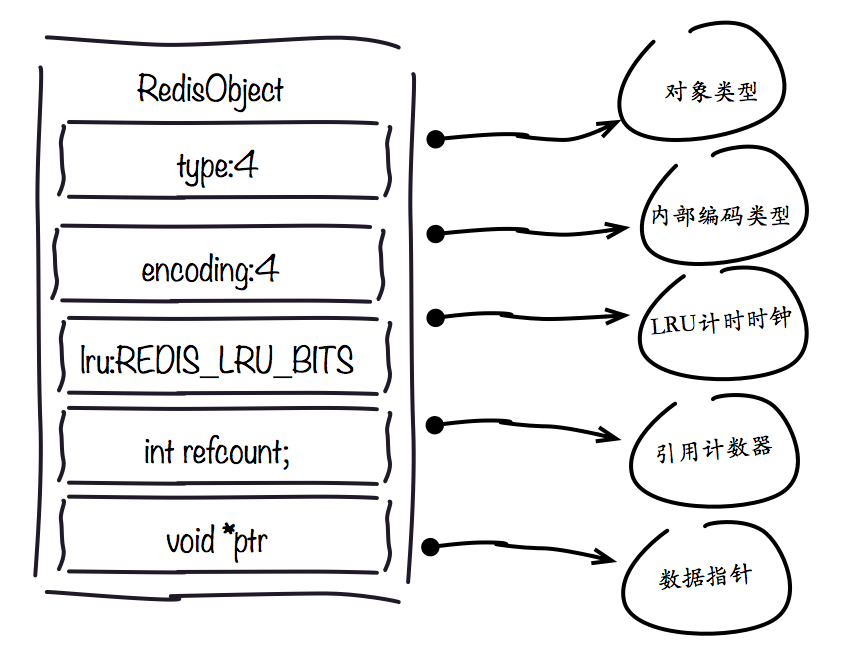
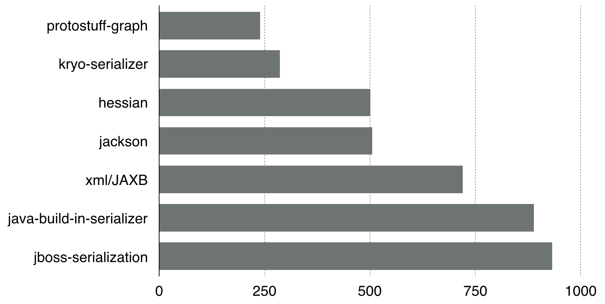
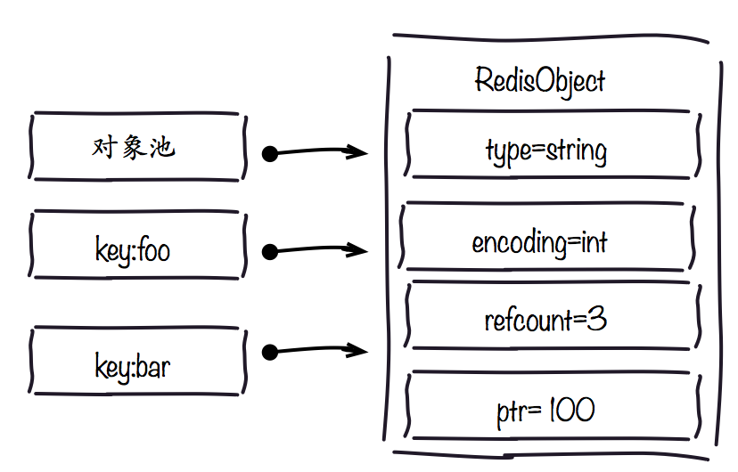
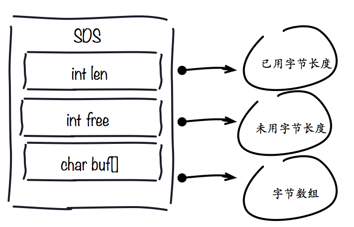
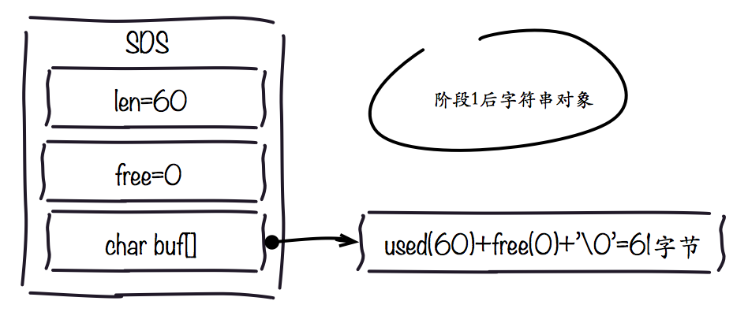
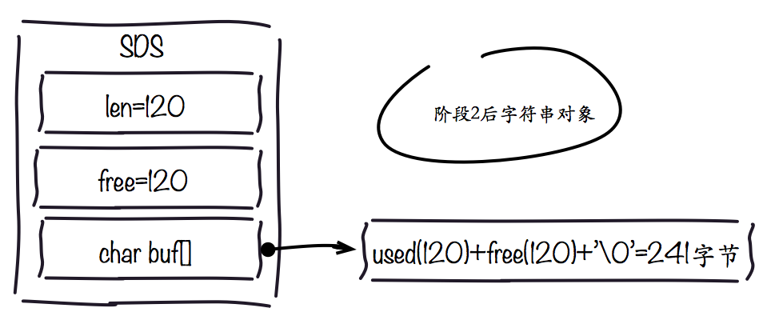
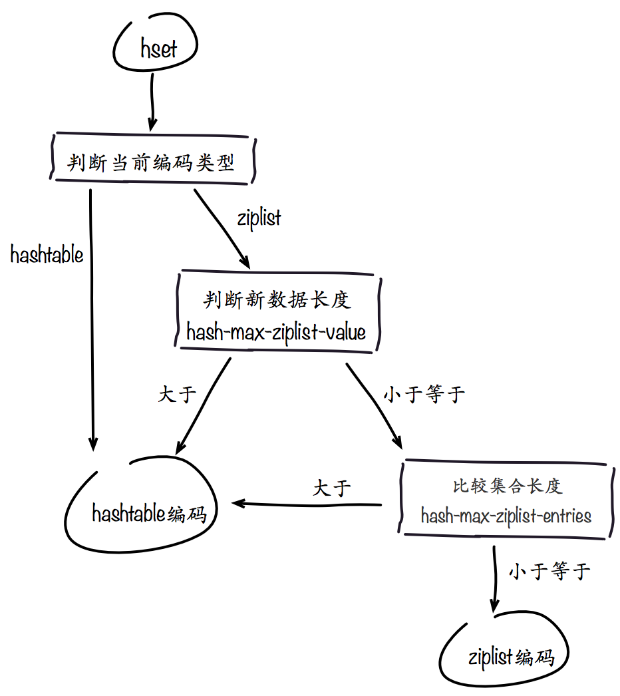
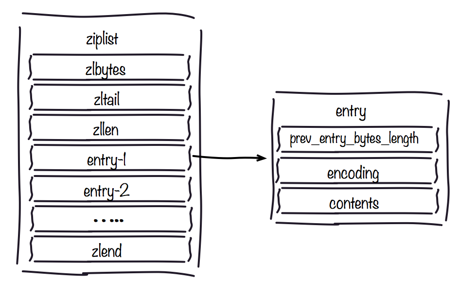
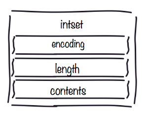
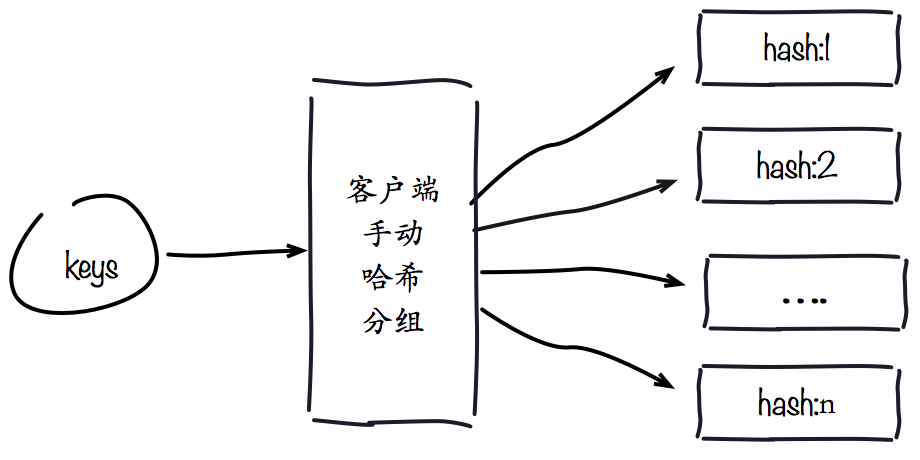

Redis所有的数据都在内存中，而内存又是非常宝贵的资源。对于如何优化内存使用一直是Redis用户非常关注的问题。本文让我们深入到Redis细节中，学习内存优化的技巧。分为如下几个部分：

<a name="chapter1"/>

## 一. redisObject对象

Redis存储的所有值对象在内部定义为redisObject结构体，内部结构如下图所示。



Redis存储的数据都使用redisObject来封装，包括string,hash,list,set,zset在内的所有数据类型。理解redisObject对内存优化非常有帮助，下面针对每个字段做详细说明：

<!--more-->

### 1.type字段:

表示当前对象使用的数据类型，Redis主要支持5种数据类型:string,hash,list,set,zset。可以使用type {key}命令查看对象所属类型，type命令返回的是值对象类型，键都是string类型。

### 2.encoding字段:

表示Redis内部编码类型，encoding在Redis内部使用，代表当前对象内部采用哪种数据结构实现。理解Redis内部编码方式对于优化内存非常重要，同一个对象采用不同的编码实现内存占用存在明显差异，具体细节见之后编码优化部分。

### 3.lru字段:

记录对象最后一次被访问的时间，当配置了maxmemory和maxmemory-policy=volatile-lru | allkeys-lru 时， 用于辅助LRU算法删除键数据。可以使用object idletime {key}命令在不更新lru字段情况下查看当前键的空闲时间。

```
开发提示：可以使用scan + object idletime 命令批量查询哪些键长时间未被访问，找出长时间不访问的键进行清理降低内存占用。
```

### 4.refcount字段:

记录当前对象被引用的次数，用于通过引用次数回收内存，当refcount=0时，可以安全回收当前对象空间。使用object refcount {key}获取当前对象引用。当对象为整数且范围在[0-9999]时，Redis可以使用共享对象的方式来节省内存，具体细节见之后共享对象池部分。

### 5. *ptr字段: 

与对象的数据内容相关，如果是整数直接存储数据，否则表示指向数据的指针。Redis在3.0之后对值对象是字符串且长度<=39字节的数据，内部编码采用embstr类型，字符串sds和redisObject一起分配，从而只要一次内存操作。

```
开发提示：高并发写入场景中，在条件允许的情况下建议字符串长度控制在39字节以内，减少创建redisObject内存分配次数，从而提高性能。
```
<a name="chapter2"/>

## 二. 缩减键值对象

降低Redis内存使用最直接的方式就是缩减键（key）和值（value）的长度。

+ key长度：如在设计键时，在完整描述业务情况下，键值越短越好。

+ value长度：值对象缩减比较复杂，常见需求是把业务对象序列化成二进制数组放入Redis。首先应该在业务上精简业务对象，去掉不必要的属性避免存储无效数据。其次在序列化工具选择上，应该选择更高效的序列化工具来降低字节数组大小。以JAVA为例，内置的序列化方式无论从速度还是压缩比都不尽如人意，这时可以选择更高效的序列化工具，如: protostuff，kryo等，下图是JAVA常见序列化工具空间压缩对比。



其中java-built-in-serializer表示JAVA内置序列化方式，更多数据见jvm-serializers项目:https://github.com/eishay/jvm-serializers/wiki，其它语言也有各自对应的高效序列化工具。

值对象除了存储二进制数据之外，通常还会使用通用格式存储数据比如:json，xml等作为字符串存储在Redis中。这种方式优点是方便调试和跨语言，但是同样的数据相比字节数组所需的空间更大，在内存紧张的情况下，可以使用通用压缩算法压缩json,xml后再存入Redis，从而降低内存占用，例如使用GZIP压缩后的json可降低约60%的空间。

```
开发提示：当频繁压缩解压json等文本数据时，开发人员需要考虑压缩速度和计算开销成本，这里推荐使用google的Snappy压缩工具，在特定的压缩率情况下效率远远高于GZIP等传统压缩工具，且支持所有主流语言环境。
```
<a name="chapter3"/>

## 三. 共享对象池

对象共享池指Redis内部维护[0-9999]的整数对象池。创建大量的整数类型redisObject存在内存开销，每个redisObject内部结构至少占16字节，甚至超过了整数自身空间消耗。所以Redis内存维护一个[0-9999]的整数对象池，用于节约内存。除了整数值对象，其他类型如list,hash,set,zset内部元素也可以使用整数对象池。因此开发中在满足需求的前提下，尽量使用整数对象以节省内存。
整数对象池在Redis中通过变量REDIS_SHARED_INTEGERS定义，不能通过配置修改。可以通过object refcount 命令查看对象引用数验证是否启用整数对象池技术，如下:

```
redis> set foo 100 
OK
redis> object refcount foo
(integer) 2
redis> set bar 100
OK
redis> object refcount bar
(integer) 3
```


设置键foo等于100时，直接使用共享池内整数对象，因此引用数是2，再设置键bar等于100时，引用数又变为3，如下图所示。



使用整数对象池究竟能降低多少内存？让我们通过测试来对比对象池的内存优化效果，如下表所示。


操作说明 | 是否对象共享 | key大小 | value大小 | used_mem | used_memory_rss
--- |--- |--- |--- |--- |--- 
插入200万 | 否 | 20字节 | [0-9999]整数 | 199.91MB | 205.28MB
插入200万 | 是 | 20字节 | [0-9999]整数 | 138.87MB | 143.28MB

```
注意本文所有测试环境都保持一致，信息如下:
服务器信息: cpu=Intel-Xeon E5606@2.13GHz memory=32GB
Redis版本:Redis server v=3.0.7 sha=00000000:0 malloc=jemalloc-3.6.0 bits=64
```

使用共享对象池后，相同的数据内存使用降低30%以上。可见当数据大量使用[0-9999]的整数时，共享对象池可以节约大量内存。需要注意的是对象池并不是只要存储[0-9999]的整数就可以工作。当设置maxmemory并启用LRU相关淘汰策略如:volatile-lru，allkeys-lru时，Redis禁止使用共享对象池，测试命令如下：

```
redis> set key:1 99
OK //设置key:1=99
redis> object refcount key:1
(integer) 2 //使用了对象共享,引用数为2
redis> config set maxmemory-policy volatile-lru
OK //开启LRU淘汰策略
redis> set key:2 99
OK //设置key:2=99
redis> object refcount key:2
(integer) 3 //使用了对象共享,引用数变为3
redis> config set maxmemory 1GB
OK //设置最大可用内存
redis> set key:3 99
OK //设置key:3=99
redis> object refcount key:3
(integer) 1 //未使用对象共享,引用数为1
redis> config set maxmemory-policy volatile-ttl
OK //设置非LRU淘汰策略
redis> set key:4 99
OK //设置key:4=99
redis> object refcount key:4
(integer) 4 //又可以使用对象共享,引用数变为4
```


#### 为什么开启maxmemory和LRU淘汰策略后对象池无效?

LRU算法需要获取对象最后被访问时间，以便淘汰最长未访问数据，每个对象最后访问时间存储在redisObject对象的lru字段。对象共享意味着多个引用共享同一个redisObject，这时lru字段也会被共享，导致无法获取每个对象的最后访问时间。如果没有设置maxmemory，直到内存被用尽Redis也不会触发内存回收，所以共享对象池可以正常工作。

综上所述，共享对象池与maxmemory+LRU策略冲突，使用时需要注意。 对于ziplist编码的值对象，即使内部数据为整数也无法使用共享对象池，因为ziplist使用压缩且内存连续的结构，对象共享判断成本过高，ziplist编码细节后面内容详细说明。

#### 为什么只有整数对象池？
首先整数对象池复用的几率最大，其次对象共享的一个关键操作就是判断相等性，Redis之所以只有整数对象池，是因为整数比较算法时间复杂度为O(1)，只保留一万个整数为了防止对象池浪费。如果是字符串判断相等性，时间复杂度变为O(n)，特别是长字符串更消耗性能(浮点数在Redis内部使用字符串存储)。对于更复杂的数据结构如hash,list等，相等性判断需要O(n<sup>2</sup>)。对于单线程的Redis来说，这样的开销显然不合理，因此Redis只保留整数共享对象池。

<a name="chapter4"/>

## 四. 字符串优化
字符串对象是Redis内部最常用的数据类型。所有的键都是字符串类型， 值对象数据除了整数之外都使用字符串存储。比如执行命令:lpush cache:type "redis" "memcache" "tair" "levelDB" ，Redis首先创建"cache:type"键字符串，然后创建链表对象，链表对象内再包含四个字符串对象，排除Redis内部用到的字符串对象之外至少创建5个字符串对象。可见字符串对象在Redis内部使用非常广泛，因此深刻理解Redis字符串对于内存优化非常有帮助。

### 1.字符串结构

Redis没有采用原生C语言的字符串类型而是自己实现了字符串结构，内部简单动态字符串(simple dynamic string)，简称SDS。结构下图所示。



Redis自身实现的字符串结构有如下特点:

+ O(1)时间复杂度获取：字符串长度，已用长度，未用长度。
+ 可用于保存字节数组，支持安全的二进制数据存储。
+ 内部实现空间预分配机制，降低内存再分配次数。
+ 惰性删除机制，字符串缩减后的空间不释放，作为预分配空间保留。


### 2.预分配机制

因为字符串(SDS)存在预分配机制，日常开发中要小心预分配带来的内存浪费，例如下表的测试用例。

#### 表：字符串内存预分配测试

阶段 | 数据量 | 操作说明 | 命令 | key大小 | value大小 | used_mem | used_memory_rss | mem_fragmentation_ratio
--- |--- |--- |--- |--- |--- |--- |--- |---
阶段1 | 200w | 新插入200w数据 | set |20字节 |60字节 |321.98MB |331.44MB |1.02
阶段2 | 200w | 在阶段1上每个对象追加60字节数据 | append |20字节 |60字节 |657.67MB |752.80MB |1.14
阶段3 | 200w | 重新插入200w数据 | set |20字节 |120字节 |474.56MB |482.45MB |1.02


从测试数据可以看出，同样的数据追加后内存消耗非常严重，下面我们结合图来分析这一现象。阶段1每个字符串对象空间占用如下图所示。


 
阶段1插入新的字符串后，free字段保留空间为0，总占用空间=实际占用空间+1字节，最后1字节保存‘\0’标示结尾，这里忽略int类型len和free字段消耗的8字节。在阶段1原有字符串上追加60字节数据空间占用如下图所示。



追加操作后字符串对象预分配了一倍容量作为预留空间，而且大量追加操作需要内存重新分配，造成内存碎片率(mem_fragmentation_ratio)上升。直接插入与阶段2相同数据的空间占用，如下图所示。


 

阶段3直接插入同等数据后，相比阶段2节省了每个字符串对象预分配的空间，同时降低了碎片率。
字符串之所以采用预分配的方式是防止修改操作需要不断重分配内存和字节数据拷贝。但同样也会造成内存的浪费。字符串预分配每次并不都是翻倍扩容，空间预分配规则如下:

1. 第一次创建len属性等于数据实际大小，free等于0，不做预分配。
2. 修改后如果已有free空间不够且数据小于1M，每次预分配一倍容量。如原有len=60byte，free=0，再追加60byte，预分配120byte，总占用空间:60byte+60byte+120byte+1byte。
3. 修改后如果已有free空间不够且数据大于1MB，每次预分配1MB数据。如原有len=30MB，free=0，当再追加100byte ,预分配1MB，总占用空间:1MB+100byte+1MB+1byte。

```
开发提示:尽量减少字符串频繁修改操作如append，setrange, 改为直接使用set修改字符串，降低预分配带来的内存浪费和内存碎片化。
```

### 3.字符串重构

字符串重构：指不一定把每份数据作为字符串整体存储，像json这样的数据可以使用hash结构，使用二级结构存储也能帮我们节省内存。同时可以使用hmget,hmset命令支持字段的部分读取修改，而不用每次整体存取。例如下面的json数据：
```
{
    "vid": "4133687xx",
    "title": "搜狐屌丝男士",
    "videoAlbumPic": "http://xxx.sohu.com/60160518/vrsa_ver8400079_ae433_pic26.jpg",
    "pid": "6494271",
    "type": "1024",
    "playlist": "6494271",
    "playTime": "468"
}
```

分别使用字符串和hash结构测试内存表现，如下表所示。

#### 表：测试内存表现

数据量 | key | 存储类型 | value | 配置 | used_mem
--- |--- |--- |--- |--- |--- 
200W | 20字节 | string | json字符串 | 默认 | 612.62M
200W | 20字节 | hash | key-value对 | 默认 | 默认	1.88GB
200W | 20字节 | hash | key-value对 | hash-max-ziplist-value:66 | 535.60M

根据测试结构，第一次默认配置下使用hash类型，内存消耗不但没有降低反而比字符串存储多出2倍，而调整hash-max-ziplist-value=66之后内存降低为535.60M。因为json的videoAlbumPic属性长度是65，而hash-max-ziplist-value默认值是64，Redis采用hashtable编码方式，反而消耗了大量内存。调整配置后hash类型内部编码方式变为ziplist，相比字符串更省内存且支持属性的部分操作。下一节将具体介绍ziplist编码优化细节。

<a name="chapter5"/>

## 五. 编码优化

### 1.了解编码

Redis对外提供了string,list,hash,set,zet等类型，但是Redis内部针对不同类型存在编码的概念，所谓编码就是具体使用哪种底层数据结构来实现。编码不同将直接影响数据的内存占用和读写效率。使用object encoding {key}命令获取编码类型。如下:

```
redis> set str:1 hello
OK
redis> object encoding str:1
"embstr" // embstr编码字符串
redis> lpush list:1 1 2 3
(integer) 3
redis> object encoding list:1
"ziplist" // ziplist编码列表
```

Redis针对每种数据类型(type)可以采用至少两种编码方式来实现，下表表示type和encoding的对应关系。

#### 表：type和encoding对应关系表

类型 | 编码方式 | 数据结构
--- |--- |--- 
string | raw<br/>embstr<br/>int | 动态字符串编码<br/>优化内存分配的字符串编码<br/>整数编码
hash | hashtable<br/>ziplist | 散列表编码<br/>压缩列表编码
list | linkedlist<br/>ziplist<br/>quicklist<br/> | 双向链表编码<br/>压缩列表编码<br/>3.2版本新的列表编码
set | hashtable<br/>intset | 散列表编码<br/>整数集合编码
zset | skiplist<br/>ziplist | 跳跃表编码<br/>压缩列表编码

了解编码和类型对应关系之后，我们不禁疑惑Redis为什么需要对一种数据结构实现多种编码方式？
主要原因是Redis作者想通过不同编码实现效率和空间的平衡。比如当我们的存储只有10个元素的列表，当使用双向链表数据结构时，必然需要维护大量的内部字段如每个元素需要：前置指针，后置指针，数据指针等，造成空间浪费，如果采用连续内存结构的压缩列表(ziplist)，将会节省大量内存，而由于数据长度较小，存取操作时间复杂度即使为O(n<sup>2</sup>)性能也可满足需求。


### 2.控制编码类型

编码类型转换在Redis写入数据时自动完成，这个转换过程是不可逆的，转换规则只能从小内存编码向大内存编码转换。例如：

```
redis> lpush list:1 a b c d
(integer) 4 //存储4个元素
redis> object encoding list:1
"ziplist" //采用ziplist压缩列表编码
redis> config set list-max-ziplist-entries 4
OK //设置列表类型ziplist编码最大允许4个元素
redis> lpush list:1 e
(integer) 5 //写入第5个元素e
redis> object encoding list:1
"linkedlist" //编码类型转换为链表
redis> rpop list:1
"a" //弹出元素a
redis> llen list:1
(integer) 4 // 列表此时有4个元素
redis> object encoding list:1
"linkedlist" //编码类型依然为链表，未做编码回退
```

以上命令体现了list类型编码的转换过程，其中Redis之所以不支持编码回退，主要是数据增删频繁时，数据向压缩编码转换非常消耗CPU，得不偿失。以上示例用到了list-max-ziplist-entries参数，这个参数用来决定列表长度在多少范围内使用ziplist编码。当然还有其它参数控制各种数据类型的编码，如下表所示：

#### 表：hash,list,set,zset内部编码配置


类型 | 编码 | 决定条件
--- |--- |--- 
hash | ziplist | 满足所有条件:<br/>value最大空间(字节)<=hash-max-ziplist-value<br/>field个数<=hash-max-ziplist-entries
同上 | hashtable | 满足任意条件:<br/>value最大空间(字节)>hash-max-ziplist-value<br/>field个数>hash-max-ziplist-entries
list | ziplist | ziplist	满足所有条件:<br/>value最大空间(字节)<=list-max-ziplist-value<br/>链表长度<=list-max-ziplist-entries
同上 | linkedlist | 满足任意条件<br/>value最大空间(字节)>list-max-ziplist-value<br/>链表长度>list-max-ziplist-entries
同上 | quicklist | 3.2版本新编码:<br/>废弃list-max-ziplist-entries和list-max-ziplist-entries配置<br/>使用新配置: <br/>list-max-ziplist-size:表示最大压缩空间或长度,最大空间使用[-5-1]范围配置，默认-2表示8KB,正整数表示最大压缩长度<br/>list-compress-depth:表示最大压缩深度，默认=0不压缩
set | intset | 满足所有条件:<br/>元素必须为整数<br/>集合长度<=set-max-intset-entries
同上 | hashtable | 满足任意条件<br/>元素非整数类型<br/>集合长度>hash-max-ziplist-entries
zset | ziplist | 满足所有条件:<br/>value最大空间(字节)<=zset-max-ziplist-value<br/>有序集合长度<=zset-max-ziplist-entries
同上 | skiplist | 满足任意条件:<br/>value最大空间(字节)>zset-max-ziplist-value<br/>有序集合长度>zset-max-ziplist-entries
	
掌握编码转换机制，对我们通过编码来优化内存使用非常有帮助。下面以hash类型为例，介绍编码转换的运行流程，如下图所示。

 

理解编码转换流程和相关配置之后，可以使用config set命令设置编码相关参数来满足使用压缩编码的条件。对于已经采用非压缩编码类型的数据如hashtable,linkedlist等，设置参数后即使数据满足压缩编码条件，Redis也不会做转换，需要重启Redis重新加载数据才能完成转换。

### 3.ziplist编码

ziplist编码主要目的是为了节约内存，因此所有数据都是采用线性连续的内存结构。ziplist编码是应用范围最广的一种，可以分别作为hash、list、zset类型的底层数据结构实现。首先从ziplist编码结构开始分析，它的内部结构类似这样:<zlbytes><zltail><zllen><entry-1><entry-2><....><entry-n><zlend>。一个ziplist可以包含多个entry(元素)，每个entry保存具体的数据(整数或者字节数组)，内部结构如下图所示。
 


ziplist结构字段含义：

1. zlbytes:记录整个压缩列表所占字节长度，方便重新调整ziplist空间。类型是int-32，长度为4字节
2. zltail:记录距离尾节点的偏移量，方便尾节点弹出操作。类型是int-32，长度为4字节
3. zllen:记录压缩链表节点数量，当长度超过216-2时需要遍历整个列表获取长度，一般很少见。类型是int-16，长度为2字节
4. entry:记录具体的节点，长度根据实际存储的数据而定。 
    1. prev_entry_bytes_length:记录前一个节点所占空间，用于快速定位上一个节点，可实现列表反向迭代。
    2. encoding:标示当前节点编码和长度，前两位表示编码类型：字符串/整数，其余位表示数据长度。 
    3. contents:保存节点的值，针对实际数据长度做内存占用优化。
5. zlend:记录列表结尾，占用一个字节。

根据以上对ziplist字段说明，可以分析出该数据结构特点如下:

1. 内部表现为数据紧凑排列的一块连续内存数组。
2. 可以模拟双向链表结构，以O(1)时间复杂度入队和出队。
3. 新增删除操作涉及内存重新分配或释放，加大了操作的复杂性。
4. 读写操作涉及复杂的指针移动，最坏时间复杂度为O(n<sup>2</sup>)。
5. 适合存储小对象和长度有限的数据。

下面通过测试展示ziplist编码在不同类型中内存和速度的表现，如下表所示。

#### 表：ziplist在hash,list,zset内存和速度测试

类型 |	数据量	| key总数量	| 长度|	value大小	|普通编码内存量/平均耗时	|压缩编码内存量/平均耗时	|内存降低比例|	耗时增长倍数
--- |--- |--- |--- |--- |--- |---
hash|	100万|	1千|	1千|	36字节|	103.37M/0.84微秒|	43.83M/13.24微秒	|57.5%|	15倍
list|	100万|	1千|	1千|	36字节|	92.46M/2.04微秒|	39.92M/5.45微秒|	56.8%	|2.5倍|
zset|	100万|	1千|	1千|	36字节|	151.84M/1.85微秒|	43.83M/77.88微秒	|71%	|42倍


测试数据采用100W个36字节数据，划分为1000个键，每个类型长度统一为1000。从测试结果可以看出：

1. 使用ziplist可以分别作为hash,list,zset数据类型实现。
2. 使用ziplist编码类型可以大幅降低内存占用。
3. ziplist实现的数据类型相比原生结构，命令操作更加耗时，不同类型耗时排序:list < hash < zset。

ziplist压缩编码的性能表现跟值长度和元素个数密切相关，正因为如此Redis提供了{type}-max-ziplist-value和{type}-max-ziplist-entries相关参数来做控制ziplist编码转换。最后再次强调使用ziplist压缩编码的原则：追求空间和时间的平衡。

```
开发提示：
1）针对性能要求较高的场景使用ziplist，建议长度不要超过1000，每个元素大小控制在512字节以内。
2）命令平均耗时使用info Commandstats命令获取，包含每个命令调用次数，总耗时，平均耗时，单位微秒。
```

### 4.intset编码

intset编码是集合(set)类型编码的一种，内部表现为存储有序，不重复的整数集。当集合只包含整数且长度不超过set-max-intset-entries配置时被启用。执行以下命令查看intset表现：

```
127.0.0.1:6379> sadd set:test 3 4 2 6 8 9 2
(integer) 6 //乱序写入6个整数
127.0.0.1:6379> object encoding set:test
"intset" //使用intset编码
127.0.0.1:6379> smembers set:test
"2" "3" "4" "6" "8" "9" // 排序输出整数结合
redis> config set set-max-intset-entries 6
OK //设置intset最大允许整数长度
redis> sadd set:test 5
(integer) 1 //写入第7个整数 5
redis> object encoding set:test
"hashtable" // 编码变为hashtable
redis> smembers set:test
"8" "3" "5" "9" "4" "2" "6" //乱序输出
```

以上命令可以看出intset对写入整数进行排序，通过O(log(n))时间复杂度实现查找和去重操作，intset编码结构如下图所示。




intset的字段结构含义：

1. encodind:整数表示类型，根据集合内最长整数值确定类型，整数类型划分三种：int-16，int-32，int-64。
2. length:表示集合元素个数。
3. contents:整数数组，按从小到大顺序保存。

intset保存的整数类型根据长度划分，当保存的整数超出当前类型时，将会触发自动升级操作且升级后不再做回退。升级操作将会导致重新申请内存空间，把原有数据按转换类型后拷贝到新数组。

```
开发提示：使用intset编码的集合时，尽量保持整数范围一致，如都在int-16范围内。防止个别大整数触发集合升级操作，产生内存浪费。
下面通过测试查看ziplist编码的集合内存和速度表现，如下表所示。
```

#### 表：ziplist编码在set下内存和速度表现

数据量|	key大小|	value大小|	编码	| 集合长度|	内存量|	内存降低比例|	平均耗时
--- |--- |--- |--- |--- |--- |---
100w|	20byte|	7字节|	hashtable|	1千|	61.97MB| -- | 0.78毫秒
100w|	20byte|	7字节|	intset|	1千|	4.77MB|	92.6%|	0.51毫秒
100w|	20byte|	7字节|	ziplist|	1千|	8.67MB|	86.2%|	13.12毫秒

根据以上测试结果发现intset表现非常好，同样的数据内存占用只有不到hashtable编码的十分之一。intset数据结构插入命令复杂度为O(n)，查询命令为O(log(n))，由于整数占用空间非常小，所以在集合长度可控的基础上，写入命令执行速度也会非常快，因此当使用整数集合时尽量使用intset编码。上表测试第三行把ziplist-hash类型也放入其中，主要因为intset编码必须存储整数，当集合内保存非整数数据时，无法使用intset实现内存优化。这时可以使用ziplist-hash类型对象模拟集合类型，hash的field当作集合中的元素，value设置为1字节占位符即可。使用ziplist编码的hash类型依然比使用hashtable编码的集合节省大量内存。

<a name="chapter6"/>

## 六 控制key的数量

当使用Redis存储大量数据时，通常会存在大量键，过多的键同样会消耗大量内存。Redis本质是一个数据结构服务器，它为我们提供多种数据结构，如hash，list，set，zset 等结构。使用Redis时不要进入一个误区，大量使用get/set这样的API，把Redis当成Memcached使用。对于存储相同的数据内容利用Redis的数据结构降低外层键的数量，也可以节省大量内存。如下图所示，通过在客户端预估键规模，把大量键分组映射到多个hash结构中降低键的数量。




hash结构降低键数量分析：

+	根据键规模在客户端通过分组映射到一组hash对象中，如存在100万个键，可以映射到1000个hash中，每个hash保存1000个元素。
+	hash的field可用于记录原始key字符串，方便哈希查找。
+	hash的value保存原始值对象，确保不要超过hash-max-ziplist-value限制。

下面测试这种优化技巧的内存表现，如下表所示。


#### 表：hash分组控制键规模测试

数据量|	key大小|	value大小|	string类型占用内存|	hash-ziplist类型占用内存|	内存降低比例|	string:set平均耗时|	hash:hset平均耗时|
--- |--- |--- |--- |--- |--- |--- |---
200w|	20byte|	512byte|	1392.64MB|	1000.97MB|	28.1%|	2.13微秒|	21.28微秒
200w|	20byte|	200byte|	596.62MB|	399.38MB|	33.1%|	1.49微秒|	16.08微秒
200w|	20byte|	100byte|	382.99MB|	211.88MB|	44.6%|	1.30微秒|	14.92微秒
200w|	20byte|	50byte|	291.46MB|	110.32MB|	62.1%|	1.28微秒|	13.48微秒
200w|	20byte|	20byte|	246.40MB|	55.63MB|	77.4%|	1.10微秒|	13.21微秒
200w|	20byte|	5byte|	199.93MB|	24.42MB|	87.7%|	1.10微秒|	13.06微秒

通过这个测试数据，可以说明：

+ 同样的数据使用ziplist编码的hash类型存储比string类型节约内存
+ 节省内存量随着value空间的减少，越来越明显。
+ hash-ziplist类型比string类型写入耗时，但随着value空间的减少，耗时逐渐降低。

使用hash重构后节省内存量效果非常明显，特变对于存储小对象的场景，内存只有不到原来的1/5。下面分析这种内存优化技巧的关键点：

1. hash类型节省内存的原理是使用ziplist编码，如果使用hashtable编码方式反而会增加内存消耗。
2. ziplist长度需要控制在1000以内，否则由于存取操作时间复杂度在O(n)到O(n2)之间，长列表会导致CPU消耗严重，得不偿失。
3. ziplist适合存储的小对象，对于大对象不但内存优化效果不明显还会增加命令操作耗时。
4. 需要预估键的规模，从而确定每个hash结构需要存储的元素数量。
5. 根据hash长度和元素大小，调整hash-max-ziplist-entries和hash-max-ziplist-value参数，确保hash类型使用ziplist编码。

关于hash键和field键的设计：

1. 当键离散度较高时，可以按字符串位截取，把后三位作为哈希的field，之前部分作为哈希的键。如：key=1948480 哈希key=group:hash:1948，哈希field=480。
2. 当键离散度较低时，可以使用哈希算法打散键，如:使用crc32(key)&10000函数把所有的键映射到“0-9999”整数范围内，哈希field存储键的原始值。
3. 尽量减少hash键和field的长度，如使用部分键内容。

使用hash结构控制键的规模虽然可以大幅降低内存，但同样会带来问题，需要提前做好规避处理。如下:

1. 客户端需要预估键的规模并设计hash分组规则，加重客户端开发成本。
2. hash重构后所有的键无法再使用超时(expire)和LRU淘汰机制自动删除，需要手动维护删除。
3. 对于大对象，如1KB以上的对象。使用hash-ziplist结构控制键数量。
不过瑕不掩瑜，对于大量小对象的存储场景，非常适合使用ziplist编码的hash类型控制键的规模来降低内存。

```
开发提示：使用ziplist+hash优化keys后，如果想使用超时删除功能，开发人员可以存储每个对象写入的时间，再通过定时任务使用hscan命令扫描数据，找出hash内超时的数据项删除即可。
```

本文主要讲解Redis内存优化技巧，Redis的数据特性是"ALL IN MEMORY"，优化内存将变得非常重要。对于内存优化建议读者先要掌握Redis内存存储的特性比如字符串，压缩编码，整数集合等，再根据数据规模和所用命令需求去调整，从而达到空间和效率的最佳平衡。建议使用Redis存储大量数据时，把内存优化环节加入到前期设计阶段，否则数据大幅增长后，开发人员需要面对重新优化内存所带来开发和数据迁移的双重成本。当Redis内存不足时，首先考虑的问题不是加机器做水平扩展，应该先尝试做内存优化。当遇到瓶颈时，再去考虑水平扩展。即使对于集群化方案，垂直层面优化也同样重要，避免不必要的资源浪费和集群化后的管理成本。